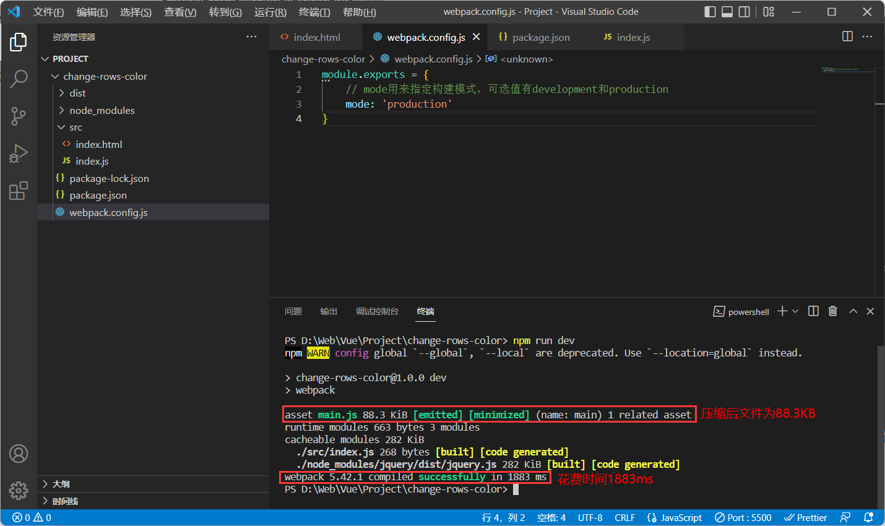
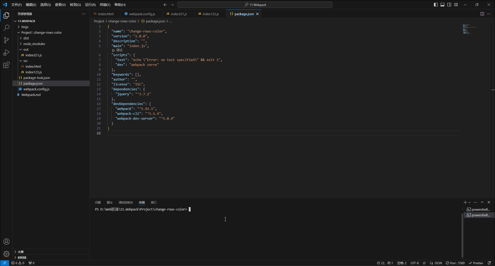
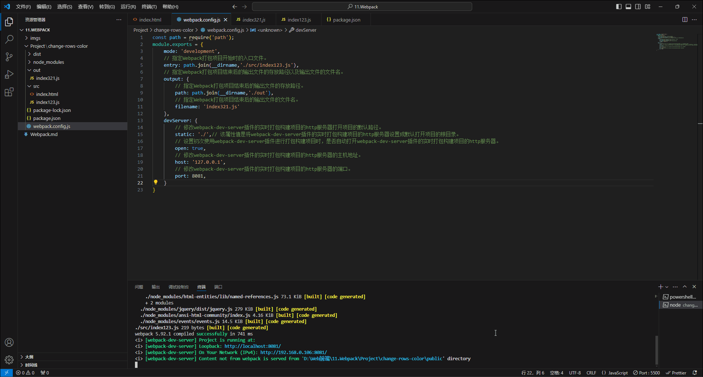
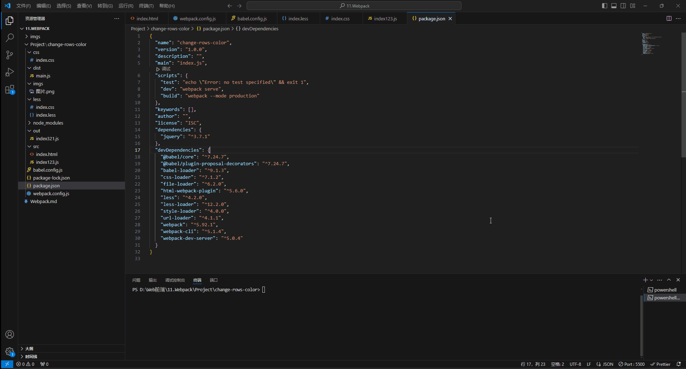

# 1.前端工程化

## 1.1小白眼中的前端开发VS实际的前端开发

- 小白眼中的前端开发：
  - 会写HTML+CSS+JavaScript就会前端开发。
  - 需要美化页面样式，就拽一个BootStrap过来。
  - 需要操作DOM或发起Ajax请求，就再拽一个jQuery过来。
  - 需要快速实现网页布局效果，就拽一个Layui过来。
- 实际的前端开发：
  - 模块化：JavaScript的模块化、CSS的模块化、资源的模块化。
  - 组件化：复用现有的UI结构、样式、行为。
  - 规范化：目录结构的划分、编码规范化、接口规范化、文档规范化、Git分支管理。
  - 自动化：自动化构建、自动部署、自动化测试。

## 1.2前端工程化简介

- 前端工程化指的是在企业级的前端项目开发中，把前端开发所需的工具、技术、流程、经验等进行规范化、标准化。如：企业中的Vue项目和React项目，都是基于工程化的方式来进行开发的。
- 前端工程化的好处就是前端开发自成体系，有一套标准的开发方案和流程。

## 1.3前端工程化的解决方案

- 早期的前端工程化解决方案有以下两种：
  - grunt：https://www.gruntjs.net/
  - gulp：https://www.gulpjs.com.cn/
- 目前主流的前端工程化解决方案有以下两种：
  - webpack：https://www.webpackjs.com/
  - parcel：https://zh.parceljs.org/

# 2.Webpack的基本使用

## 2.1Webpack简介

- Webpack是前端项目工程化的具体解决方案，它提供了友好的前端模块化开发支持，以及代码压缩混淆、处理浏览器端JavaScript的兼容性、性能优化等强大的功能。

  > 注：目前Vue、React等前端项目，基本上都是基于Webpack进行工程化开发的。

- Webpack的好处就是让程序员把工作的重心放到具体功能的实现上，从而提高了前端开发效率和项目的可维护性。

## 2.2Webpack的使用

### 2.2.1创建一个隔行变色项目

- 创建一个隔行变色项目的步骤，如下所示：

  1. 初始化项目结构，如下图所示：

     

     > 注：src文件夹是源代码文件夹，我们后续所写的源代码文件都要放在这个文件夹中。

  2. 在项目根目录中，使用终端运行 `npm init -y` 命令，来初始化包管理配置文件，如下图所示：

     

  3. 在项目根目录中，使用终端运行 `npm i jquery -s` 命令，来安装jQuery包，如下图所示：

     

     > 注1：`npm i jquery -s` 命令中的 `-s` 指令是 `--save` 指令的缩写形式，它们的作用是相同的，它的作用就是将要下载并安装的包记录到项目中的package.json配置文件中的 `dependencies` 节点中。当然我们也可以不使用 `-s` 指令来将要下载并安装的包记录到项目中的package.json配置文件中的 `dependencies` 节点中，因为npm包管理工具在下载并安装包时，默认都是将要下载并安装的包记录到项目中的package.json配置文件中的 `dependencies` 节点中的。
     >
     > 注2：如果某些包在开发和项目上线之后都需要用到，则建议把这些包记录到项目中的package.json配置文件中的 `dependencies` 节点中。

  4. 编写代码在src文件夹中的index.html文件，具体代码如下所示：

     ```html
     <!DOCTYPE html>
     <html lang="en">
     <head>
         <meta charset="UTF-8">
         <meta name="viewport" content="width=device-width, initial-scale=1.0">
         <title>Document</title>
     </head>
     <body>
         <ul>
             <li>第1个</li>
             <li>第2个</li>
             <li>第3个</li>
             <li>第4个</li>
             <li>第5个</li>
             <li>第6个</li>
             <li>第7个</li>
             <li>第8个</li>
             <li>第9个</li>
             <li>第10个</li>
         </ul>
     </body>
     </html>
     ```

  5. 编写代码在src文件夹中的index.js文件，具体代码如下所示：

     ```javascript
     // 使用ES6语法导入所需要的模块。
     import $ from "jquery";
     // 定义入口函数。
     $(function() {
         $('li:odd').css('background-color','yellow');
         $('li:even').css('background-color','pink');
     });
     ```

     > 注：`import 对象名 from "所需要导入的模块"` 语句就相当与我们学Node.js时的 `const 对象名 = require("所需要导入的模块")` 语句，它们的作用都是将我们所需的模块导入进来，并给其赋一个名称。`import 对象名 from "所需要导入的模块"` 语句是更高级的写法，但是不代表 `import 对象名 from "所需要导入的模块"` 语句能在Node.js中使用。

  6. 将src文件夹中的index.js文件导入进src文件夹中的index.html文件，来实现隔行变色效果，如以下代码所示：

     ```javascript
     <!DOCTYPE html>
     <html lang="en">
     <head>
         <meta charset="UTF-8">
         <meta name="viewport" content="width=device-width, initial-scale=1.0">
         <title>Document</title>
     </head>
     <body>
         <ul>
             <li>第1个</li>
             <li>第2个</li>
             <li>第3个</li>
             <li>第4个</li>
             <li>第5个</li>
             <li>第6个</li>
             <li>第7个</li>
             <li>第8个</li>
             <li>第9个</li>
             <li>第10个</li>
         </ul>
         <script src="./index.js"></script>
     </body>
     </html>
     ```

     > 注1：演示结果，如下图所示：
     >
     > 
     >
     > 注2：我们可以看到上图的演示结果中，并没有实现隔行变色效果，这是因为我们使用了ES6语法导入jQuery模块，这在浏览器中是不兼容的，所以实现不了隔行变色效果，但是我们可以通过Webpack来解决该问题，因为Webpack具有处理浏览器端JavaScript的兼容性问题的功能。

### 2.2.2在项目中使用Webpack

- 在项目中使用Webpack，需要通过以下步骤：

  1. 在项目根目录中，使用终端运行 `npm i webpack webpack-cli -D` 命令，来安装Webpack相关的两个包，如下图所示：

     

     > 注1：`npm i webpack webpack-cli -D` 命令中的 `-D` 指令是 `--save-dev` 指令的缩写形式，它们的作用是相同的，它的作用就是将要下载并安装的包记录到项目中的package.json配置文件中的 `devDependencies` 节点中。
     >
     > 注2：如果某些包只在项目开发阶段中会用到，在项目上线后不会用到，则建议把这些包记录到项目中的package.json配置文件中的 `devDependencies` 节点中。

  2. 在项目根目录中，创建一个webpack.config.js文件，该文件是Webpack的配置文件，如下图所示：

     

  3. 在项目根目录中的webpack.config.js文件中，编写Webpack的配置代码，如以下代码所示：

     ```javascript
     module.exports = {
         mode: 'development'
     }
     ```

     > 注1：`mode` 属性是用来指定Webpack的构建模式的，可选值有 `development` 和 `production`。
     >
     > 注2：`mode` 属性使用 `development` 值是在项目开发时使用的，它不会对打包生成的文件进行代码压缩和性能优化，有着打包速度快的优势，所以适合在开发阶段使用。
     >
     > 注3：`mode` 属性使用 `production` 值是在项目上线时使用的，它会对打包生成的文件进行代码压缩和性能优化，所以打包速度很慢，所以仅适合在项目上线阶段使用。
     >
     > 注4：`mode` 属性使用 `development` 值，打包的速度，如下图所示：
     >
     > 
     >
     > 注5：`mode` 属性使用 `production` 值，打包的速度，如下图所示：
     >
     > 

  4. 在项目根目录中的package.json文件中，新增脚本，该脚本是用来运行Webpack的，如以下代码所示：

     ```json
     {
       "name": "change-rows-color",
       "version": "1.0.0",
       "description": "",
       "main": "index.js",
       "scripts": {
         "test": "echo \"Error: no test specified\" && exit 1",
         "dev": "webpack"
       },
       "keywords": [],
       "author": "",
       "license": "ISC",
       "dependencies": {
         "jquery": "^3.7.1"
       },
       "devDependencies": {
         "webpack": "^5.92.1",
         "webpack-cli": "^5.1.4"
       }
     }
     ```

     > 注1：新增的脚本需要写在package.json文件中的scripts节点中，并且因为package.json文件是json文件，所以脚本的名称和脚本的命令都需要使用 `""` 包裹起来。
     >
     > 注2：新增脚本的格式为 `"脚本名称": "要运行的命令"`，其中脚本的名称可以随意编写，要运行的命令按自己所需编写，如：`"dev": "webpack"` 就是一个名称为 `dev` 的脚本，该脚本的作用就是运行Webpack。
     >
     > 注3：package.json文件中的scripts节点中的脚本，可以通过 `npm run 脚本名称` 命令来运行。

  5. 在项目根目录中，使用终端运行 `npm run dev` 命令，来运行Webpack对项目进行打包构建，如下图所示：

     

     > 注1：使用Webpack对项目进行打包构建后，会生成一个dist文件夹，并且该文件夹中会有一个main.js文件。
     >
     > 注2：因为原生的Webpack只支持打包js文件，所以使用Webpack对该项目进行打包构建后，Webpack会将该项目中的js文件也就是jQuery模块和index.js文件进行打包合并，并生成一个main.js输出文件，我们可以通过index.html文件导入main.js文件来使用经过Webpack打包后的js文件。

  6. 修改src文件夹中的index.html文件中的代码， 代码如下所示：

     ```javascript
     <!DOCTYPE html>
     <html lang="en">
     <head>
         <meta charset="UTF-8">
         <meta name="viewport" content="width=device-width, initial-scale=1.0">
         <title>Document</title>
     </head>
     <body>
         <ul>
             <li>第1个</li>
             <li>第2个</li>
             <li>第3个</li>
             <li>第4个</li>
             <li>第5个</li>
             <li>第6个</li>
             <li>第7个</li>
             <li>第8个</li>
             <li>第9个</li>
             <li>第10个</li>
         </ul>
         <script src="../dist/main.js"></script>
     </body>
     </html>
     ```

     > 注1：运行结果如下图所示：
     >
     > 
     >
     > 注2：我们可以看到上图的演示结果中，实现了隔行变色效果，这是因为我们使用了Webpack打包构建了该项目，使得ES6语法导入jQuery模块，在浏览器中兼容，这是因为Webpack具有处理浏览器端JavaScript的兼容性问题的功能。

### 2.2.3Webpack配置文件webpack.config.js的作用

- webpack.config.js文件是我们创建的Webpack的配置文件，该文件的作用是在Webpack真正开始打包构建项目之前，Webpack会先读取这个配置文件，从而根据该文件中的设置，对项目进行打包。

  > 注：由于Webpack是基于Node.js开发出来的打包工具，因此在它的配置文件中，是支持使用Node.js相关的语法和模块进行Webpack的个性化配置的。

### 2.2.4Webpack打包项目开始时的入口文件和打包项目结束后的输出文件

- 在Webpack 4.x和Webpack 5.x的版本中，有以下的默认约定：
  - Webpack打包项目开始时的入口文件默认为项目中的src目录下的index.js文件。

    > 注：通俗来讲就是Webpack在打包项目时，它处理的是项目中的src目录下的index.js文件，如果找不到这个文件，Webpack就会报错，如下图所示：
    >
    > 

  - Webpack打包项目结束后的输出文件默认放在项目中的dist目录下的main.js文件。

- 我们可以在Webpack的配置文件webpack.config.js中修改Webpack的默认约定，如下所示：

  - 我们可以在Webpack的配置文件webpack.config.js中输出 `entry` 属性，来指定Webpack打包项目开始时的入口文件，如以下代码所示：

    ```javascript
    const path = require('path');
    module.exports = {
        mode: 'development',
        // 指定Webpack打包项目开始时的入口文件。
        entry: path.join(__dirname,'./src/index123.js')
    }
    ```

    > 注1：演示结果，如下图所示：
    >
    > 
    >
    > 注2：由于Webpack是基于Node.js开发出来的打包工具，因此在它的配置文件中，是支持使用Node.js相关的语法和模块进行Webpack的个性化配置的，如以上示例中我们使用了Node.js中的path模块。

  - 我们可以在Webpack的配置文件webpack.config.js中输出 `output` 属性，来指定Webpack打包项目结束后的输出文件的存放路径以及输出文件的文件名，如以下代码所示：

    ```javascript
    const path = require('path');
    module.exports = {
        mode: 'development',
        // 指定Webpack打包项目开始时的入口文件。
        entry: path.join(__dirname,'./src/index123.js'),
        // 指定Webpack打包项目结束后的输出文件的存放路径以及输出文件的文件名。
        output: {
            // 指定Webpack打包项目结束后的输出文件的存放路径。
            path: path.join(__dirname,'./out'),
            // 指定Webpack打包项目结束后的输出文件的文件名。
            filename: 'index321.js'
        }
    }
    ```

    > 注1：演示结果，如下图所示：
    >
    > 
    >
    > 注2：`path` 属性是用来指定Webpack打包项目结束后的输出文件的存放路径。
    >
    > 注3：`filename` 属性是用来指定Webpack打包项目结束后的输出文件的文件名。

## 2.3Webpack插件的使用

### 2.3.1Webpack插件的作用

- 我们可以通过安装和配置Webpack的第三方插件，来拓展Webpack的能力，从而让Webpack使用起来更方便。
- Webpack中最常用的插件，有以下两个：
  - webpack-dev-server：该插件类似与我们学Node.js时，所使用的nodeman工具，该插件可以在我们修改项目中的源代码后，自动使用Webpack打包构建项目，这样我们就无需频繁使用 `npm run dev` 命令了。
  - html-webpack-plugin：该插件是Webpack中的HTML插件，该插件类似于一个模板引擎插件，我们可以通过该插件来控制项目中的html文件。

### 2.3.2Webpack中的webpack-dev-server插件的使用

- webpack-dev-server插件，可以让Webpack监听项目中的源代码的变化，从而自行打包构建项目。

- webpack-dev-server插件的使用步骤如下：

  1. 在项目根目录中，使用终端运行 `npm i webpack-dev-server -D` 命令，来安装webpack-dev-server插件，如下图所示：

     

  2. 在项目根目录中的package.json文件中修改dev脚本，让它运行 `webpack serve` 指令，也就是运行webpack-dev-server插件，如以下代码所示：

     ```javascript
     {
       "name": "change-rows-color",
       "version": "1.0.0",
       "description": "",
       "main": "index.js",
       "scripts": {
         "test": "echo \"Error: no test specified\" && exit 1",
         "dev": "webpack serve"
       },
       "keywords": [],
       "author": "",
       "license": "ISC",
       "dependencies": {
         "jquery": "^3.7.1"
       },
       "devDependencies": {
         "webpack": "^5.92.1",
         "webpack-cli": "^5.1.4",
         "webpack-dev-server": "^5.0.4"
       }
     }
     ```

  3. 在项目根目录中，使用终端运行 `npm run dev` 命令来运行webpack-dev-server插件，如下图所示：

     

     > 注1：我们可以从上图看到我们每次修改项目中的源代码，并保存后，webpack-dev-server插件就会自动运行Webpack来帮我们打包构建项目。
     >
     > 注2：webpack-dev-server插件运行时会启动一个实时打包构建项目的http服务器，我们可以通过该服务器来查看webpack-dev-server插件自动打包构建项目后的效果，如下图所示：
     >
     > 
     >
     > > 注：我们可以在上图中看到当我们打开webpack-dev-server插件的实时打包构建项目的http服务器时，会报错，这是因为webpack-dev-server插件的实时打包构建项目的http服务器是默认打开项目的public文件夹，而我们的项目中并没有该文件夹，所以当我们打开webpack-dev-server插件的实时打包构建项目的http服务器时，会报错，我们可以通过配置webpack-dev-server插件来解决该问题。

  4. 我们可以在Webpack的配置文件webpack.config.js中输出 `devServer` 属性，来配置webpack-dev-server插件的实时打包构建项目的http服务器，如以下代码所示：

     ```javascript
     const path = require('path');
     module.exports = {
         mode: 'development',
         // 指定Webpack打包项目开始时的入口文件。
         entry: path.join(__dirname,'./src/index123.js'),
         // 指定Webpack打包项目结束后的输出文件的存放路径以及输出文件的文件名。
         output: {
             // 指定Webpack打包项目结束后的输出文件的存放路径。
             path: path.join(__dirname,'./out'),
             // 指定Webpack打包项目结束后的输出文件的文件名。
             filename: 'index321.js'
         },
         devServer: {
             // 修改webpack-dev-server插件的实时打包构建项目的http服务器打开项目的默认路径。
             static: './',// 该属性值是将webpack-dev-server插件的实时打包构建项目的http服务器设置成默认打开项目的根目录。
             // 设置初次使用webpack-dev-server插件进行打包构建项目时，是否自动打开webpack-dev-server插件的实时打包构建项目的http服务器。
             open: true,
             // 修改webpack-dev-server插件的实时打包构建项目的http服务器的主机地址。
             host: '127.0.0.1',
             // 修改webpack-dev-server插件的实时打包构建项目的http服务器的端口。
             port: 8081,
         }
     }
     ```

     > 注1：只要是修改了Webpack的配置文件webpack.config.js或修改了package.json配置文件，就必须重启webpack-dev-server插件，否则最新的配置文件将无法生效。
     >
     > 注2：演示结果，如下图所示：
     >
     > 
     >
     > 注3：在上图中可以看到我们使用了 `Ctrl + C` 快捷键来关闭webpack-dev-server插件的实时打包构建项目的http服务器。
     >
     > 注4：`static` 属性是修改webpack-dev-server插件的实时打包构建项目的http服务器打开项目的默认路径的。
     >
     > 注5：`open` 属性是设置初次使用webpack-dev-server插件进行打包构建项目时，是否自动打开webpack-dev-server插件的实时打包构建项目的http服务器的。
     >
     > 注6：`host` 属性是修改webpack-dev-server插件的实时打包构建项目的http服务器的主机地址的，默认的webpack-dev-server插件的实时打包构建项目的http服务器的主机地址为 `localhost`，也就是127.0.0.1。
     >
     > 注7：`port` 属性是修改webpack-dev-server插件的实时打包构建项目的http服务器的端口的，默认的webpack-dev-server插件的实时打包构建项目的http服务器的端口为8081。

  5. 在项目根目录中，使用终端运行 `npm run dev` 命令来运行webpack-dev-server插件，并打开webpack-dev-server插件的实时打包构建项目的http服务器，来查看打包构建项目后的效果，如下图所示：

     

     > 注1：我们可以在上图中看到，在我们使用浏览器打开项目的src文件夹时，浏览器自动打开了src文件夹中的index.html文件，这是因为当浏览器一进入某个文件夹时，就会检测该文件夹中是否有index.html文件，如果该文件夹中有index.html文件，那么浏览器就会自动打开该文件。
     >
     > 注2：我们可以在上图中看到，我们修改了项目的源代码，并保存后，浏览器并没有显示我们想要的效果，这是因为当我们使用了webpack-dev-server插件后，Webpack打包构建项目后的输出文件是被存放在项目的根目录中的，并且该文件是虚拟的，我们在项目的根目录中找不到该文件，但是我们可以通过在文件中引用该文件来使用该文件，具体原因可以查看webpack-dev-server插件的特性。

  6. 修改src文件夹中的index.html文件，让其使用使用了webpack-dev-server插件后，Webpack打包构建项目后的输出文件，如以下代码所示：

     ```javascript
     <!DOCTYPE html>
     <html lang="en">
     <head>
         <meta charset="UTF-8">
         <meta name="viewport" content="width=device-width, initial-scale=1.0">
         <title>Document</title>
     </head>
     <body>
         <ul>
             <li>第1个</li>
             <li>第2个</li>
             <li>第3个</li>
             <li>第4个</li>
             <li>第5个</li>
             <li>第6个</li>
             <li>第7个</li>
             <li>第8个</li>
             <li>第9个</li>
             <li>第10个</li>
         </ul>
         <!-- 引用使用了webpack-dev-server插件后，Webpack打包构建项目后的输出文件 -->
         <script src="../index321.js"></script>
     </body>
     </html>
     ```

     > 注：演示结果，如下图所示：
     >
     > 

### 2.3.3webpack-dev-server插件的特性

- webpack-dev-server插件的特性，如下：

  - 在不使用webpack-dev-server插件时，Webpack打包构建项目后的输出文件是存放在实际的物理磁盘中的，并且我们可以在项目的文件夹中看到该文件，而且该文件的存放路径和该文件的文件名，都是根据Webpack的配置文件webpack.config.js中的 `output` 属性来决定的。

  - 在使用webpack-dev-server插件时，Webpack打包构建项目后的输出文件是存放在内存中的，并且我们在项目的文件夹中看不到该文件，而且该文件的存放路径被设置成存放在项目的根目录中，但是该文件的文件名，还是根据Webpack的配置文件webpack.config.js中的 `output` 属性来决定的。

- 为什么使用webpack-dev-server插件，Webpack会将打包构建项目后的输出文件存放在内存中，这是因为将其存放在内存中可以提高实时打包输出的性能，因为内存比物理磁盘速度快的多。

### 2.3.4Webpack中的html-webpack-plugin插件的使用

- html-webpack-plugin插件是Webpack中的HTML插件，我们可以通过该插件来操控项目中的HTML文件。

- html-webpack-plugin插件的使用步骤如下：

  1. 在项目根目录中，使用终端运行 `npm i html-webpack-plugin -D` 命令，来安装html-webpack-plugin插件，如下图所示：

     

  2. 在Webpack的配置文件webpack.config.js中配置html-webpack-plugin插件，让其复制一份项目中的src文件夹中的index.html文件到项目的根目录中，如以下代码所示：

     ```javascript
     const path = require('path');
     // 导入html-webpack-plugin插件。
     const HtmlPlugin = require('html-webpack-plugin');
     // 创建html-webpack-plugin插件的实例对象。
     const htmlPlugin = new HtmlPlugin({
         // 指定要复制哪个HTML文件。
         template: './src/index.html',
         // 指定要将复制的文件粘贴在哪里，并指定该文件的文件名。
         filename: './index.html'
     });
     module.exports = {
         mode: 'development',
         // 指定Webpack打包项目开始时的入口文件。
         entry: path.join(__dirname,'./src/index123.js'),
         // 指定Webpack打包项目结束后的输出文件的存放路径以及输出文件的文件名。
         output: {
             // 指定Webpack打包项目结束后的输出文件的存放路径。
             path: path.join(__dirname,'./out'),
             // 指定Webpack打包项目结束后的输出文件的文件名。
             filename: 'index321.js'
         },
         devServer: {
             // 修改webpack-dev-server插件的实时打包构建项目的http服务器打开项目的默认路径。
             static: './',// 该属性值是将webpack-dev-server插件的实时打包构建项目的http服务器设置成默认打开项目的根目录。
             // 设置初次使用webpack-dev-server插件进行打包构建项目时，是否自动打开webpack-dev-server插件的实时打包构建项目的http服务器。
             open: true,
             // 修改webpack-dev-server插件的实时打包构建项目的http服务器的主机地址。
             host: '127.0.0.1',
             // 修改webpack-dev-server插件的实时打包构建项目的http服务器的端口。
             port: 8081,
         }
     }
     ```

     > 注1：我们在配置html-webpack-plugin插件时，要先导入html-webpack-plugin插件，然后再创建html-webpack-plugin插件的实例对象，这样我们就可以在html-webpack-plugin插件的实例对象中配置html-webpack-plugin插件。
     >
     > 注2：`template` 属性是设置要复制哪个HTML文件。
     >
     > 注3：`filename` 属性是设置要将复制的文件粘贴在哪里，并指定该文件的文件名。

  3. 我们可以在Webpack的配置文件webpack.config.js中输出 `plugins` 属性，来让html-webpack-plugin插件生效，如以下代码所示：

     ```javascript
     const path = require('path');
     // 导入html-webpack-plugin插件。
     const HtmlPlugin = require('html-webpack-plugin');
     // 创建html-webpack-plugin插件的实例对象。
     const htmlPlugin = new HtmlPlugin({
         // 指定要复制哪个HTML文件。
         template: './src/index.html',
         // 指定要将复制的文件粘贴在哪里，并指定该文件的文件名。
         filename: './index.html'
     });
     module.exports = {
         mode: 'development',
         // 指定Webpack打包项目开始时的入口文件。
         entry: path.join(__dirname,'./src/index123.js'),
         // 指定Webpack打包项目结束后的输出文件的存放路径以及输出文件的文件名。
         output: {
             // 指定Webpack打包项目结束后的输出文件的存放路径。
             path: path.join(__dirname,'./out'),
             // 指定Webpack打包项目结束后的输出文件的文件名。
             filename: 'index321.js'
         },
         devServer: {
             // 修改webpack-dev-server插件的实时打包构建项目的http服务器打开项目的默认路径。
             static: './',// 该属性值是将webpack-dev-server插件的实时打包构建项目的http服务器设置成默认打开项目的根目录。
             // 设置初次使用webpack-dev-server插件进行打包构建项目时，是否自动打开webpack-dev-server插件的实时打包构建项目的http服务器。
             open: true,
             // 修改webpack-dev-server插件的实时打包构建项目的http服务器的主机地址。
             host: '127.0.0.1',
             // 修改webpack-dev-server插件的实时打包构建项目的http服务器的端口。
             port: 8081,
         },
         // 让html-webpack-plugin插件生效。
         plugins: [htmlPlugin]
     }
     ```

     > 注1：演示结果，如下图所示：
     >
     > 
     >
     > 注2：在上图中我们可以看到，我们已经将项目中的src文件夹中的index.html文件复制到了项目的根目录中，因为我们运行webpack-dev-server插件，让Webpack打包构建项目时，我们一打开webpack-dev-server插件的实时打包构建项目的http服务器时，就自动打开了index.html文件，这是因为我们配置了webpack-dev-server插件的实时打包构建项目的http服务器，让其打开项目的根目录，而浏览器又会自动打开文件夹中的index.html文件，所以我们可以断定html-webpack-plugin插件已经将项目中的src文件夹中的index.html文件复制到了项目的根目录中了，而且我们发现我们无需修改经过html-webpack-plugin插件复制粘贴后的index.html文件中的引用Webpack打包构建项目后的输出文件的路径，也可以使用Webpack打包构建项目后的输出文件，具体原因可以查看html-webpack-plugin插件的特性。

### 2.3.5html-webpack-plugin插件的特性

- html-webpack-plugin插件的特性，如下：
  - 使用html-webpack-plugin插件复制粘贴后的HTML文件是存放在内存当中的。
  - 使用html-webpack-plugin插件复制粘贴后的HTML文件，该文件会被自动注入Webpack打包构建项目后的输出文件。

## 2.4Webpack中的loader（加载器）

### 2.4.1Webpack中的loader简介

- Webpack中的loader（加载器）的作用是协助Webpack打包处理特定的文件模块的，比如，如果项目中有 `.css` 后缀的文件，那么Webpack默认是处理不了该文件的，会报错，这是因为Webpack默认只能打包处理项目中的 `.js` 后缀的文件，处理不了其它后缀的文件，但是我们可以通过调用Webpack中的loader来让Webpack支持打包处理项目中的其它后缀的文件，除此之外，Webpack还处理不了包含了JavaScript高级语法的后缀为 `.js` 的文件，但是这也可以通过调用Webpack中的loader来处理。

  > 注1：css-loader可以让Webpack打包处理项目中的后缀为 `.css` 相关的文件。
  >
  > 注2：less-loader可以让Webpack打包处理项目中的后缀为 `.less` 相关的文件。
  >
  > 注3：babel-loader可以让Webpack打包处理项目中包含了JavaScript高级语法的相关文件。
  >
  > 注4：让Webpack打包处理项目中的非 `.js` 后缀的文件，会报错，报错代码，如下图所示：
  >
  > 
  >
  > 注5：在上图中我们看到，我们使用了`import "所需要导入的文件"` 语句，将CSS文件导入进了Webpack打包构建项目开始时的入口文件中，这是因为在Webpack中，一切皆模块，我们可以通过ES6的导入语法将其进行导入和使用，所以我们无需在HTML文件中导入CSS文件来实现样式效果，而是将CSS文件导入进Webpack打包构建项目开始时的入口文件中，让Webpack将其一并打包，然后在HTML文件中导入Webpack打包构建项目结束后的输出文件，这样我们就能在HTML文件中实现CSS文件中所设置的样式效果了，但是前提是调用了Webpack中的css-loader，否则将会报错，这是因为Webpack默认只能打包处理项目中的 `.js` 后缀的文件。
  >
  > 注6：`import "所需要导入的文件"` 语句和 `import 对象名 from "所需要导入的模块"` 语句都是ES6的导入语法，它们的区别在于导入的模块如果返回的是 `undefined`，那么就没必要使用 `from` 关键字进行接收，而是直接使用 `import "所需要导入的文件"` 语句即可，或者我们只想加载某个文件，并不需要接收该文件时，我们也可以直接使用 `import "所需要导入的文件"` 语句。

### 2.4.2Webpack中的loader调用过程的流程图

- Webpack中的loader调用过程的流程图，如下图所示：

  

### 2.4.3css-loader

- css-loader的作用就是可以让Webpack打包处理项目中的后缀为 `.css` 相关的文件。

- css-loader的使用步骤如下：

  1. 在项目根目录中，使用终端运行 `npm i style-loader css-loader -D` 命令，来安装style-loader和css-loader，如下图所示：

     

  2. 在Webpack的配置文件webpack.config.js中输出 `module` 属性来配置style-loader和css-loader，让其Webpack在打包构建项目时遇到 `.css` 后缀文件时，就调用style-loader和css-loader，如以下代码所示：

     ```javascript
     const path = require('path');
     // 导入html-webpack-plugin插件。
     const HtmlPlugin = require('html-webpack-plugin');
     // 创建html-webpack-plugin插件的实例对象。
     const htmlPlugin = new HtmlPlugin({
         // 指定要复制哪个HTML文件。
         template: './src/index.html',
         // 指定要将复制的文件粘贴在哪里，并指定该文件的文件名。
         filename: './index.html'
     });
     module.exports = {
         mode: 'development',
         // 指定Webpack打包项目开始时的入口文件。
         entry: path.join(__dirname,'./src/index123.js'),
         // 指定Webpack打包项目结束后的输出文件的存放路径以及输出文件的文件名。
         output: {
             // 指定Webpack打包项目结束后的输出文件的存放路径。
             path: path.join(__dirname,'./out'),
             // 指定Webpack打包项目结束后的输出文件的文件名。
             filename: 'index321.js'
         },
         devServer: {
             // 修改webpack-dev-server插件的实时打包构建项目的http服务器打开项目的默认路径。
             static: './',// 该属性值是将webpack-dev-server插件的实时打包构建项目的http服务器设置成默认打开项目的根目录。
             // 设置初次使用webpack-dev-server插件进行打包构建项目时，是否自动打开webpack-dev-server插件的实时打包构建项目的http服务器。
             open: true,
             // 修改webpack-dev-server插件的实时打包构建项目的http服务器的主机地址。
             host: '127.0.0.1',
             // 修改webpack-dev-server插件的实时打包构建项目的http服务器的端口。
             port: 8081,
         },
         // 让html-webpack-plugin插件生效。
         plugins: [htmlPlugin],
         // 指定Webpack在打包构建项目时，遇到后缀不为.js的文件时，就调用相对应的loader。
         module: {
             // 设置Webpack在打包构建项目时，遇到后缀为.css的文件时，就调用style-loader和css-loader。
             rules: [
                 {
                     test: /\.css$/,
                     use: ['style-loader','css-loader']
                 }
             ]
         }
     }
     ```

     > 注1：`rules` 属性是用于设置Webpack在打包构建项目时，在遇到什么特定的后缀的文件时，就要调用那些loader的，它的属性值是一个数组，其中设置的每个对应的规则就为一个对象，而对象中的 `test` 属性就是设置Webpack在打包构建项目时，会遇到什么特定的后缀的文件，而 `use` 属性就是设置Webpack在打包构建项目时，当遇到设置的特定的后缀的文件时，就调用那些loader的。
     >
     > 注2：`use` 属性中的loader的书写顺序是固定的，Webpack会从右往左依次运行其中的loader，

  3. 在项目根目录中，使用终端运行 `npm run dev` 命令，来运行Webpack，如下图所示：

     

     > 注：我们在上图中看到，当我们配置完style-loader和css-loader后，就能让Webpack打包构建项目中的后缀为 `.css` 的文件了，但是需要将后缀为 `.css` 的文件导入进Webpack打包构建项目开始时的入口文件中，否则Webpack不会打包构建项目中的后缀为 `.css` 的文件。

- css-loader被调用的过程，如下所示：

  1. Webpack默认只能打包处理后缀为 `.js` 的文件，处理不了其它后缀的文件。
  2. 由于项目中包含了后缀为 `.css` 文件，并且该文件被导入进了Webpack打包构建项目开始时的入口文件中，所以Webpack默认处理不了该文件。
  3. 当Webpack发现某个文件处理不了的时候，就会查找Webpack的配置文件webpack.config.js中的 `module.rules` 数组，看看该数组中是否配置了相对应的loader。
  4. 如果Webpack在 `module.rules` 数组中找到了相对应的loader时，就会把项目中的后缀为 `.css` 的文件，先转交给最后一个loader进行处理，如：`module: {rules: [{test: /\.css$/,use: ['style-loader','css-loader']}]}` 中，就会把项目中的后缀为 `.css` 的文件，先转交给css-loader进行处理，当css-loader处理完毕后，就会把处理的结果，转交给下一个loader，也就是转交给style-loader再进行处理，当style-loader处理完毕后，Webpack发现没有下一个loader了，就会把处理的结果，转交给了Webpack。
  5. Webpack就会把最后处理的结果，一起合并到Webpack打包项目结束后的输出文件中。

### 2.4.4less-loader

- less-loader的作用就是可以让Webpack打包处理项目中的后缀为 `.less` 相关的文件。

- less-loader的使用步骤如下：

  1. 在项目根目录中，使用终端运行 `npm i less-loader less -D` 命令，来安装less-loader和less，如下图所示：

     

  2. 在Webpack的配置文件webpack.config.js中输出 `module` 属性来配置less-loader，让其Webpack在打包构建项目时遇到 `.less` 后缀文件时，就调用less-loader，如以下代码所示：

     ```javascript
     const path = require('path');
     // 导入html-webpack-plugin插件。
     const HtmlPlugin = require('html-webpack-plugin');
     // 创建html-webpack-plugin插件的实例对象。
     const htmlPlugin = new HtmlPlugin({
         // 指定要复制哪个HTML文件。
         template: './src/index.html',
         // 指定要将复制的文件粘贴在哪里，并指定该文件的文件名。
         filename: './index.html'
     });
     module.exports = {
         mode: 'development',
         // 指定Webpack打包项目开始时的入口文件。
         entry: path.join(__dirname,'./src/index123.js'),
         // 指定Webpack打包项目结束后的输出文件的存放路径以及输出文件的文件名。
         output: {
             // 指定Webpack打包项目结束后的输出文件的存放路径。
             path: path.join(__dirname,'./out'),
             // 指定Webpack打包项目结束后的输出文件的文件名。
             filename: 'index321.js'
         },
         devServer: {
             // 修改webpack-dev-server插件的实时打包构建项目的http服务器打开项目的默认路径。
             static: './',// 该属性值是将webpack-dev-server插件的实时打包构建项目的http服务器设置成默认打开项目的根目录。
             // 设置初次使用webpack-dev-server插件进行打包构建项目时，是否自动打开webpack-dev-server插件的实时打包构建项目的http服务器。
             open: true,
             // 修改webpack-dev-server插件的实时打包构建项目的http服务器的主机地址。
             host: '127.0.0.1',
             // 修改webpack-dev-server插件的实时打包构建项目的http服务器的端口。
             port: 8081,
         },
         // 让html-webpack-plugin插件生效。
         plugins: [htmlPlugin],
         // 指定Webpack在打包构建项目时，遇到后缀不为.js的文件时，就调用相对应的loader。
         module: {
             rules: [
                 // 设置Webpack在打包构建项目时，遇到后缀为.css的文件时，就调用style-loader和css-loader。
                 {
                     test: /\.css$/,
                     use: ['style-loader','css-loader']
                 },
                 // 设置Webpack在打包构建项目时，遇到后缀为.less的文件时，就调用less-loader。
                 {
                     test: /\.less/,
                     use: ['style-loader','css-loader','less-loader']
                 }
             ]
         }
     }
     ```

     > 注：less-loader还需要搭配css-loader和style-loader，才能让Webpack可以打包处理项目中的后缀为 `.less` 相关的文件。

  3. 在项目根目录中，使用终端运行 `npm run dev` 命令，来运行Webpack，如下图所示：

     

     > 注：我们可以在上图中看到，当我们配置完less-loader后，就能让Webpack打包构建项目中的后缀为 `.less` 的文件了，但是需要将后缀为 `.less` 的文件导入进Webpack打包构建项目开始时的入口文件中，否则Webpack不会打包构建项目中的后缀为 `.less` 的文件。

### 2.4.5base64图片

- base64图片就是图片的base64编码，它可以将一张图片的数据编码成一串字符串，我们可以使用该字符串来代替图片的URL地址，如下图所示：

  

  > 注1：在上图中我们可以看到，我们可以使用图片的base64编码来代替图片的URL地址，它们都可以显示出图片。
  >
  > 注2：在上图中我们可以看到，我们可以使用在线工具来编译图片的base64编码。

- base64图片的优缺点如下所示：

  - 优点：
    - 减少浏览器请求服务器的请求次数，因为采用base64编码的图片会随着页面一起被下载，而采用URL地址形式导入的图片还需要浏览器对服务器进行再次请求，从而下载该图片，所以使用base64图片只需要浏览器请求服务器一次即可，而URL地址形式导入的图片需要请求两次服务器。
    - 因为采用base64编码的图片会随着页面一起被下载，所以不会存在跨域请求的问题。
  - 缺点：
    - base64图片的体积会比原图片的体积大，这会让使用base64图片的文件的体积变大，从而导致编译的时间变长。
    - 只有在IE10及以上的版本的浏览器，才支持base64图片。

- 总结：base64图片的作用类似于我们之前所学的精灵图的作用是一样的，它们都是为了减少浏览器请求服务器的请求次数。

### 2.4.6url-loader

- url-loader的作用就是可以让Webpack将项目中的图片转换为base64图片。

- url-loader的使用步骤如下：

  1. 在项目根目录中，使用终端运行 `npm i url-loader file-loader -D` 命令，来安装url-loader和file-loader，如下图所示：

     

  2. 在Webpack的配置文件webpack.config.js中输出 `module` 属性来配置url-loader，让其Webpack在打包构建项目时遇到图片时，就调用url-loader，如以下代码所示：

     ```javascript
     const path = require('path');
     // 导入html-webpack-plugin插件。
     const HtmlPlugin = require('html-webpack-plugin');
     // 创建html-webpack-plugin插件的实例对象。
     const htmlPlugin = new HtmlPlugin({
         // 指定要复制哪个HTML文件。
         template: './src/index.html',
         // 指定要将复制的文件粘贴在哪里，并指定该文件的文件名。
         filename: './index.html'
     });
     module.exports = {
         mode: 'development',
         // 指定Webpack打包项目开始时的入口文件。
         entry: path.join(__dirname,'./src/index123.js'),
         // 指定Webpack打包项目结束后的输出文件的存放路径以及输出文件的文件名。
         output: {
             // 指定Webpack打包项目结束后的输出文件的存放路径。
             path: path.join(__dirname,'./out'),
             // 指定Webpack打包项目结束后的输出文件的文件名。
             filename: 'index321.js'
         },
         devServer: {
             // 修改webpack-dev-server插件的实时打包构建项目的http服务器打开项目的默认路径。
             static: './',// 该属性值是将webpack-dev-server插件的实时打包构建项目的http服务器设置成默认打开项目的根目录。
             // 设置初次使用webpack-dev-server插件进行打包构建项目时，是否自动打开webpack-dev-server插件的实时打包构建项目的http服务器。
             open: true,
             // 修改webpack-dev-server插件的实时打包构建项目的http服务器的主机地址。
             host: '127.0.0.1',
             // 修改webpack-dev-server插件的实时打包构建项目的http服务器的端口。
             port: 8081,
         },
         // 让html-webpack-plugin插件生效。
         plugins: [htmlPlugin],
         // 指定Webpack在打包构建项目时，遇到后缀不为.js的文件时，就调用相对应的loader。
         module: {
             rules: [
                 // 设置Webpack在打包构建项目时，遇到后缀为.css的文件时，就调用style-loader和css-loader。
                 {
                     test: /\.css$/,
                     use: ['style-loader','css-loader']
                 },
                 // 设置Webpack在打包构建项目时，遇到后缀为.less的文件时，就调用less-loader。
                 {
                     test: /\.less/,
                     use: ['style-loader','css-loader','less-loader']
                 },
                 // 设置Webpack在打包构建项目时遇到图片时，就调用url-loader。
                 {
                     test: /\.jpg|png|gif$/,
                     use: 'url-loader?limit=5120'
                 }
             ]
         }
     }
     ```

     > 注1：如果Webpack要调用多个loader，那么 `use` 属性的属性值就要用数组形式将这多个loader进行存储，如：`use: ['style-loader','css-loader']`，如果Webpack只用调用一个loader，那么 `use` 属性就可以不用数组形式来存储loader，如：`use:'url-loader?limit=5120'`。
     >
     > 注2：`use` 属性中的url-loader后面添加了 `?` 就表示调用url-loader时要携带一些参数，而 `？` 后面就是url-loader要携带的参数项，其中 `limit` 参数表示当图片文件大小小于等于多少时，才会调用url-loader，如：`use:'url-loader?limit=5120'`，就是要当图片文件大小小于等于5120Byte时，Webpack才会调用url-loader处理该图片。

  3. 在项目根目录中，使用终端运行 `npm run dev` 命令，来运行Webpack，如下图所示：

     

     > 注1：我们可以在上图中看到，当我们配置完url-loader后，就能让Webpack将项目中的图片转换为base64图片，但是需要将图片导入进Webpack打包构建项目开始时的入口文件中，否则Webpack不会将项目中的图片转换为base64图片。
     >
     > 注2：Webpack将项目中的图片转换为base64图片后，会将图片的base64编码返回给图片，所以我们要使用 `import 对象名 from "所需要导入的模块"` 语句来接收图片的base64编码。

### 2.4.7babel-loader

- babel-loader的作用就是可以让Webpack打包处理项目中包含了JavaScript高级语法的相关文件，因为Webpack默认只能处理一部分的JavaScript高级语法，如下图所示：

  

  > 注1：我们可以在上图中看到，Webpack遇到JavaScript高级语法中的装饰器和类时，是无法对其进行打包处理的，我们需要使用babel-loader，让其Webpack有能力打包处理这类JavaScript高级语法。
  >
  > 注2：在上图中我们可以看到，我们使用了JavaScript高级语法中的装饰器和类，这些我们目前无需去了解，这两种语法是在React中较为常用。

- babel-loader的使用步骤如下：

  1. 在项目根目录中，使用终端运行 `npm i babel-loader @babel/core @babel/plugin-proposal-decorators -D` 命令，来安装babel-loader和@babel/core以及@babel/plugin-proposal-decorators，如下图所示：

     

  2. 在Webpack的配置文件webpack.config.js中输出 `module` 属性来配置babel-loader，让其Webpack在打包构建项目时遇到包含了JavaScript高级语法的相关文件时，就调用babel-loader，如以下代码所示：

     ```javascript
     const path = require('path');
     // 导入html-webpack-plugin插件。
     const HtmlPlugin = require('html-webpack-plugin');
     // 创建html-webpack-plugin插件的实例对象。
     const htmlPlugin = new HtmlPlugin({
         // 指定要复制哪个HTML文件。
         template: './src/index.html',
         // 指定要将复制的文件粘贴在哪里，并指定该文件的文件名。
         filename: './index.html'
     });
     module.exports = {
         mode: 'development',
         // 指定Webpack打包项目开始时的入口文件。
         entry: path.join(__dirname,'./src/index123.js'),
         // 指定Webpack打包项目结束后的输出文件的存放路径以及输出文件的文件名。
         output: {
             // 指定Webpack打包项目结束后的输出文件的存放路径。
             path: path.join(__dirname,'./out'),
             // 指定Webpack打包项目结束后的输出文件的文件名。
             filename: 'index321.js'
         },
         devServer: {
             // 修改webpack-dev-server插件的实时打包构建项目的http服务器打开项目的默认路径。
             static: './',// 该属性值是将webpack-dev-server插件的实时打包构建项目的http服务器设置成默认打开项目的根目录。
             // 设置初次使用webpack-dev-server插件进行打包构建项目时，是否自动打开webpack-dev-server插件的实时打包构建项目的http服务器。
             open: true,
             // 修改webpack-dev-server插件的实时打包构建项目的http服务器的主机地址。
             host: '127.0.0.1',
             // 修改webpack-dev-server插件的实时打包构建项目的http服务器的端口。
             port: 8081,
         },
         // 让html-webpack-plugin插件生效。
         plugins: [htmlPlugin],
         // 指定Webpack在打包构建项目时，遇到后缀不为.js的文件时，就调用相对应的loader。
         module: {
             rules: [
                 // 设置Webpack在打包构建项目时，遇到后缀为.css的文件时，就调用style-loader和css-loader。
                 {
                     test: /\.css$/,
                     use: ['style-loader','css-loader']
                 },
                 // 设置Webpack在打包构建项目时，遇到后缀为.less的文件时，就调用less-loader。
                 {
                     test: /\.less/,
                     use: ['style-loader','css-loader','less-loader']
                 },
                 // 设置Webpack在打包构建项目时遇到图片时，就调用url-loader。
                 {
                     test: /\.jpg|png|gif$/,
                     use: 'url-loader?limit=5120'
                 },
                 // 设置Webpack在打包构建项目时遇到包含了JavaScript高级语法的相关文件时，就调用babel-loader。
                 {
                     test: /\.js$/,
                     use: 'babel-loader',
                     exclude: /node_modules/
                 }
             ]
         }
     }
     ```

     > 注：`exclude` 属性是用于设置那些文件或文件夹是无需调用loader的，如：我们在上面的代码中将node_modules文件夹设置成无需调用babel-loader，这样Webpack在打包构建项目时遇到node_modules文件夹时，是不会调用babel-loader的，并且这不影响Webpack打包处理node_modules文件夹，只是在处理的过程中是不会调用babel-loader的。

  3. 在项目根目录中创建一个名为babel.config.js的配置文件，该配置文件是用于配置@babel/plugin-proposal-decorators的，因为babel-loader是单独处理不了JavaScript高级语法中的装饰器的，还需要搭配@babel/plugin-proposal-decorators才能让babel-loader有能力处理JavaScript高级语法中的装饰器，如下图所示：

     

  4. 在babel.config.js配置文件中输出 `plugins` 属性来配置@babel/plugin-proposal-decorators，如以下代码所示：

     ```javascript
     module.exports = {
         // 声明@babel/plugin-proposal-decorators。
         plugins:[['@babel/plugin-proposal-decorators',{legacy: true}]]
     }
     ```

     > 注1：我们可以将@babel/plugin-proposal-decorators理解成babel-loader的插件，当Webpack调用babel-loader时，babel-loader就会先加载babel.config.js配置文件中的已经配置好了的插件。
     >
     > 注2：`plugins:[['@babel/plugin-proposal-decorators',{legacy: true}]]` 是配置@babel/plugin-proposal-decorators的固定写法，我们可以在https://babeljs.io/官网中查询这些写法。

  5. 在项目根目录中，使用终端运行 `npm run dev` 命令，来运行Webpack，如下图所示：

     

     > 注：我们可以在上图中看到，当我们配置完babel-loader和@babel/plugin-proposal-decorators后，就能让Webpack打包构建项目中包含了JavaScript高级语法的相关文件了，但是需要将JavaScript高级语法写在Webpack打包构建项目开始时的入口文件中或者将包含了JavaScript高级语法的相关文件导入进Webpack打包构建项目开始时的入口文件中，否则Webpack不会打包构建项目中包含了JavaScript高级语法的相关文件的。

# 3.打包发布项目

- 项目开发完成后，我们需要使用Webpack对项目进行打包发布，让项目能够在生产环境中高性能的运行，但是因为在项目开发阶段中，我们使用的是Webpack的 `development` 模式，该模式下的Webpack会把打包构建项目所生成的文件存放在内存中，我们是无法获取该文件的，这样会导致我们无法把该文件发送给服务器从而无法发布项目，并且该模式下的Webpack是不会对项目中的代码进行代码压缩和性能优化的，所以我们需要使用Webpack的 `production` 模式来打包构建项目，该模式下的Webpack会把打包构建项目所生成的文件存放在硬盘中，这样我们就可以获取该文件，将其发送给服务器从而发布项目，并且该模式下的Webpack是会把项目中的代码进行代码压缩和性能优化的。

- 打包发布项目的步骤如下：

  1. 在项目根目录中的package.json文件中，新增脚本，该脚本是用来运行Webpack的 `production` 模式的，如以下代码所示：

     ```javascript
     {
       "name": "change-rows-color",
       "version": "1.0.0",
       "description": "",
       "main": "index.js",
       "scripts": {
         "test": "echo \"Error: no test specified\" && exit 1",
         "dev": "webpack serve",
         "build": "webpack --mode production"
       },
       "keywords": [],
       "author": "",
       "license": "ISC",
       "dependencies": {
         "jquery": "^3.7.1"
       },
       "devDependencies": {
         "@babel/core": "^7.24.7",
         "@babel/plugin-proposal-decorators": "^7.24.7",
         "babel-loader": "^9.1.3",
         "css-loader": "^7.1.2",
         "file-loader": "^6.2.0",
         "html-webpack-plugin": "^5.6.0",
         "less": "^4.2.0",
         "less-loader": "^12.2.0",
         "style-loader": "^4.0.0",
         "url-loader": "^4.1.1",
         "webpack": "^5.92.1",
         "webpack-cli": "^5.1.4",
         "webpack-dev-server": "^5.0.4"
       }
     }
     ```

     > 注1：我们可以在上面代码中看到，我们新增了一个build脚本，在该脚本中我们使用了 `--mode` 参数，该参数是用于修改Webpack的构建模式的，如：`--mode production` 就是将Webpack的构建模式修改成 `production` 模式，但是要注意 `--mode` 参数是不会修改Webpack的配置文件webpack.config.js中的 `mode` 属性的属性值的，只是在运行该脚本时，`--mode` 参数会覆盖掉Webpack的配置文件webpack.config.js中的 `mode` 属性的属性值，因此我们不运行该脚本时，Webpack是使用 `development` 模式，而运行该脚本时，Webpack是使用 `production` 模式。
     >
     > 注2：演示结果，如下图所示：
     >
     > 
     >
     > 注3：在上图中我们可以看到，Webpack在 `production` 模式下，会把打包构建项目所生成的文件存放在硬盘中，并不会存放在内存中，这样我们就可以将这些文件发送给服务器从而实现发布项目。
     >
     > 注4：在上图中我们可以看到，我们在Webpack打包构建项目开始时的入口文件中导入了一张大于512Kb的图片，使得Webpack不会调用url-loader对其进行处理，这样我们就可以模拟项目中存在图片的情况下，Webpack会对其进行怎样的处理，因为如果调用了url-loader，那么url-loader就会将图片转换为base64图片，base64图片又是以base64编码来表示图片的，所以无法模拟项目中存在图片的情况。
     >
     > 注5：在上图中我们可以看到，Webpack在 `production` 模式下，会把项目中的图片文件一起进行打包构建，并且将其打包后所生成的文件存放在Webpack配置文件webpack.config.js中的 `output` 属性所指定的目录下，但是前提是该图片文件是导入进了Webpack打包构建项目开始时的入口文件中，否则Webpack不会对其进行打包构建。
     >
     > 注5：在上图中我们可以看到，Webpack在 `production` 模式下打包构建项目所生成的文件中有HTML文件，但是我们在Webpack打包构建项目开始时的入口文件中，并没有导入HTML文件，那为什么Webpack在 `production` 模式下打包构建项目所生成的文件中会有HTML文件，这是因为我们配置了html-webpack-plugin插件，如果没有配置html-webpack-plugin插件，那么Webpack在 `production` 模式下打包构建项目所生成的文件中是不会有HTML文件的。

  2. 我们在步骤一中可以看到，Webpack在 `production` 模式下打包构建项目所生成的文件都是存放在同一目录下的，这不符合我们的项目目录规范，因此我们需要将图片都存放在imgs文件夹下，将JavaScript文件都存放在js文件夹下，我们可以通过修改Webpack的配置文件webpack.config.js，来实现我们的目的，如以下代码所示：

     ```javascript
     const path = require('path');
     // 导入html-webpack-plugin插件。
     const HtmlPlugin = require('html-webpack-plugin');
     // 创建html-webpack-plugin插件的实例对象。
     const htmlPlugin = new HtmlPlugin({
         // 指定要复制哪个HTML文件。
         template: './src/index.html',
         // 指定要将复制的文件粘贴在哪里，并指定该文件的文件名。
         filename: './index.html'
     });
     module.exports = {
         mode: 'development',
         // 指定Webpack打包项目开始时的入口文件。
         entry: path.join(__dirname,'./src/index123.js'),
         // 指定Webpack打包项目结束后的输出文件的存放路径以及输出文件的文件名。
         output: {
             // 指定Webpack打包项目结束后的输出文件的存放路径。
             path: path.join(__dirname,'./out'),
             // 指定Webpack打包项目结束后的输出文件的文件名。
             filename: './js/index321.js'
         },
         devServer: {
             // 修改webpack-dev-server插件的实时打包构建项目的http服务器打开项目的默认路径。
             static: './',// 该属性值是将webpack-dev-server插件的实时打包构建项目的http服务器设置成默认打开项目的根目录。
             // 设置初次使用webpack-dev-server插件进行打包构建项目时，是否自动打开webpack-dev-server插件的实时打包构建项目的http服务器。
             open: true,
             // 修改webpack-dev-server插件的实时打包构建项目的http服务器的主机地址。
             host: '127.0.0.1',
             // 修改webpack-dev-server插件的实时打包构建项目的http服务器的端口。
             port: 8081,
         },
         // 让html-webpack-plugin插件生效。
         plugins: [htmlPlugin],
         // 指定Webpack在打包构建项目时，遇到后缀不为.js的文件时，就调用相对应的loader。
         module: {
             rules: [
                 // 设置Webpack在打包构建项目时，遇到后缀为.css的文件时，就调用style-loader和css-loader。
                 {
                     test: /\.css$/,
                     use: ['style-loader','css-loader']
                 },
                 // 设置Webpack在打包构建项目时，遇到后缀为.less的文件时，就调用less-loader。
                 {
                     test: /\.less/,
                     use: ['style-loader','css-loader','less-loader']
                 },
                 // 设置Webpack在打包构建项目时遇到图片时，就调用url-loader。
                 {
                     test: /\.jpg|png|gif$/,
                     use: 'url-loader?limit=5120&outputPath=imgs'
                 },
                 // 设置Webpack在打包构建项目时遇到包含了JavaScript高级语法的相关文件时，就调用babel-loader。
                 {
                     test: /\.js$/,
                     use: 'babel-loader',
                     exclude: /node_modules/
                 }
             ]
         }
     }
     ```

     > 注1：从上面代码中我们可以看到，我们使用了 `output` 属性下的 `filename` 属性来设置Webpack在 `production` 模式下打包构建项目所生成的文件中的js文件的存放路径以及该文件的文件名，为什么不使用 `output` 属性下的 `path` 属性来设置，这是因为该属性是用来设置Webpack在 `production` 模式下打包构建项目所生成的所有文件的存放路径的。
     >
     > 注2：从上面代码中我们可以看到，我们使用了url-loader中的 `outputPath` 参数来设置Webpack在 `production` 模式下打包构建项目所生成的文件中的图片的存放路径。
     >
     > 注3：演示结果，如下图所示：
     >
     > 
     >
     > 注4：从上图中我们可以看到，我们删除了上次Webpack在 `production` 模式下打包构建项目所生成的所有文件，这是因为每次使用Webpack的 `production` 模式打包构建项目时，上一次使用Webpack的 `production` 模式打包构建项目所生成的文件都不会被删除，只有文件名相同的才会被覆盖，因此我们每次使用Webpack的 `production` 模式打包构建项目时，都要将之前的Webpack在 `production` 模式下打包构建项目所生成的所有文件删除。

  3. 因为我们每次使用Webpack的 `production` 模式打包构建项目时，都要将之前的Webpack在 `production` 模式下打包构建项目所生成的所有文件删除，这显得很麻烦，所以我们可以使用clean-webpack-plugin插件来解决这个问题，因为clean-webpack-plugin插件会自动删除之前的Webpack在 `production` 模式下打包构建项目所生成的所有文件，clean-webpack-plugin插件的使用步骤如下：

     1. 在项目根目录中，使用终端运行 `npm install --save-dev clean-webpack-plugin` 命令，来安装clean-webpack-plugin插件，如下图所示：

        

     2. 在Webpack的配置文件webpack.config.js中配置clean-webpack-plugin插件，如以下代码所示：

        ```javascript
        const path = require('path');
        // 导入html-webpack-plugin插件。
        const HtmlPlugin = require('html-webpack-plugin');
        // 创建html-webpack-plugin插件的实例对象。
        const htmlPlugin = new HtmlPlugin({
            // 指定要复制哪个HTML文件。
            template: './src/index.html',
            // 指定要将复制的文件粘贴在哪里，并指定该文件的文件名。
            filename: './index.html'
        });
        // 解构赋值clean-webpack-plugin插件。
        const { CleanWebpackPlugin } = require('clean-webpack-plugin');
        // 创建clean-webpack-plugin插件的实例对象。
        const cleanPlugin = new CleanWebpackPlugin();
        module.exports = {
            mode: 'development',
            // 指定Webpack打包项目开始时的入口文件。
            entry: path.join(__dirname,'./src/index123.js'),
            // 指定Webpack打包项目结束后的输出文件的存放路径以及输出文件的文件名。
            output: {
                // 指定Webpack打包项目结束后的输出文件的存放路径。
                path: path.join(__dirname,'./out'),
                // 指定Webpack打包项目结束后的输出文件的文件名。
                filename: './js/index321.js'
            },
            devServer: {
                // 修改webpack-dev-server插件的实时打包构建项目的http服务器打开项目的默认路径。
                static: './',// 该属性值是将webpack-dev-server插件的实时打包构建项目的http服务器设置成默认打开项目的根目录。
                // 设置初次使用webpack-dev-server插件进行打包构建项目时，是否自动打开webpack-dev-server插件的实时打包构建项目的http服务器。
                open: true,
                // 修改webpack-dev-server插件的实时打包构建项目的http服务器的主机地址。
                host: '127.0.0.1',
                // 修改webpack-dev-server插件的实时打包构建项目的http服务器的端口。
                port: 8081,
            },
            // 让html-webpack-plugin插件生效。
            plugins: [htmlPlugin],
            // 指定Webpack在打包构建项目时，遇到后缀不为.js的文件时，就调用相对应的loader。
            module: {
                rules: [
                    // 设置Webpack在打包构建项目时，遇到后缀为.css的文件时，就调用style-loader和css-loader。
                    {
                        test: /\.css$/,
                        use: ['style-loader','css-loader']
                    },
                    // 设置Webpack在打包构建项目时，遇到后缀为.less的文件时，就调用less-loader。
                    {
                        test: /\.less/,
                        use: ['style-loader','css-loader','less-loader']
                    },
                    // 设置Webpack在打包构建项目时遇到图片时，就调用url-loader。
                    {
                        test: /\.jpg|png|gif$/,
                        use: 'url-loader?limit=5120&outputPath=imgs'
                    },
                    // 设置Webpack在打包构建项目时遇到包含了JavaScript高级语法的相关文件时，就调用babel-loader。
                    {
                        test: /\.js$/,
                        use: 'babel-loader',
                        exclude: /node_modules/
                    }
                ]
            }
        }
        ```

        > 注：我们在配置clean-webpack-plugin插件时，要先解构赋值clean-webpack-plugin插件，然后再创建clean-webpack-plugin插件的实例对象。

     3. 我们可以在Webpack的配置文件webpack.config.js中输出 `plugins` 属性，来让clean-webpack-plugin插件生效，如以下代码所示：

        ```javascript
        const path = require('path');
        // 导入html-webpack-plugin插件。
        const HtmlPlugin = require('html-webpack-plugin');
        // 创建html-webpack-plugin插件的实例对象。
        const htmlPlugin = new HtmlPlugin({
            // 指定要复制哪个HTML文件。
            template: './src/index.html',
            // 指定要将复制的文件粘贴在哪里，并指定该文件的文件名。
            filename: './index.html'
        });
        // 解构赋值clean-webpack-plugin插件。
        const { CleanWebpackPlugin } = require('clean-webpack-plugin');
        // 创建clean-webpack-plugin插件的实例对象。
        const cleanPlugin = new CleanWebpackPlugin();
        module.exports = {
            mode: 'development',
            // 指定Webpack打包项目开始时的入口文件。
            entry: path.join(__dirname,'./src/index123.js'),
            // 指定Webpack打包项目结束后的输出文件的存放路径以及输出文件的文件名。
            output: {
                // 指定Webpack打包项目结束后的输出文件的存放路径。
                path: path.join(__dirname,'./out'),
                // 指定Webpack打包项目结束后的输出文件的文件名。
                filename: './js/index321.js'
            },
            devServer: {
                // 修改webpack-dev-server插件的实时打包构建项目的http服务器打开项目的默认路径。
                static: './',// 该属性值是将webpack-dev-server插件的实时打包构建项目的http服务器设置成默认打开项目的根目录。
                // 设置初次使用webpack-dev-server插件进行打包构建项目时，是否自动打开webpack-dev-server插件的实时打包构建项目的http服务器。
                open: true,
                // 修改webpack-dev-server插件的实时打包构建项目的http服务器的主机地址。
                host: '127.0.0.1',
                // 修改webpack-dev-server插件的实时打包构建项目的http服务器的端口。
                port: 8081,
            },
            // 让html-webpack-plugin插件生效，也让clean-webpack-plugin插件生效。
            plugins: [htmlPlugin,cleanPlugin],
            // 指定Webpack在打包构建项目时，遇到后缀不为.js的文件时，就调用相对应的loader。
            module: {
                rules: [
                    // 设置Webpack在打包构建项目时，遇到后缀为.css的文件时，就调用style-loader和css-loader。
                    {
                        test: /\.css$/,
                        use: ['style-loader','css-loader']
                    },
                    // 设置Webpack在打包构建项目时，遇到后缀为.less的文件时，就调用less-loader。
                    {
                        test: /\.less/,
                        use: ['style-loader','css-loader','less-loader']
                    },
                    // 设置Webpack在打包构建项目时遇到图片时，就调用url-loader。
                    {
                        test: /\.jpg|png|gif$/,
                        use: 'url-loader?limit=5120&outputPath=imgs'
                    },
                    // 设置Webpack在打包构建项目时遇到包含了JavaScript高级语法的相关文件时，就调用babel-loader。
                    {
                        test: /\.js$/,
                        use: 'babel-loader',
                        exclude: /node_modules/
                    }
                ]
            }
        }
        ```

        > 注1：演示结果，如下图所示：
        >
        > 
        >
        > 注2：在上图中我们可以看到，我们将项目中的图片不导入进Webpack打包构建项目开始时的入口文件中，然后使用Webpack的 `production` 模式来打包构建项目，我们可以看到之前的Webpack在 `production` 模式下打包构建项目所生成的所有文件都被删除了。

# 4.Source Map

## 4.1Source Map简介

- Source Map是一个信息文件，它里面储存着代码的位置信息，也就是说Source Map文件中存储着压缩混淆后的代码所对应的转换前的位置，有了它，出错的时候，除错工具就将直接显示原始代码，而不是转换后的代码，能够极大的方便后期的调试。

## 4.2在Webpack的 `development` 模式下的Source Map

- Webpack在 `development` 模式下，是默认开启Source Map的，当程序运行出错时，Source Map会直接在浏览器的控制台中提示错误代码的位置，并显示错误代码在代码中的位置，这样能让我们快速的定位到错误代码在代码中的位置，如下图所示：

  

  > 注：在上图中我们看到，我们在Webpack打包构建项目开始时的入口文件中，人为创造了一个错误，将 `console.log(Parson.info);` 语句变成 `consoe.log(Parson.info);`。

- 在Webpack的 `development` 模式下的Source Map有一个默认问题，那就是在该模式下的Source Map记录的是Webpack打包构建项目后所生成的代码的位置，并不是项目源代码的位置，所以我们查看到的错误代码在代码中的具体位置和错误代码在项目源代码中的具体位置有偏差，如下图所示：

  

- 解决在Webpack的 `development` 模式下的Source Map的默认问题，步骤如下：

  1. 在Webpack的配置文件webpack.config.js中输出 `devtool` 属性，如以下代码所示：

     ```javascript
     const path = require('path');
     // 导入html-webpack-plugin插件。
     const HtmlPlugin = require('html-webpack-plugin');
     // 创建html-webpack-plugin插件的实例对象。
     const htmlPlugin = new HtmlPlugin({
         // 指定要复制哪个HTML文件。
         template: './src/index.html',
         // 指定要将复制的文件粘贴在哪里，并指定该文件的文件名。
         filename: './index.html'
     });
     // 解构赋值clean-webpack-plugin插件。
     const { CleanWebpackPlugin } = require('clean-webpack-plugin');
     // 创建clean-webpack-plugin插件的实例对象。
     const cleanPlugin = new CleanWebpackPlugin();
     module.exports = {
         mode: 'development',
         // 设置Source Map的功能。
         devtool: 'eval-source-map',
         // 指定Webpack打包项目开始时的入口文件。
         entry: path.join(__dirname,'./src/index123.js'),
         // 指定Webpack打包项目结束后的输出文件的存放路径以及输出文件的文件名。
         output: {
             // 指定Webpack打包项目结束后的输出文件的存放路径。
             path: path.join(__dirname,'./out'),
             // 指定Webpack打包项目结束后的输出文件的文件名。
             filename: './js/index321.js'
         },
         devServer: {
             // 修改webpack-dev-server插件的实时打包构建项目的http服务器打开项目的默认路径。
             static: './',// 该属性值是将webpack-dev-server插件的实时打包构建项目的http服务器设置成默认打开项目的根目录。
             // 设置初次使用webpack-dev-server插件进行打包构建项目时，是否自动打开webpack-dev-server插件的实时打包构建项目的http服务器。
             open: true,
             // 修改webpack-dev-server插件的实时打包构建项目的http服务器的主机地址。
             host: '127.0.0.1',
             // 修改webpack-dev-server插件的实时打包构建项目的http服务器的端口。
             port: 8081,
         },
         // 让html-webpack-plugin插件生效，也让clean-webpack-plugin插件生效。
         plugins: [htmlPlugin,cleanPlugin],
         // 指定Webpack在打包构建项目时，遇到后缀不为.js的文件时，就调用相对应的loader。
         module: {
             rules: [
                 // 设置Webpack在打包构建项目时，遇到后缀为.css的文件时，就调用style-loader和css-loader。
                 {
                     test: /\.css$/,
                     use: ['style-loader','css-loader']
                 },
                 // 设置Webpack在打包构建项目时，遇到后缀为.less的文件时，就调用less-loader。
                 {
                     test: /\.less/,
                     use: ['style-loader','css-loader','less-loader']
                 },
                 // 设置Webpack在打包构建项目时遇到图片时，就调用url-loader。
                 {
                     test: /\.jpg|png|gif$/,
                     use: 'url-loader?limit=5120&outputPath=imgs'
                 },
                 // 设置Webpack在打包构建项目时遇到包含了JavaScript高级语法的相关文件时，就调用babel-loader。
                 {
                     test: /\.js$/,
                     use: 'babel-loader',
                     exclude: /node_modules/
                 }
             ]
         }
     }
     ```

     > 注1：`devtool` 属性是用来设置Source Map的功能，如果其属性值是 `eval-source-map`，就表示让Source Map记录项目源代码的位置，而不是记录Webpack打包构建项目后所生成的代码的位置，这样我们就能直观的查看到错误代码在项目源代码中的具体位置。
     >
     > 注2：演示结果，如下图所示：
     >
     > 
     >
     > 注3：`devtool: 'eval-source-map'` 只适合在Webpack的 `development` 模式下使用，因为如果在Webpack的 `production` 模式下使用，别人就可以看到你的错误代码在项目源代码中的具体位置，并且还能看到项目源代码，这样就会导致我们使用Webpack的 `production` 模式来打包构建项目，从而压缩混淆项目源代码的意义不存在了，如下图所示：
     >
     > 

## 4.3在Webpack的 `production` 模式下的Source Map

- Webpack在 `production` 模式下，是默认关闭Source Map的，当程序运行出错时，就不会调用Source Map，从而查看不到错误代码在项目源代码中的具体位置，这样的好处就是可以让别人查看不到我们的错误代码在项目源代码中的具体位置，并且还查看不到项目源代码，但是这也导致了我们也查看不到错误代码在项目源代码中的具体位置和项目源代码，如下图所示：

  

  > 注：在上图中我们可以看到，我们省略了Webpack的配置文件webpack.config.js中的 `devtool` 属性，这样Webpack在 `production` 模式下，就是默认关闭Source Map的。

- 如果我们想让Webpack在 `production` 模式下，使用Source Map，并且只显示错误代码在项目源代码中的具体位置，不显示项目源代码，那么我们可以在Webpack的配置文件webpack.config.js中输出 `devtool` 属性，如以下代码所示：

  ```javascript
  const path = require('path');
  // 导入html-webpack-plugin插件。
  const HtmlPlugin = require('html-webpack-plugin');
  // 创建html-webpack-plugin插件的实例对象。
  const htmlPlugin = new HtmlPlugin({
      // 指定要复制哪个HTML文件。
      template: './src/index.html',
      // 指定要将复制的文件粘贴在哪里，并指定该文件的文件名。
      filename: './index.html'
  });
  // 解构赋值clean-webpack-plugin插件。
  const { CleanWebpackPlugin } = require('clean-webpack-plugin');
  // 创建clean-webpack-plugin插件的实例对象。
  const cleanPlugin = new CleanWebpackPlugin();
  module.exports = {
      mode: 'development',
      // 设置Source Map的功能。
      devtool: 'nosources-source-map',
      // 指定Webpack打包项目开始时的入口文件。
      entry: path.join(__dirname,'./src/index123.js'),
      // 指定Webpack打包项目结束后的输出文件的存放路径以及输出文件的文件名。
      output: {
          // 指定Webpack打包项目结束后的输出文件的存放路径。
          path: path.join(__dirname,'./out'),
          // 指定Webpack打包项目结束后的输出文件的文件名。
          filename: './js/index321.js'
      },
      devServer: {
          // 修改webpack-dev-server插件的实时打包构建项目的http服务器打开项目的默认路径。
          static: './',// 该属性值是将webpack-dev-server插件的实时打包构建项目的http服务器设置成默认打开项目的根目录。
          // 设置初次使用webpack-dev-server插件进行打包构建项目时，是否自动打开webpack-dev-server插件的实时打包构建项目的http服务器。
          open: true,
          // 修改webpack-dev-server插件的实时打包构建项目的http服务器的主机地址。
          host: '127.0.0.1',
          // 修改webpack-dev-server插件的实时打包构建项目的http服务器的端口。
          port: 8081,
      },
      // 让html-webpack-plugin插件生效，也让clean-webpack-plugin插件生效。
      plugins: [htmlPlugin,cleanPlugin],
      // 指定Webpack在打包构建项目时，遇到后缀不为.js的文件时，就调用相对应的loader。
      module: {
          rules: [
              // 设置Webpack在打包构建项目时，遇到后缀为.css的文件时，就调用style-loader和css-loader。
              {
                  test: /\.css$/,
                  use: ['style-loader','css-loader']
              },
              // 设置Webpack在打包构建项目时，遇到后缀为.less的文件时，就调用less-loader。
              {
                  test: /\.less/,
                  use: ['style-loader','css-loader','less-loader']
              },
              // 设置Webpack在打包构建项目时遇到图片时，就调用url-loader。
              {
                  test: /\.jpg|png|gif$/,
                  use: 'url-loader?limit=5120&outputPath=imgs'
              },
              // 设置Webpack在打包构建项目时遇到包含了JavaScript高级语法的相关文件时，就调用babel-loader。
              {
                  test: /\.js$/,
                  use: 'babel-loader',
                  exclude: /node_modules/
              }
          ]
      }
  }
  ```

  > 注1：`devtool` 属性是用来设置Source Map的功能，如果其属性值是 `nosources-source-map`，就表示让Source Map记录项目源代码的位置，而不是记录Webpack打包构建项目后所生成的代码的位置，并且不记录项目源代码，这样我们就能直观的查看到错误代码在项目源代码中的具体位置，可是看不到源代码。
  >
  > 注2：演示结果，如下图所示：
  >
  > 

- 如果我们想让Webpack在 `production` 模式下，使用Source Map，并且显示错误代码在项目源代码中的具体位置和显示项目源代码，那么我们可以在Webpack的配置文件webpack.config.js中输出 `devtool` 属性，如以下代码所示：

  ```javascript
  const path = require('path');
  // 导入html-webpack-plugin插件。
  const HtmlPlugin = require('html-webpack-plugin');
  // 创建html-webpack-plugin插件的实例对象。
  const htmlPlugin = new HtmlPlugin({
      // 指定要复制哪个HTML文件。
      template: './src/index.html',
      // 指定要将复制的文件粘贴在哪里，并指定该文件的文件名。
      filename: './index.html'
  });
  // 解构赋值clean-webpack-plugin插件。
  const { CleanWebpackPlugin } = require('clean-webpack-plugin');
  // 创建clean-webpack-plugin插件的实例对象。
  const cleanPlugin = new CleanWebpackPlugin();
  module.exports = {
      mode: 'development',
      // 设置Source Map的功能。
      devtool: 'source-map',
      // 指定Webpack打包项目开始时的入口文件。
      entry: path.join(__dirname,'./src/index123.js'),
      // 指定Webpack打包项目结束后的输出文件的存放路径以及输出文件的文件名。
      output: {
          // 指定Webpack打包项目结束后的输出文件的存放路径。
          path: path.join(__dirname,'./out'),
          // 指定Webpack打包项目结束后的输出文件的文件名。
          filename: './js/index321.js'
      },
      devServer: {
          // 修改webpack-dev-server插件的实时打包构建项目的http服务器打开项目的默认路径。
          static: './',// 该属性值是将webpack-dev-server插件的实时打包构建项目的http服务器设置成默认打开项目的根目录。
          // 设置初次使用webpack-dev-server插件进行打包构建项目时，是否自动打开webpack-dev-server插件的实时打包构建项目的http服务器。
          open: true,
          // 修改webpack-dev-server插件的实时打包构建项目的http服务器的主机地址。
          host: '127.0.0.1',
          // 修改webpack-dev-server插件的实时打包构建项目的http服务器的端口。
          port: 8081,
      },
      // 让html-webpack-plugin插件生效，也让clean-webpack-plugin插件生效。
      plugins: [htmlPlugin,cleanPlugin],
      // 指定Webpack在打包构建项目时，遇到后缀不为.js的文件时，就调用相对应的loader。
      module: {
          rules: [
              // 设置Webpack在打包构建项目时，遇到后缀为.css的文件时，就调用style-loader和css-loader。
              {
                  test: /\.css$/,
                  use: ['style-loader','css-loader']
              },
              // 设置Webpack在打包构建项目时，遇到后缀为.less的文件时，就调用less-loader。
              {
                  test: /\.less/,
                  use: ['style-loader','css-loader','less-loader']
              },
              // 设置Webpack在打包构建项目时遇到图片时，就调用url-loader。
              {
                  test: /\.jpg|png|gif$/,
                  use: 'url-loader?limit=5120&outputPath=imgs'
              },
              // 设置Webpack在打包构建项目时遇到包含了JavaScript高级语法的相关文件时，就调用babel-loader。
              {
                  test: /\.js$/,
                  use: 'babel-loader',
                  exclude: /node_modules/
              }
          ]
      }
  }
  ```

  > 注1：`devtool` 属性是用来设置Source Map的功能，如果其属性值是 `source-map`，就表示让Source Map记录项目源代码的位置，而不是记录Webpack打包构建项目后所生成的代码的位置，并且记录项目源代码，这样我们就能直观的查看到错误代码在项目源代码中的具体位置和项目源代码。
  >
  > 注2：演示结果，如下图所示：
  >
  > 

# 5.Webpack中的@

- 在Webpack中我们可以使用 `@` 来表示某一层目录，从而让我们可以从外往里来查找文件，而不需要使用 `../` 来从里往外来查找文件，这样能让我们更方便的查找文件，如：我们要在某个项目的src文件夹下的js文件夹下的test文件夹下的test.js文件中导入src文件夹下的one.js文件，如果我们从里往外来查找文件的话，就要使用 `../../one.js` 来查找one.js文件并将其导入，如果我们从外往里来查找文件的话，就可以让 `@` 来表示src文件夹目录，从而只需使用 `@/one.js` 来查找one.js文件并将其导入。

- Webpack中的 `@` 的使用步骤如下：

  1. 在Webpack的配置文件webpack.config.js中输出 `resolve` 属性来配置Webpack中的 `@`，如以下代码所示：

     ```javascript
     const path = require('path');
     // 导入html-webpack-plugin插件。
     const HtmlPlugin = require('html-webpack-plugin');
     // 创建html-webpack-plugin插件的实例对象。
     const htmlPlugin = new HtmlPlugin({
         // 指定要复制哪个HTML文件。
         template: './src/index.html',
         // 指定要将复制的文件粘贴在哪里，并指定该文件的文件名。
         filename: './index.html'
     });
     // 解构赋值clean-webpack-plugin插件。
     const { CleanWebpackPlugin } = require('clean-webpack-plugin');
     // 创建clean-webpack-plugin插件的实例对象。
     const cleanPlugin = new CleanWebpackPlugin();
     module.exports = {
         mode: 'development',
         // 设置Source Map的功能。
         devtool: 'source-map',
         // 指定Webpack打包项目开始时的入口文件。
         entry: path.join(__dirname,'./src/index123.js'),
         // 指定Webpack打包项目结束后的输出文件的存放路径以及输出文件的文件名。
         output: {
             // 指定Webpack打包项目结束后的输出文件的存放路径。
             path: path.join(__dirname,'./out'),
             // 指定Webpack打包项目结束后的输出文件的文件名。
             filename: './js/index321.js'
         },
         devServer: {
             // 修改webpack-dev-server插件的实时打包构建项目的http服务器打开项目的默认路径。
             static: './',// 该属性值是将webpack-dev-server插件的实时打包构建项目的http服务器设置成默认打开项目的根目录。
             // 设置初次使用webpack-dev-server插件进行打包构建项目时，是否自动打开webpack-dev-server插件的实时打包构建项目的http服务器。
             open: true,
             // 修改webpack-dev-server插件的实时打包构建项目的http服务器的主机地址。
             host: '127.0.0.1',
             // 修改webpack-dev-server插件的实时打包构建项目的http服务器的端口。
             port: 8081,
         },
         // 让html-webpack-plugin插件生效，也让clean-webpack-plugin插件生效。
         plugins: [htmlPlugin,cleanPlugin],
         // 指定Webpack在打包构建项目时，遇到后缀不为.js的文件时，就调用相对应的loader。
         module: {
             rules: [
                 // 设置Webpack在打包构建项目时，遇到后缀为.css的文件时，就调用style-loader和css-loader。
                 {
                     test: /\.css$/,
                     use: ['style-loader','css-loader']
                 },
                 // 设置Webpack在打包构建项目时，遇到后缀为.less的文件时，就调用less-loader。
                 {
                     test: /\.less/,
                     use: ['style-loader','css-loader','less-loader']
                 },
                 // 设置Webpack在打包构建项目时遇到图片时，就调用url-loader。
                 {
                     test: /\.jpg|png|gif$/,
                     use: 'url-loader?limit=5120&outputPath=imgs'
                 },
                 // 设置Webpack在打包构建项目时遇到包含了JavaScript高级语法的相关文件时，就调用babel-loader。
                 {
                     test: /\.js$/,
                     use: 'babel-loader',
                     exclude: /node_modules/
                 }
             ]
         },
         resolve: {
             alias: {
                 // 配置Webpack中的@，让@表示src文件夹目录。
                 '@': path.join(__dirname,'./src')
             }
         }
     }
     ```

     > 注1：`alias` 属性是用来配置Webpack中的 `@`，让 `@` 表示某一层目录的，它的属性值是一个对象，在该对象中我们配置 `'@'` 属性的属性值，来让 `@` 表示某一层目录。
     >
     > 注2：演示结果，如下图所示：
     >
     > 
     >
     > 注3：在上图中我们可以看到，我们在项目的src文件夹中创建了one.js文件，并且在该文件中输出了一个对象，该对象中包含一个属性，然后我们又在项目的src文件夹中创建了js文件夹，并且还在js文件夹中创建了test文件夹，然后我们又在test文件夹中创建了test.js文件，并且在该文件中使用Webpack中的 `@` 来导入src文件夹中的one.js文件，并将one.js文件中的对象进行输出，最后我们将test.js文件通过Webpack中的 `@` 导入进Webpack打包构建项目开始时的入口文件中，让其Webpack中的 `@` 生效。

