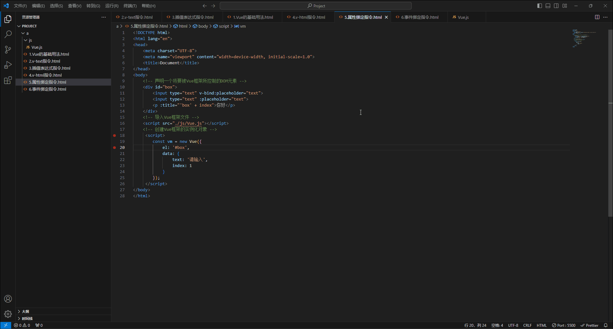
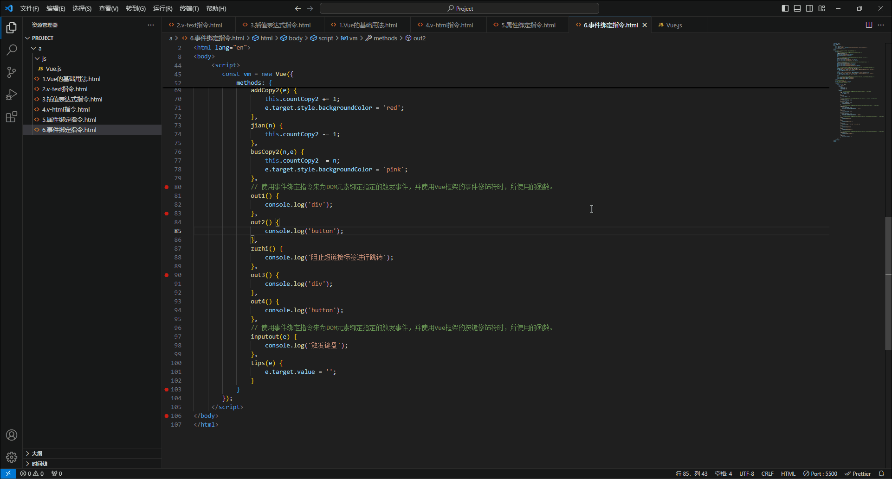
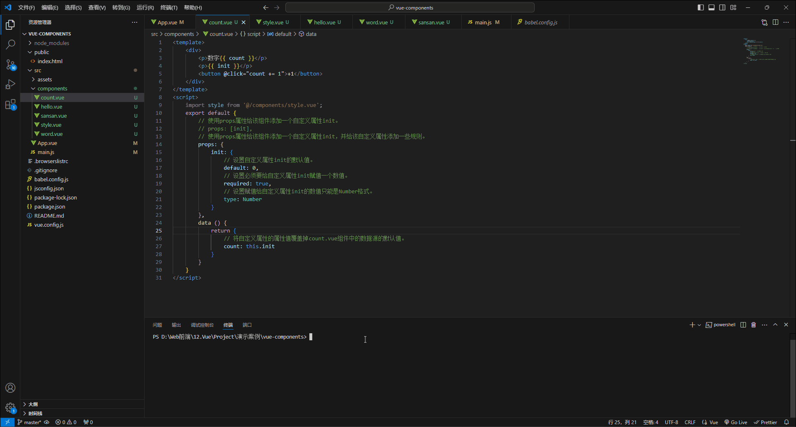
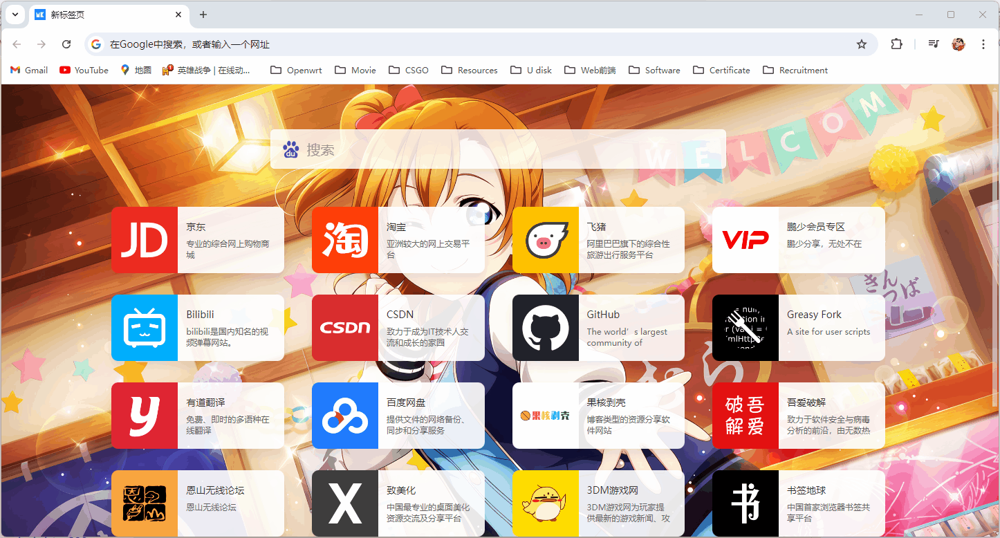
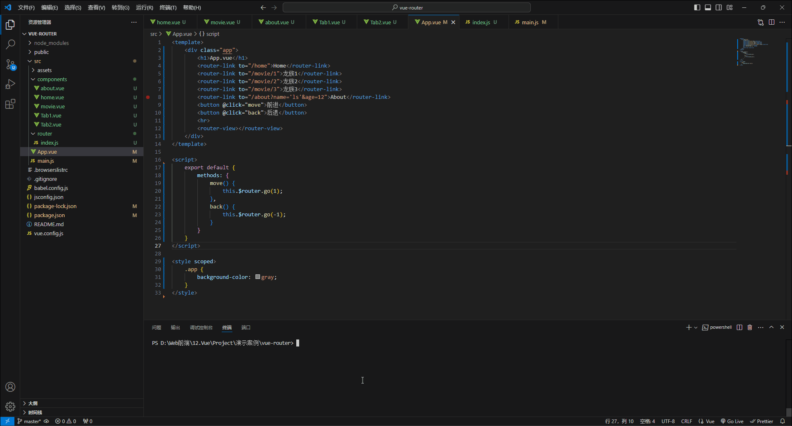

# 1.Vue基础

## 1.1Vue简介

- Vue是一套用于**构建用户界面**的**前端框架**。

  > 注1：构建用户界面就是将服务器发送过来的数据，填充进用户页面中，而Vue框架就是来实现这个过程的。
  >
  > 注2：框架就是一套现成的解决方案，我们只能遵守框架的使用规范，去编写自己的代码，所以学习Vue框架就是学习Vue框架的使用规范，其中就包括Vue的指令、组件、路由、VUEX、Vue组件库等，把这些理解清楚我们就能独自开发自己的Vue项目。

## 1.2Vue的特性

- Vue框架的特性，主要为以下两个方面：

  1. 数据驱动视图：

     - 在使用了Vue框架的用户页面中，Vue框架会监听数据库中的数据，当数据库中的数据发生了变化，Vue框架就会把变化后的数据，重新渲染到用户页面中，这也就是我们说的数据的变化会驱动视图的自动更新，也就是数据驱动视图。

     - 数据驱动视图的示意图，如下图所示：

       

       > 注：数据驱动视图是单向的数据绑定，如上图所示，只有在数据库中的数据发生了变化后，Vue框架才会把变化后的数据，重新渲染到用户页面中。

     - 数据驱动视图的好处就是我们只需要维护好数据，Vue框架就会自动根据数据重新渲染用户页面。

  2. 双向数据绑定：

     - 在使用了Vue框架的用户页面中，Vue框架会监听用户页面中的form表单中所提交的数据，并将该数据同步给数据库，然后又将同步后的数据，重新渲染到用户页面中，这也就是我们说的双向数据绑定。

     - 双向数据绑定的示意图，如下图所示：

       

     - 双向数据绑定的好处就是我们不再需要手动的操控DOM元素来获取form表单中所提交的数据，并将其同步到数据库中，然后我们也不再需要手动的操作DOM元素来将同步后的数据，重新渲染到用户页面中。

## 1.3Vue的核心原理

- MVVM就是Vue框架实现数据驱动视图和双向数据绑定的核心原理，MVVM指的是**M**odel、**V**iew和**V**iew**M**odel，其中Model指的是使用了Vue框架的用户页面，该页面在渲染时，所依赖的数据源，View指的是使用了Vue框架的用户页面，该页面在渲染时，所使用的DOM结构，ViewModel指的是使用了Vue框架的用户页面，该页面在渲染时，所使用的Vue框架的实例，并且ViewModel还是MVVM的核心，通过上述这些我们可以得知，MVVM会将每个使用了Vue框架的用户页面都分成这三个部分，如下图所示：

  

- MVVM的工作原理：ViewModel作为MVVM的核心，它会将使用了Vue框架的用户页面中所依赖的数据源（Model）和所使用的DOM结构（View）进行连接，当DOM结构（View）中的form表单提交了数据时，ViewModel会监听到该提交的数据，然后将该数据自动同步到数据源（Model）中，并且ViewModel还会将数据源（Model）中，变化了的数据，重新渲染到DOM结构（View）中，如下图所示：

  

## 1.4Vue的基础用法

- Vue框架的基础用法，有以下几个步骤：

  1. 下载Vue框架，如下图所示：

     

  2. 在项目中新建一个HTML文件，如下图所示：

     

  3. 在HTML文件中导入Vue框架，如以下代码所示：

     ```html
     <!DOCTYPE html>
     <html lang="en">
     <head>
         <meta charset="UTF-8">
         <meta name="viewport" content="width=device-width, initial-scale=1.0">
         <title>Document</title>
     </head>
     <body>
         <!-- 导入Vue框架 -->
         <script src="./js/Vue.js"></script>
     </body>
     </html>
     ```

  4. 在HTML文件中声明一个将要被Vue框架所控制的DOM元素，如以下代码所示：

     ```html
     <!DOCTYPE html>
     <html lang="en">
     <head>
         <meta charset="UTF-8">
         <meta name="viewport" content="width=device-width, initial-scale=1.0">
         <title>Document</title>
     </head>
     <body>
         <!-- 声明一个将要被Vue框架所控制的DOM元素 -->
         <div id="box"></div>
         <!-- 导入Vue框架文件 -->
         <script src="./js/Vue.js"></script>
     </body>
     </html>
     ```

  5. 在HTML文件中创建Vue框架的实例化对象，如以下代码所示：

     ```html
     <!DOCTYPE html>
     <html lang="en">
     <head>
         <meta charset="UTF-8">
         <meta name="viewport" content="width=device-width, initial-scale=1.0">
         <title>Document</title>
     </head>
     <body>
         <!-- 声明一个将要被Vue框架所控制的DOM元素 -->
         <div id="box"></div>
         <!-- 导入Vue框架文件 -->
         <script src="./js/Vue.js"></script>
         <!-- 创建Vue框架的实例化对象 -->
          <script>
             const vm = new Vue();
          </script>
     </body>
     </html>
     ```

     > 注：当我们导入Vue框架文件时，就会在window对象中添加一个Vue构造函数，我们可以通过该构造函数来实例化Vue对象。

  6. 往Vue框架的实例化对象中，添加一个对象，并且该对象中包含 `el` 属性和 `data` 属性，如以下代码所示：

     ```html
     <!DOCTYPE html>
     <html lang="en">
     <head>
         <meta charset="UTF-8">
         <meta name="viewport" content="width=device-width, initial-scale=1.0">
         <title>Document</title>
     </head>
     <body>
         <!-- 声明一个将要被Vue框架所控制的DOM元素 -->
         <div id="box"></div>
         <!-- 导入Vue框架文件 -->
         <script src="./js/Vue.js"></script>
         <!-- 创建Vue框架的实例化对象 -->
          <script>
             const vm = new Vue({
                 el: '#box',
                 data: {
                     username: '张三'
                 }
             });
          </script>
     </body>
     </html>
     ```

     > 注1：`el` 属性是固定写法，它用来设置当前Vue框架的实例化对象要控制HTML页面中的哪个DOM元素，如上述代码所示：当前Vue框架的实例化对象vm，它控制了HTML页面中的 `div` 元素。
     >
     > 注2：`el` 属性的属性值是一个选择器，它用来选择，将要被Vue框架的实例化对象所控制的DOM元素。
     >
     > 注3：被Vue框架所控制的DOM元素，其下的所有子元素都会被Vue框架所控制。
     >
     > 注4：当 `el` 属性选择了多个将要被Vue框架的实例化对象所控制的DOM元素时，`el` 属性只会选择第一个将要被Vue框架的实例化对象所控制的DOM元素。
     >
     > 注4：`data` 属性存储的是Vue框架在渲染HTML页面时，所依赖的数据源，它的属性值是个对象，该对象中存储着Vue框架在渲染HTML页面时，所依赖的数据源。

  7. 在Vue框架所控制的DOM元素中添加 `{{}}` 插值表达式来将我们要渲染到HTML页面上的数据填充到DOM元素内部，如以下代码所示：

     ```html
     <!DOCTYPE html>
     <html lang="en">
     <head>
         <meta charset="UTF-8">
         <meta name="viewport" content="width=device-width, initial-scale=1.0">
         <title>Document</title>
     </head>
     <body>
         <!-- 声明一个将要被Vue框架所控制的DOM元素 -->
         <div id="box">{{ username }}</div>
         <!-- 导入Vue框架文件 -->
         <script src="./js/Vue.js"></script>
         <!-- 创建Vue框架的实例化对象 -->
          <script>
             const vm = new Vue({
                 el: '#box',
                 data: {
                     username: '张三'
                 }
             });
          </script>
     </body>
     </html>
     ```

     > 注1：上述代码中，我们使用了插值表达式来将Vue框架在渲染HTML页面时，所依赖的数据源中的 `username` 属性的属性值，填充进了 `div` 元素中。
     >
     > 注2：演示结果，如下图所示：
     >
     > 
     >
     > 注3：上述代码与MVVM的对应关系，如下图所示：
     >
     > 

## 1.5Vue的调试工具

- Vue.js devtools是官方提供的Vue框架的调试工具，它能够方便我们对Vue项目进行调试与开发。

- Vue的调试工具的使用步骤如下：

  1. 在浏览器中安装Vue.js devtools，如下图所示：

     

  2. 配置Vue.js devtools，如下图所示：

     

  3. 使用Vue.js devtools，如下图所示：

     

## 1.6Vue的指令

### 1.6.1指令的概念

- 指令（Directives）是Vue框架为我们提供的模板语法，它可以辅助我们渲染页面的基本结构。
- Vue框架中的指令包含以下六大类：
  - 内容渲染指令。
  - 属性绑定指令。
  - 事件绑定指令。
  - 双向绑定指令。
  - 条件渲染指令。
  - 列表渲染指令。

### 1.6.2内容渲染指令

- 内容渲染指令可以将数据源中的数据渲染到Vue框架所控制的DOM元素的文本内容中。

- 常用的内容渲染指令，有以下三个：

  - `v-text` 指令：

    - `v-text` 指令的使用示例如下：

      ```html
      <!DOCTYPE html>
      <html lang="en">
      <head>
          <meta charset="UTF-8">
          <meta name="viewport" content="width=device-width, initial-scale=1.0">
          <title>Document</title>
      </head>
      <body>
          <!-- 声明一个将要被Vue框架所控制的DOM元素 -->
          <div id="box">
              <p v-text="username"></p>
              <p v-text="username">你好</p>
              <p v-text="text"></p>
              <p v-text="test = '你好'"></p>
          </div>
          <!-- 导入Vue框架文件 -->
          <script src="./js/Vue.js"></script>
          <!-- 创建Vue框架的实例化对象 -->
           <script>
              const vm = new Vue({
                  el: '#box',
                  data: {
                      username: '张三',
                      text: '<h1>pink<h1>',
                      test: ''
                  }
              });
           </script>
      </body>
      </html>
      ```
  
      > 注：演示结果，如下图所示：
      >
      > 

    - `v-text` 指令的特性：
  
      - `v-text` 指令会将DOM元素中原有的文本内容进行覆盖，在示例中我们可以看到DOM元素中原有的文本内容是 `你好`，在使用了 `v-text` 指令后，`v-text` 指令就会将数据源中的数据 `张三`，覆盖掉DOM元素中原有的文本内容。
      - `v-text` 指令只能渲染纯文本的内容，也就是说，如果要渲染的内容中有标签，`v-text` 指令也会将其当成文本进行渲染。
      - `v-text` 指令支持JavaScript语法，也就是说 `v-text` 指令能运行JavaScript语句，并且所有的Vue的指令都支持JavaScript语法，但是只支持简单的JavaScript表达式，不支持复杂的JavaScript语句，如 `if` 语句等。
      - `v-text` 指令是写在标签的内部的。
  
  - `{{}}` 指令：
  
    - `{{}}` 指令是用来解决 `v-text` 指令会将DOM元素中原有的文本内容进行覆盖的问题，`{{}}` 指令又称插值表达式（Mustache）。
  
    - `{{}}` 指令的使用示例如下：
  
      ```html
      <!DOCTYPE html>
      <html lang="en">
      <head>
          <meta charset="UTF-8">
          <meta name="viewport" content="width=device-width, initial-scale=1.0">
          <title>Document</title>
      </head>
      <body>
          <!-- 声明一个将要被Vue框架所控制的DOM元素 -->
          <div id="box">
              <p>{{ username }}</p>
              <p>你好{{ username }}</p>
              <p>{{ text }}</p>
              <p>{{ username }}反转的结果是：{{ username.split('').reverse().join('') }}</p>
          </div>
          <!-- 导入Vue框架文件 -->
          <script src="./js/Vue.js"></script>
          <!-- 创建Vue框架的实例化对象 -->
           <script>
              const vm = new Vue({
                  el: '#box',
                  data: {
                      username: '张三',
                      text: '<h1>pink<h1>'
                  }
              });
           </script>
      </body>
      </html>
      ```
  
      > 注：演示结果，如下图所示：
      >
      > 
  
    - `{{}}` 指令的特性：
  
      - `{{}}` 指令只是内容的占位符，因此它不会覆盖掉DOM元素中原有的文本内容，在示例中我们可以看到DOM元素中原有的文本内容是 `你好`，在使用了 `{{}}` 指令后，`{{}}` 指令并不会覆盖掉DOM元素中原有的文本内容，只是在 `你好` 后面插入了数据源中的数据 `张三`。
      - `{{}}` 指令只能渲染纯文本的内容，也就是说，如果要渲染的内容中有标签，`{{}}` 指令也会将其当成文本进行渲染。
      - `{{}}` 指令支持JavaScript语法，也就是说 `{{}}` 指令能运行JavaScript语句，并且所有的Vue的指令都支持JavaScript语法，但是只支持简单的JavaScript表达式，不支持复杂的JavaScript语句，如 `if` 语句等。
      - `{{}}` 指令只能写在标签里不能写在标签的内部，如：`<div style="{{123}}"></div>` 是错误的。
  
  - `v-html` 指令：
  
    - `v-html` 指令是用来解决 `v-text` 指令和 `{{}}` 指令只能渲染纯文本的内容的问题。
  
    - `v-html` 指令的使用示例如下：
  
      ```html
      <!DOCTYPE html>
      <html lang="en">
      <head>
          <meta charset="UTF-8">
          <meta name="viewport" content="width=device-width, initial-scale=1.0">
          <title>Document</title>
      </head>
      <body>
          <!-- 声明一个将要被Vue框架所控制的DOM元素 -->
          <div id="box">
              <p v-html="username"></p>
              <p v-html="username">你好</p>
              <p v-html="text"></p>
              <p v-html="test = '你好'"></p>
          </div>
          <!-- 导入Vue框架文件 -->
          <script src="./js/Vue.js"></script>
          <!-- 创建Vue框架的实例化对象 -->
           <script>
              const vm = new Vue({
                  el: '#box',
                  data: {
                      username: '张三',
                      text: '<h1>pink<h1>',
                      test: ''
                  }
              });
           </script>
      </body>
      </html>
      ```
    
      > 注：演示结果，如下图所示：
      >
      > 
  
    - `v-html` 指令的特性：
    
      - `v-html` 指令会将DOM元素中原有的文本内容进行覆盖，在示例中我们可以看到DOM元素中原有的文本内容是 `你好`，在使用了 `v-html` 指令后，`v-html` 指令就会将数据源中的数据 `张三`，覆盖掉DOM元素中原有的文本内容。
      - `v-html` 指令不只能渲染纯文本的内容还能将文本中的标签也进行渲染，也就是说，如果要渲染的内容中有标签，`v-html` 指令也会将其当成标签进行渲染。
      - `v-html` 指令支持JavaScript语法，也就是说 `v-html` 指令能运行JavaScript语句，并且所有的Vue的指令都支持JavaScript语法，但是只支持简单的JavaScript表达式，不支持复杂的JavaScript语句，如 `if` 语句等。
      - `v-html` 指令是写在标签的内部的。

### 1.6.3属性绑定指令

- 属性绑定指令 `v-bind:`，它的作用是将数据源中的数据动态绑定到Vue框架所控制的DOM元素的属性的属性值中的。

- `v-bind:` 指令的使用示例如下：

  ```html
  <!DOCTYPE html>
  <html lang="en">
  <head>
      <meta charset="UTF-8">
      <meta name="viewport" content="width=device-width, initial-scale=1.0">
      <title>Document</title>
  </head>
  <body>
      <!-- 声明一个将要被Vue框架所控制的DOM元素 -->
      <div id="box">
          <input type="text" v-bind:placeholder="text">
          <input type="text" :placeholder="text">
          <p :title="'box' + index">你好</p>
      </div>
      <!-- 导入Vue框架文件 -->
      <script src="./js/Vue.js"></script>
      <!-- 创建Vue框架的实例化对象 -->
       <script>
          const vm = new Vue({
              el: '#box',
              data: {
                  text: '请输入',
                  index: 1
              }
          });
       </script>
  </body>
  </html>
  ```

  > 注：演示结果，如下图所示：
  >
  > 

- `v-bind:` 指令的特性：

  - `v-bind:` 指令可以简写成 `:`。
  - `v-bind:` 指令支持JavaScript语法，也就是说 `v-bind:` 指令能运行JavaScript语句，并且所有的Vue的指令都支持JavaScript语法，但是只支持简单的JavaScript表达式，不支持复杂的JavaScript语句，如 `if` 语句等。
  - 如果 `v-bind:` 指令要运行动态拼接的JavaScript语句，并且该语句中有字符串时，则要将字符串用单引号进行包裹，如：`<p :title="'box' + index">你好</p>`。
  - `v-bind:` 指令是写在DOM元素的属性的属性名前的，写在哪个DOM元素的属性的属性名前，就表示将数据源中的数据动态绑定到该属性的属性值中。

### 1.6.4事件绑定指令

- 我们可以通过事件绑定指令 `v-on:事件名称="触发事件时要执行的函数的函数名"`，来为Vue框架所控制的DOM元素添加触发事件。

- 事件绑定指令的使用示例如下：

  ```html
  <!DOCTYPE html>
  <html lang="en">
  <head>
      <meta charset="UTF-8">
      <meta name="viewport" content="width=device-width, initial-scale=1.0">
      <title>Document</title>
  </head>
  <body>
      <!-- 声明一个将要被Vue框架所控制的DOM元素 -->
      <div id="box">
          <!-- 使用事件绑定指令来为DOM元素绑定指定的触发事件 -->
          <p>数字：{{count}}</p>
          <button v-on:click="add">+1</button>
          <button @click="bus">-1</button>
          <hr>
          <!-- 使用事件绑定指令来为DOM元素绑定指定的触发事件，并传递参数 -->
          <p>数字：{{countCopy1}}</p>
          <button v-on:click="addCopy1(2)">+2</button>
          <button v-on:click="busCopy1(2,3)">-2</button>
          <hr>
          <!-- 使用事件绑定指令来为DOM元素绑定指定的触发事件，并获取事件对象 -->
          <p>数字：{{countCopy2}}</p>
          <button v-on:click="addCopy2">+1</button>
          <button v-on:click="jian(1)">-1</button>
          <button v-on:click="busCopy2(1,$event)">-1</button>
          <hr>
          <!-- 使用事件绑定指令来为DOM元素绑定指定的触发事件，并使用Vue框架的事件修饰符 -->
          <a href="https://www.baidu.com/">跳转到百度</a>
          <div @click="out1" style="width: 100px;height: 100px;background-color: yellow;">
              <button @click="out2">按钮</button>
          </div>
          <a href="https://www.baidu.com/" @click.prevent="zuzhi">跳转到百度</a>
          <div @click="out3" style="width: 100px;height: 100px;background-color: black;">
              <button @click.stop="out4">按钮</button>
          </div>
          <hr>
          <!-- 使用事件绑定指令来为DOM元素绑定指定的触发事件，并使用Vue框架的按键修饰符 -->
          <input type="text" @keyup="inputout">
          <input type="text" @keyup.esc="tips">
      </div>
      <!-- 导入Vue框架文件 -->
      <script src="./js/Vue.js"></script>
      <!-- 创建Vue框架的实例化对象 -->
       <script>
          const vm = new Vue({
              el: '#box',
              data: {
                  count: 0,
                  countCopy1: 0,
                  countCopy2: 0,
              },
              methods: {
                  // 使用事件绑定指令来为DOM元素绑定指定的触发事件时，所使用的函数。
                  add: function () {
                      vm.count += 1;
                  },
                  bus() {
                      this.count -= 1;
                  },
                  // 使用事件绑定指令来为DOM元素绑定指定的触发事件，并传递参数时，所使用的函数。
                  addCopy1(n) {
                      this.countCopy1 += n;
                  },
                  busCopy1(n,num) {
                      this.countCopy1 -= n;
                      console.log(num);
                  },
                  // 使用事件绑定指令来为DOM元素绑定指定的触发事件，并获取事件对象时，所使用的函数。
                  addCopy2(e) {
                      this.countCopy2 += 1;
                      e.target.style.backgroundColor = 'red';
                  },
                  jian(n) {
                      this.countCopy2 -= 1;
                  },
                  busCopy2(n,e) {
                      this.countCopy2 -= n;
                      e.target.style.backgroundColor = 'pink';
                  },
                  // 使用事件绑定指令来为DOM元素绑定指定的触发事件，并使用Vue框架的事件修饰符时，所使用的函数。
                  out1() {
                      console.log('div');
                  },
                  out2() {
                      console.log('button');
                  },
                  zuzhi() {
                      console.log('阻止超链接标签进行跳转');
                  },
                  out3() {
                      console.log('div');
                  },
                  out4() {
                      console.log('button');
                  },
                  // 使用事件绑定指令来为DOM元素绑定指定的触发事件，并使用Vue框架的按键修饰符时，所使用的函数。
                  inputout(e) {
                      console.log('触发键盘');
                  },
                  tips(e) {
                      e.target.value = '';
                  }
              }
          });
       </script>
  </body>
  </html>
  ```

  > 注：演示结果，如下图所示：
  >
  > 

- 事件绑定指令的特性：

  - `v-on:事件名称="触发事件时要执行的函数的函数名"` 指令可以简写成 `@事件名称="触发事件时要执行的函数的函数名"`。
  - 我们可以通过事件绑定指令中的 `事件名称` 来为DOM元素绑定指定的触发事件，如：`<button v-on:click="add">+1</button>` 就是给 `button` 标签绑定鼠标点击事件，当事件触发时，就执行 `add` 函数。
  - 事件绑定指令还需要搭配事件触发后，要执行的函数，该函数是写在Vue框架的实例对象中的 `methods` 属性中的，并且该函数还可以由 `add: function () {vm.count += 1;}` 形式，简写成 `add() {vm.count += 1;}` 形式，我们推荐简写的形式。

  - Vue框架的实例对象中是有数据源属性的，我们可以使用该属性来修改数据源中的数据，如：`add() {vm.count += 1;}` 就是当调用 `add` 函数时，就会将数据源中的 `count` 属性的属性值加一， 并且因为 `add` 函数是写在Vue框架的实例对象中的 `methods` 属性中的，所以我们可以在 `add` 函数中，使用 `this` 关键字来指向Vue框架的实例对象，这样我们就可以将 `add() {vm.count += 1;}` 修改成 `add() {this.count += 1;}`。

  - 我们可以在事件绑定指令中的触发事件时要执行的函数的函数名的后面添加一个 `()` 来传递一个或多个实参给触发事件时要执行的函数。

  - 当我们在使用事件绑定指令时，如果没有实参要传递给触发事件时要执行的函数，那么该函数的第一个形参中存储的就是事件对象，如：`addCopy2(e) {this.countCopy2 += 1;e.target.style.backgroundColor = 'red';}`，当调用 `addCopy2` 函数时，我们就可以在该函数的形参中获得事件对象，然后我们还可以通过该事件对象中的 `target` 属性来获取是哪个DOM元素触发了该函数的该DOM元素的DOM对象，这样我们就可以通过该DOM对象来修改该DOM元素的样式。

  - 当我们在使用事件绑定指令时，如果有实参要传递给触发事件时要执行的函数，那么该函数的形参就不会存储事件对象，除非传递的实参是 `$event`，那么该函数的形参就会存储事件对象。

  - 我们可以在事件绑定指令中的 `事件名称` 的后面添加 `.事件修饰符` 来帮助我们更方便的对事件的触发进行控制，如：`<a href="https://www.baidu.com/" @click.prevent="zuzhi">跳转到百度</a>`，当我们鼠标点击这个 `a` 链接时，是不会进行跳转的，因为我们使用了 `prevent` 事件修饰符，这个事件修饰符的实现效果就和我们之前在WebAPIs中使用的事件对象中的 `preventDefault()` 方法的效果是一样的，它们都是会阻止DOM元素的默认行为的。

    > 注1：事件修饰符是Vue框架提供的概念，它只有在Vue框架中才有。
    >
    > 注2：常用的事件修饰符，如下所示：
    >
    > | 事件修饰符 | 作用                                                         |
    > | ---------- | ------------------------------------------------------------ |
    > | `prevent`  | 阻止DOM元素的默认行为，如：阻止 `a` 链接的跳转               |
    > | `stop`     | 阻止DOM元素的事件流的冒泡                                    |
    > | `capture`  | 以捕获模式来触发，当前DOM元素，触发事件时要执行的函数        |
    > | `once`     | DOM元素绑定的触发事件只能触发一次                            |
    > | `self`     | 只有在DOM元素的事件对象中的 `target` 属性中是该DOM元素的DOM对象时，才能触发，触发事件时要执行的函数 |

  - 我们可以在事件绑定指令中的 `事件名称` 的后面添加 `.按键修饰符` 来设置用户只能在按下了某个按键时，才能触发键盘事件，如：`<input type="text" @keyup.esc="tips">`，当用户按下键盘中的 `Esc` 按键时，才能触发，触发事件时要执行的函数。

    > 注：按键修饰符是Vue框架提供的概念，它只有在Vue框架中才有。

### 1.6.5双向绑定指令

- 我们可以通过双向绑定指令 `v-model="数据源中的数据"`，来让我们在不用操作DOM元素的前提下，获取到用户输入的数据，并将该数据更新到数据源中，然后将更新后的数据，重新渲染到HTML页面中。

- 双向绑定指令的使用示例如下：

  ```html
  <!DOCTYPE html>
  <html lang="en">
  <head>
      <meta charset="UTF-8">
      <meta name="viewport" content="width=device-width, initial-scale=1.0">
      <title>Document</title>
  </head>
  <body>
      <!-- 声明一个将要被Vue框架所控制的DOM元素 -->
      <div id="box">
          <!-- 使用双向绑定指令 -->
          <div>{{ username }}</div>
          <input type="text" v-model="username">
          <div>下列表所选的城市：{{ city }}</div>
          <select v-model="city">
              <option value="">请选择你的城市</option>
              <option value="北京">北京</option>
              <option value="上海">上海</option>
              <option value="广州">广州</option>
              <option value="深圳">深圳</option>
          </select>
          <hr>
          <!-- 双向绑定指令和属性绑定指令的区别 -->
          <div>{{ usernameCopy1 }}</div>
          <input type="text" v-model="usernameCopy1">
          <input type="text" :value="usernameCopy1">
          <hr>
          <!-- 双向绑定指令只能用在表单类标签中 -->
          <div style="width: 100px; height: 100px; background-color: yellow;" v-model="usernameCopy2"></div>
          <hr>
          <!-- 双向绑定指令的number修饰符 -->
          <input type="text" v-model="usernameCopy3">
          <input type="text" v-model.number="usernameCopy3">
          <hr>
          <!-- 双向绑定指令的trim修饰符 -->
          <input type="text" v-model="usernameCopy4">
          <input type="text" v-model.trim="usernameCopy4">
          <hr>
          <!-- 双向绑定指令的lazy修饰符 -->
          <input type="text" v-model="usernameCopy5">
          <input type="text" v-model.lazy="usernameCopy5">
      <!-- 导入Vue框架文件 -->
      <script src="./js/Vue.js"></script>
      <!-- 创建Vue框架的实例化对象 -->
       <script>
          const vm = new Vue({
              el: '#box',
              data: {
                  username: '李四',
                  city: '',
                  usernameCopy1: '李四',
                  usernameCopy2: '李四',
                  usernameCopy3: '李四',
                  usernameCopy4: '李四',
                  usernameCopy5: '李四'
              }
          });
       </script>
  </body>
  </html>
  ```

  > 注：演示结果，如下图所示：
  >
  > 

- 双向绑定指令的特性：

  - 双向绑定指令是写在标签的内部的。

  - 双向绑定指令不仅可以获取到用户输入的数据，并将该数据更新到数据源中，还可以将更新后的数据，重新渲染到HTML页面中，这就是我们在Vue的特性中提到的双向数据绑定，而属性绑定指令只能将数据源中的数据渲染到HTML页面中，并不能获取到用户输入的数据，并将该数据更新到数据源中，所以这就是我们在Vue的特性中提到的数据驱动视图。

  - 双向绑定指令只能用在表单类标签中，如：`input` 标签、`textarea` 标签、`select` 标签等。

  - 双向绑定指令默认是将用户输入的数据当成字符串类型进行存储的。

  - 双向绑定指令默认是不会过滤掉用户输入的数据中的所有的空格的。

  - 双向绑定指令默认是在用户输入的数据发生了变化时，才会运行的。

  - 我们可以在双向绑定指令中的 `数据源中的数据` 的后面添加 `.双向绑定数据修饰符` 来帮助我们更方便的对用户输入的数据进行控制，如：`<input type="text" v-model.number="usernameCopy3">`，双向绑定指令会将用户输入的数字转换为数字类型进行存储。

    > 注1：常用的双向绑定数据修饰符，如下所示：
    >
    > | 双向绑定数据修饰符 | 作用                                           |
    > | ------------------ | ---------------------------------------------- |
    > | `number`           | 将用户输入的数字转换为数字类型进行存储         |
    > | `trim`             | 过滤掉用户输入的数据中的首尾的空格             |
    > | `lazy`             | 当表单类元素失去了焦点时，才会运行双向绑定指令 |
    >
    > 注2：`number` 双向绑定数据修饰符只有在用户输入的数据是纯数字时，才会将用户输入的数据转换成数字类型进行存储，否则就会将用户输入的数据当成字符串类型进行存储，如下图所示：
    >
    > 
    >
    > 注3：`trim` 双向绑定数据修饰符会过滤掉用户输入的数据中的首尾的空格，但是如果用户输入的数据中夹着空格，那么该空格是不会被过滤掉的，如下图所示：
    >
    > 
    >
    > 注4：`lazy` 双向绑定数据修饰符只有在使用了该双向绑定数据修饰符的DOM元素失去了焦点时，才会运行双向绑定指令，如下图所示：
    >
    > 

### 1.6.6条件渲染指令

- 条件渲染指令可以通过判断条件来控制DOM元素的显示和隐藏。

- 常用的内容渲染指令，有以下两个：

  - `v-show` 指令：

    - `v-show` 指令的使用示例如下：

      ```html
      <!DOCTYPE html>
      <html lang="en">
      <head>
          <meta charset="UTF-8">
          <meta name="viewport" content="width=device-width, initial-scale=1.0">
          <title>Document</title>
      </head>
      <body>
          <!-- 声明一个将要被Vue框架所控制的DOM元素 -->
          <div id="box">
              <p v-show="flag">v-show指令</p>
          </div>
          <!-- 导入Vue框架文件 -->
          <script src="./js/Vue.js"></script>
          <!-- 创建Vue框架的实例化对象 -->
           <script>
              const vm = new Vue({
                  el: '#box',
                  data: {
                      flag: true
                  }
              });
           </script>
      </body>
      </html>
      ```

      > 注：演示结果，如下图所示：
      >
      > 

    - `v-show` 指令的特性：

      - `v-show` 指令是写在标签的内部的。
      - `v-show` 指令的原理是动态为DOM元素添加或移除 `display: none` 样式，从而来实现DOM元素的显示和隐藏的。
      - `v-show` 指令适合用在需要频繁的切换DOM元素的显示状态。

  - `v-if` 指令：

    - `v-if` 指令的使用示例如下：

      ```html
      <!DOCTYPE html>
      <html lang="en">
      <head>
          <meta charset="UTF-8">
          <meta name="viewport" content="width=device-width, initial-scale=1.0">
          <title>Document</title>
      </head>
      <body>
          <!-- 声明一个将要被Vue框架所控制的DOM元素 -->
          <div id="box">
              <!-- v-if指令 -->
              <p v-if="flag">v-if指令</p>
              <!-- v-if指令和v-else指令 -->
              <P v-if="num > 2">大于2</P>
              <P v-else>小于2</P>
              <!-- v-if指令和v-else-if指令和v-else指令 -->
              <P v-if="cj === 'A'">优秀</P>
              <P v-else-if="cj === 'B'">良好</P>
              <P v-else>差劲</P>
          </div>
          <!-- 导入Vue框架文件 -->
          <script src="./js/Vue.js"></script>
          <!-- 创建Vue框架的实例化对象 -->
           <script>
              const vm = new Vue({
                  el: '#box',
                  data: {
                      flag: true,
                      num: 1,
                      cj: 'A'
                  }
              });
           </script>
      </body>
      </html>
      ```

      > 注：演示结果，如下图所示：
      >
      > 

    - `v-if` 指令的特性：
      - `v-if` 指令是写在标签的内部的。
      - `v-if` 指令的原理是动态添加或移除DOM元素，从而来实现DOM元素的显示和隐藏的。
      - `v-if` 指令适合用在刚进入HTML页面时，某些DOM元素默认不需要被显示，而且后期该DOM元素很可能也不需要被显示出来。
      - `v-if` 指令还可以搭配 `v-else` 指令来使用，它们的用法和我们在JavaScript中学到的 `if···else···` 语句的用法是一样的，只是 `v-if` 指令是用来显示或隐藏DOM元素的。
      - `v-if` 指令还可以搭配 `v-else-if` 指令和 `v-else` 指令来使用，它们的用法和我们在JavaScript中学到的 `if···else if···else···` 语句的用法是一样的，只是 `v-if` 指令是用来显示或隐藏DOM元素的。
      - `v-else-if` 指令和 `v-else` 指令必须搭配 `v-if` 指令一起使用，否则会报错。

### 1.6.7列表渲染指令

- 列表渲染指令 `v-for="item in items"` 能帮助我们基于一个数组来循环渲染出一整个列表结构。

  > 注1：列表渲染指令中的 `items` 表示的是将要被循环的数组的数组名。
  >
  > 注2：列表渲染指令中的 `item` 存储的是每次循环时，从将要被循环的数组中获取到的每一项数据，并且因为列表渲染指令中的 `item` 是形参，所以我们可以将其更改成自己想要的名字。

- 列表渲染指令的使用示例如下：

  ```html
  <!DOCTYPE html>
  <html lang="en">
  <head>
      <meta charset="UTF-8">
      <meta name="viewport" content="width=device-width, initial-scale=1.0">
      <title>Document</title>
  </head>
  <body>
      <!-- 声明一个将要被Vue框架所控制的DOM元素 -->
      <div id="box">
          <!-- 使用v-for指令 -->
          <table>
              <thead>
                  <th>id</th>
                  <th>名称</th>
              </thead>
              <tbody>
                  <tr v-for="userdata in list">
                      <td>{{ userdata.id }}</td>
                      <td>{{ userdata.username }}</td>
                  </tr>
              </tbody>
          </table>
          <hr>
          <!-- 使用v-for指令获取item存储的每一项数据在将要被循环的数组中的索引号 -->
          <table>
              <thead>
                  <th>索引</th>
                  <th>名称</th>
                  <th>id</th>
              </thead>
              <tbody>
                  <tr v-for="(userdata,index) in list" :title="'索引' + index">
                      <td>{{ index }}</td>
                      <td>{{ userdata.id }}</td>
                      <td>{{ userdata.username }}</td>
                  </tr>
              </tbody>
          </table>
          <hr>
          <!-- v-for指令的官方推荐写法 -->
          <table>
              <thead>
                  <th>索引</th>
                  <th>名称</th>
                  <th>id</th>
              </thead>
              <tbody>
                  <tr v-for="(userdata,index) in list" :key="userdata.id">
                      <td>{{ index }}</td>
                      <td>{{ userdata.id }}</td>
                      <td>{{ userdata.username }}</td>
                  </tr>
              </tbody>
          </table>
      </div>
      <!-- 导入Vue框架文件 -->
      <script src="./js/Vue.js"></script>
      <!-- 创建Vue框架的实例化对象 -->
       <script>
          const vm = new Vue({
              el: '#box',
              data: {
                  list: [
                      {id: 1, username: '张三'},
                      {id: 2, username: '李四'},
                      {id: 3, username: '王五'}
                  ]
              }
          });
       </script>
  </body>
  </html>
  ```

  > 注：演示结果，如下图所示：
  >
  > 

- 列表渲染指令的特性：

  - 列表渲染指令是写在标签的内部的。

  - 我们要循环渲染哪个DOM元素就将列表渲染指令写在该DOM元素的内部，并且列表渲染指令还会将该DOM元素中的子元素也一起循环渲染。

  - 列表渲染指令还有一个可选的参数，该参数是用来获取列表渲染指令中 `item` 存储的每一项数据在将要被循环的数组中的索引号的，该参数的使用方法为 `v-for="（item,index) in items"`，其中的 `index` 就表示该参数，并且该参数在列表渲染指令中也是形参，所以我们可以将其更改成自己想要的名字。

  - 列表渲染指令中的 `item` 存储的数据，不仅能在使用了列表渲染指令的DOM元素中使用，而且该DOM元素下的子元素也能使用。

  - Vue官方推荐在使用了列表渲染指令的DOM元素中，还要再使用属性绑定指令，绑定一个 `key` 属性，并且该属性的属性值要具有唯一性，如：`<tr v-for="(userdata,index) in list" :key="userdata.id"></tr>`。

    > 注1：为什么要在使用了列表渲染指令的DOM元素中，再使用属性绑定指令，绑定一个 `key` 属性，这是因为当列表的数据发生了变化时，默认情况下Vue框架会尽可能的复用已存在的DOM元素，从而提升渲染的性能，但这种默认的性能优化策略，会导致有状态的列表无法被正确更新，所以为了给Vue框架一个提示，以便它能跟踪每个节点的身份，从而在保证有状态的列表被正确更新的前提下，提升渲染的性能，此时就需要为列表中的每一项提供一个唯一的 `key` 属性。
    >
    > 注2：在使用了列表渲染指令的DOM元素中，还要再使用属性绑定指令，绑定一个 `key` 属性，并且该属性的属性值要遵守以下规则：
    >
    > - 该属性的属性值只能是字符串类型或数字类型。
    > - 该属性的属性值必须具有唯一性，否则终端会显示错误信息 `Duplicate keys detected`，因此建议把数据项中的 `id` 属性作为该属性的属性值，因为 `id` 属性具有唯一性。
    > - 不建议把数据项在数据项数组中的索引号当做该属性的属性值，如：` <tr v-for="(userdata,index) in list" :key="index">`，这样的做法是毫无意义的，因为数据项在数据项数组中的索引号，并不是和数据项强绑定的，比如数据项1在数据项数组中的索引号为0，当我们往数据项数组的头部填数据时，数据项1在数据项数组中的索引号就为1了。

### 1.6.8列表案例

- 列表案例的代码如下：

  ```html
  <!DOCTYPE html>
  <html lang="en">
  <head>
      <meta charset="UTF-8">
      <meta name="viewport" content="width=device-width, initial-scale=1.0">
      <title>列表案例</title>
  </head>
  <body>
      <!-- 卡片区域 -->
      <div id="app">
          <!-- 使用v-on指令绑定点击事件 -->
          <form action="" @submit.prevent="add">
              <!-- 添加区域 -->
              <input type="text" placeholder="请输入品牌名称" v-model.trim="brand">
              <button type="submit">添加</button>
              <!-- 表格区域 -->
              <table>
                  <thead>
                      <tr>
                          <td>id</td>
                          <td>品牌</td>
                          <td>状态</td>
                          <td>创建时间</td>
                          <td>操作</td>
                      </tr>
                  </thead>
                  <tbody>
                      <!-- 使用v-for指令循环渲染列表数据 -->
                      <tr v-for="item in list" :key="item.id">
                          <td>{{ item.id }}</td>
                          <td>{{ item.name }}</td>
                          <td>
                              <!-- 使用v-model指令双向绑定数据 -->
                              <input type="checkbox" :id="'ckbox' + item.id" v-model="item.status">
                              <!-- 使用v-if指令和v-else指令来按需渲染想要的内容 -->
                              <label :for="'ckbox' + item.id" v-if="item.status">已启用</label>
                              <label :for="'ckbox' + item.id" v-else>已禁用</label>
                          </td>
                          <td>{{ item.time }}</td>
                          <td>
                              <!-- 使用v-on指令绑定点击事件 -->
                              <a href="javascript:;" @click="remove(item.id)">删除</a>
                          </td>
                      </tr>
                  </tbody>
              </table>
          </form>
      </div>
      <script src="./js/Vue.js"></script>
      <script>
          const vm = new Vue({
              el: '#app',
              data: {
                  // 我们使用brand属性暂存用户想要添加的品牌名称。
                  brand: '',
                  // 我们使用nextId属性存储下一个可用的id。
                  nextId: 3,
                  list: [
                      {
                          id: 1,
                          name: '奥迪',
                          status: true,
                          time: new Date()
                      },
                      {
                          id: 2,
                          name: '奔驰',
                          status: false,
                          time: new Date()
                      }
                  ]
              },
              methods: {
                  // 当用户点击删除按钮时，触发remove函数，从而删除数据。
                  remove(id) {
                      this.list = this.list.filter((item) => {
                          return item.id !== id;
                      });
                  },
                  // 当用户点击添加按钮时，触发add函数，从而添加数据。
                  add() {
                      // 如果用户输入的品牌名称为空，要提醒用户。
                      if (this.brand === '') return alert('必须填写品牌名称');
                      // 需要存储的用户输入的品牌的数据。
                      const obj = {
                          id: this.nextId,
                          name: this.brand,
                          status: true,
                          time: new Date()
                      }
                      // 将用户输入的品牌的数据存储在list属性中的数组中。
                      this.list.push(obj);
                      // 将用户输入的品牌的数据存储完后，需要将brand属性清空。
                      this.brand = '';
                      // 将用户输入的品牌的数据存储完后，需要将nextId属性中的属性值自增。
                      this.nextId++;
                  }
              },
          });
      </script>
  </body>
  </html>
  ```

  > 注1：演示结果，如下图所示：
  >
  > 
  >
  > 注2：因为 `form` 表单标签有默认的提交事件，所以我们需要使用事件修饰符来阻止这种默认提交事件，如：` <form action="" @submit.prevent="add">`。
  >
  > 注3：要使用 `label` 标签拓展复选框的点击范围时，要注意每个复选框和其相对应的 `label` 标签，所使用的ID不能重复，否则用户点击后面的复选框都是在点击第一个复选框。
  >
  > 注4：数组有一个 `filter()` 方法，该方法是用于过滤掉数组中一些不符合要求的数据的，该方法的括号内要添加一个回调函数，该函数是用于过滤掉数组中一些不符合要求的数据的，`filter()` 方法会将数组中的每一项都循环传递给该函数的形参，然后我们就可以通过该形参处理数组中的每一项数据，从而过滤掉数组中一些不符合要求的数据，并且该函数还会自动将过滤好的数据返回给数组，`filter()` 方法和我们后面学的Vue的过滤器相似。
  >
  > 注5：我们可以将上述案例代码中的 `this.list = this.list.filter((item) => {return item.id !== id;});` 简写成 `this.list = this.list.filter(item => item.id !== id);`。

## 1.7Vue的过滤器

- Vue的过滤器（Filters）常用于处理文本，它可以过滤掉文本中我们不需要的文本。

- Vue的过滤器的使用示例如下：

  ```html
  <!DOCTYPE html>
  <html lang="en">
  <head>
      <meta charset="UTF-8">
      <meta name="viewport" content="width=device-width, initial-scale=1.0">
      <title>Document</title>
  </head>
  <body>
      <div id="app">
          <!-- 使用管道符来使用Vue的过滤器 -->
          <p>{{ str1 | headArt }}</p>
          <!-- 使用全局过滤器 -->
          <p>{{ str2 | delet}}</p>
          <!-- 使用私有过滤器 -->
          <p>{{ str3 | del}}</p>
          <!-- 使用多个过滤器 -->
          <p>{{ str1 | delet | headArt }}</p>
          <!-- 传递参数给过滤器 -->
          <p>{{ str1 | add(1) }}</p>
      </div>
      <div id="app1">
          <!-- 使用全局过滤器 -->
          <p>{{ str1 | delet}}</p>
      </div>
      <script src="./js/Vue.js"></script>
      <script>
          // 全局过滤器。
          Vue.filter('delet',(msg) => {
              return msg.slice(3);
          });
          Vue.filter('del',(msg) => {
              return msg.slice(1);
          });
          const vm = new Vue({
              el: '#app',
              data: {
                  str1: 'hellow Word',
                  str2: 'friend',
                  str3: 'family'
              },
              // 私有过滤器。
              filters: {
                  headArt(msg) {
                      return msg.charAt(0).toUpperCase() + msg.slice(1);
                  },
                  del(msg) {
                      return msg.slice(4);
                  },
                  add(msg,num) {
                      return msg + num;
                  }
              }
          });
          const vm1 = new Vue({
              el: '#app1',
              data: {
                  str1: 'hellow Word'
              },
              // 私有过滤器。
              filters: {
                  headArt(msg) {
                      return msg.charAt(0).toUpperCase() + msg.slice(1);
                  }
              }
          });
      </script>
  </body>
  </html>
  ```

  > 注1：演示结果，如下图所示：
  >
  > 
  >
  > 注2：字符串的 `toUpperCase` 方法的作用是将字符串中的小写字母改成大写字母。

- Vue的过滤器的特性：

  - 我们使用管道符 `|` 来使用Vue的过滤器，如：`<p>{{ str1 | headArt }}</p>`。

  - 管道符只能用在 `{{}}` 指令和 `v-bind` 指令中。

  - Vue的过滤器本质上来说就是一个函数，当我们使用管道符来使用Vue的过滤器时，Vue框架就会将管道符前面的待处理的数据，传递给管道符后面的函数中的第一个形参中，我们称这个函数为Vue的过滤器，也称过滤器函数，然后我们可以通过使用该函数的第一个形参来处理管道符前面的待处理的数据，然后Vue框架会将处理好的数据返回给管道符前面的待处理的数据，这样管道符前面的待处理的数据就变成了处理好的数据，如：`<p>{{ str1 | headArt }}</p>`，Vue框架会将管道符前面的 `str1` 中的数据，传递给管道符后面的 `headArt` 函数中的第一个形参中，当该函数处理好 `str1` 中的数据时，Vue框架就会将处理好的数据返回给 `str1`。

  - 因为Vue的过滤器本质上来说就是一个函数，所以我们可以传递多个参数给过滤器函数，但是要注意过滤器函数的第一个形参，永远都是管道符前面的待处理的数据，如：`<p>{{ str1 | add(1) }}</p>`，过滤器函数的第一个形参是 `str1` 中的数据，过滤器函数的第二个形参开始，才是我们传递的参数 `1`。

  - Vue的过滤器分为私有过滤器和全局过滤器，它们的区分如下：

    - 私有过滤器：

      - 私有过滤器是将过滤器函数写在Vue框架的实例对象中的 `filters` 属性中的，它的作用范围只限于该Vue框架的实例对象所控制的DOM元素中，如果想在其它Vue框架的实例对象中使用该过滤器函数，那么就需要将该过滤器函数设置成全局过滤器。

    - 全局过滤器：

      - 全局过滤器是将过滤器函数写在 `Vue.filter()` 方法中的，它的作用范围是全局的，也就是可以在多个不同的Vue框架的实例对象中使用该过滤器函数。

        > 注：`Vue.filter()` 方法的括号中有两个参数，第一个参数是过滤器函数的函数名，第二个参数就是过滤器函数，如：`Vue.filter('delet',(msg) => {return msg.slice(3);});`。

  - 如果在Vue框架的实例对象中有一个和全局过滤器相同名称的私有过滤器，那么在使用时就会按照就近原则使用Vue框架的实例对象中的私有过滤器。

  - 在过滤器函数中一定要有 `return` 值，如：`del(msg) {return msg.slice(4);}`。

  - Vue的过滤器可以使用多个，如：`<p>{{ str1 | delet | headArt }}</p>`，Vue框架会将 `str1` 中的数据交给 `delet` 函数进行处理，当该函数处理完后，又会将处理结果交给 `headArt` 函数进行处理，然后Vue框架就会将最后的处理结果返回给 `str1`。

  - Vue的过滤器只在Vue2.x和Vue1.x中支持，在Vue3.x中是不支持Vue的过滤器的，在Vue3.x中官方建议使用计算属性或方法来代替Vue的过滤器。

## 1.8Vue的侦听器

- Vue的侦听器可以监听Vue框架的实例对象中的 `data` 属性中的数据的变化，从而针对数据的变化做特定的操作。

- Vue的侦听器的使用示例如下：

  ```html
  <!DOCTYPE html>
  <html lang="en">
  <head>
      <meta charset="UTF-8">
      <meta name="viewport" content="width=device-width, initial-scale=1.0">
      <title>Document</title>
  </head>
  <body>
      <div id="app">
          <input type="text" v-model="str">
          <input type="text" v-model="str1">
          <input type="text" v-model="info.username">
          <input type="text" v-model="info.password">
      </div>
      <script src="./js/Vue.js"></script>
      <script>
          const vm = new Vue({
              el: '#app',
              data: {
                  str: '',
                  str1: '',
                  info: {
                      username: '',
                      password: ''
                  }
              },
              watch: {
                  // 监听该Vue框架的实例对象中的data属性中的str属性中的属性值是否发生了变化，并使用方法格式的Vue的侦听器。
                  str(newval,oldval) {
                      console.log(newval,oldval);
                  },
                  // 监听该Vue框架的实例对象中的data属性中的str1属性中的属性值是否发生了变化，并使用对象格式的Vue的侦听器。
                  str1: {
                      handler(newval,oldval) {
                          console.log(1,newval,oldval);
                      },
                      // 使用Vue的侦听器的immediate选项。
                      immediate: true
                  },
                  info: {
                      handler(newval) {
                          console.log(newval);
                      },
                      // 使用Vue的侦听器的deep选项。
                      deep: true
                  },
                  // 监听该Vue框架的实例对象中的data属性中的info属性中的对象中的password属性的属性值是否发生了变化，并使用对象格式的Vue的侦听器。
                  'info.password'(newval,oldval) {
                      console.log(newval,oldval);
                  }
              }
          });
      </script>
  </body>
  </html>
  str1: {handler(newval,oldval) {console.log(1,newval,oldval);},immediate: true}
  ```

  > 注：演示结果，如下图所示：
  >
  > 

- Vue的侦听器的特性：

  - 当我们要监听Vue框架的实例对象中的 `data` 属性中的某个属性的属性值的变化时，我们可以将该属性的属性名当成方法名写在该Vue框架的实例对象中的 `watch` 属性中，我们称这个方法为Vue的侦听器，也称侦听器函数，然后我们就可以监听到该属性的属性值的变化了，当该属性的属性值发生了变化，就会触发该Vue框架的实例对象中的 `watch` 属性中的与其相对应的方法，如：`str(newval,oldval) {console.log(newval,oldval);}`，当Vue框架的实例对象中的 `data` 属性中的 `str` 属性的属性值发生了变化时，就会触发该Vue框架的实例对象中的 `watch` 属性中的 `str` 方法。

  - Vue的侦听器本质上就是一个函数，所以侦听器函数中有两个形参，当侦听器函数被触发时，第一个形参存放的是监听的属性的属性值发生了变化后的数据，第二个形参存放的是监听的属性的属性值发生变化前的数据，如：`str(newval,oldval) {console.log(newval,oldval);}`，如果Vue框架的实例对象中的 `data` 属性中的 `str` 属性的属性值为 `1`，当该属性的属性值变成 `2` 时，就会触发该Vue框架的实例对象中的 `watch` 属性中的 `str` 方法，并且该方法中的 `newval` 形参存放的是 `2`，`oldval` 形参存放的是 `1`。

  - Vue的侦听器有两种写法，分别是方法格式的Vue的侦听器和对象格式的Vue的侦听器。

    > 注1：方法格式的Vue的侦听器，如：`str(newval,oldval) {console.log(newval,oldval);}`，它的书写形式是一个方法形式。
    >
    > 注2：对象格式的Vue的侦听器，如：`str: {handler(newval,oldval) {console.log(newval,oldval);}}`，它的书写形式是一个对象形式，并且要注意过滤器函数的名称必须是 `handler`。

  - 方法格式的Vue的侦听器默认是在监听的属性的属性值发生了变化时，才会被触发，如果我们想在加载页面完后就触发一次，那么就需要开启 `immediate` 选项，而 `immediate` 选项在方法格式的Vue的侦听器中是开启不了的，要在对象格式的Vue的侦听器中开启，如：`str1: {handler(newval,oldval) {console.log(1,newval,oldval);},immediate: true}`。

  - 如果我们使用方法格式的Vue的侦听器，去监听一个属性，并且该属性的属性值是一个对象时，那么该侦听器是监听不到该属性的属性值的变化的，如果想要监听该属性的属性值的变化，那么就需要使用对象格式的Vue的侦听器，并且要开启 `deep` 选项，如：`info: {handler(newval) {console.log(newval);},deep: true}`，这样当该属性中的对象中的任意一个属性的属性值发生了变化时，都会触发侦听器函数，并且因为监听的属性的属性值是一个对象，所以侦听器函数的第一个形参和第二个形参都存储的是该对象在堆中的地址，所以它们都是一样的，我们只需要用一个形参就好了。

  - 如果一个属性的属性值是一个对象，我们只想监听该对象中的某个属性的属性值的变化时，我们可以使用方法格式的Vue的侦听器来进行监听，并且因为我们监听的属性是一个对象中的某个属性，所以当我们将要监听的属性的属性名作为方法名时，要用单引号进行包裹，如：`'info.password'(newval,oldval) {console.log(newval,oldval);}`，这样我们就可以监听到 `info` 对象下 `password` 属性的属性值的变化了。

## 1.9Vue的计算属性

- Vue的计算属性可以用来减少代码的复用。

- Vue的计算属性的使用示例如下：

  ```html
  <!DOCTYPE html>
  <html lang="en">
  <head>
      <meta charset="UTF-8">
      <meta name="viewport" content="width=device-width, initial-scale=1.0">
      <title>Document</title>
  </head>
  <body>
      <div id="app">
          R:<input type="text" v-model="r"><br>
          G:<input type="text" v-model="g"><br>
          B:<input type="text" v-model="b">
          <div :style="'width: 100px; height: 100px; background-color:' + rgb">{{ rgb }}</div>
          <button @click="output">输出</button>
      </div>
      <script src="./js/Vue.js"></script>
      <script>
          const vm = new Vue({
              el: '#app',
              data: {
                  r: 0,
                  g: 0,
                  b: 0,
              },
              methods: {
                  output() {
                      console.log(this.rgb);
                  }
              },
              computed: {
                  rgb() {
                      return `rgb(${this.r},${this.g},${this.b})`;
                  }
              }
          });
      </script>
  </body>
  </html>
  ```

  > 注：演示结果，如下图所示：
  >
  > 

- Vue的计算属性的特性：

  - Vue的计算属性本质上是一个属性，但是它在声明的时候却是一个方法，并且要声明在Vue框架的实例对象中的 `computed` 属性中，我们称这个方法为Vue的计算属性，也称计算属性，我们可以在该计算属性中处理数据，当我们声明完了该计算属性时，该计算属性就会将它处理好的数据存储在一个属性中，并且该属性的属性名就是该计算属性的方法名，并且还会将其挂载在Vue框架的实例对象中，这样就可以方便我们调用，这也是为什么Vue的计算属性本质上是一个属性。
  - Vue的计算属性在声明时，一定要有 `return` 值，如：rgb() {return \`rgb(${this.r},${this.g},${this.b})`;}。
  - 当计算属性中的所依赖的数据发生了变化时，计算属性就会重新运行，然后将最新的处理好的数据覆盖掉之前的旧数据。
  - 在Vue3.x中，官方建议我们使用Vue的计算属性来代替Vue的过滤器。

# 2.Vue-CLI

## 2.1Vue-CLI简介

- Vue-CLI是Vue项目开发的标准工具，它简化了程序员基于Webpack创建工程化的Vue项目的过程，这个工具可以让程序员专注在撰写应用上，而不必花好几天去纠结Webpack配置的问题。

  > 注1：Vue-CLI官网网址为：https://cli.vuejs.org/zh/。
  >
  > 注2：我们之前创建的案例项目都为单页面应用程序，单页面应用程序（Single Page Application），简称SPA，它指的是一个Web网站中只有唯一的一个HTML页面，并且所有的功能与交互都在这唯一的一个HTML页面内完成，当我们需要发布这个项目时，需要使用Webpack进行打包处理，然后将打包处理好的文件上传到服务器中，从而进行项目发布，这里我们需要手动配置Webpack，这会很麻烦，而Vue项目，它也是一个单页面应用程序，它也需要使用Webpack来将项目进行打包处理，然后将打包好的文件上传到服务器中，从而实现项目发布，但是无需我们手动配置Webpack，因为Vue官方开发出了Vue-CLI，Vue-CLI是Vue项目开发的标准工具，它简化了程序员基于Webpack创建工程化的Vue项目的过程，它可以让我们专注在撰写应用上，而无需操心Webpack的配置问题。
  >
  > 注3：单页面应用程序的项目目录，如下图所示：
  >
  > 

## 2.2Vue-CLI的使用

- Vue-CLI的使用步骤如下：

  1. 因为Vue-CLI是npm上的一个全局包，所以我们可以在终端中使用 `npm install -g @vue/cli` 命令，来安装Vue-CLI，如下图所示：

     

  2. 我们可以在终端中使用 `vue -V` 来查看我们所安装的Vue-CLI的版本号，如下图所示：

     

     > 注：我们能查看到Vue-CLI的版本号，就证明Vue-CLI安装好了。

  3. 我们可以在终端中使用 `vue create 项目的名称` 命令，来快速创建一个工程化的Vue项目，如下图所示：

     

     > 注1：在那个目录下使用终端执行 `vue create 项目的名称` 命令，就表示要在该目录下快速创建一个工程化的Vue项目，如上图中，就是要在 `D:\Web前端\12.Vue\Project\演示案例` 目录中快速创建一个工程化的Vue项目。
     >
     > 注2：项目的名称要是英文并且不能有空格。

  4. 当我们在终端中使用了 `vue create 项目的名称` 命令，来快速创建一个工程化的Vue项目后，会显示一个选择预设窗口，如下图所示：

     

     > 注：我们可以通过选择预设窗口来快速创建一个工程化的Vue项目，如：如果我们选择了上图中的 `Default ([Vue 3] babel, eslint)` 选项时，就会快速创建一个工程化的Vue项目，并且该项目使用的Vue框架的版本是Vue3.x，并且该项目中还安装了babel插件和eslint插件。

  5. 当我们选择 `Manually select features` 选项，来自己配置一个预设时，会显示一个配置预设窗口，如下图所示：

     

     > 注：我们现阶段的项目只需要Babel插件和CSS Pre-processors，所以我们只需要选择这两个选项即可，如下图所示：
     >
     > 

  6. 当我们选择完我们项目所需的功能后，按下键盘的回车键，会显示一个选择Vue框架的版本的窗口，如下图所示：

     

     > 注：我们现阶段的项目需要使用Vue2.x版本的Vue框架，所以我们选择2.x选项即可，如下图所示：
     >
     > 

  7. 当我们选择完我们项目所需的Vue框架的版本后，按下键盘的回车键，会显示一个选择CSS编译器的窗口，如下图所示：

     

     > 注1：因为我们在第五步中为项目选择了CSS Pre-processors选项，所以在选择完项目所需的Vue框架的版本后，就会显示一个选择CSS编译器的窗口，让我们为项目选择哪个CSS编译器。
     >
     > 注2：因为我们之前学过Less编译器，所以我们选择Less选项，如下图所示：
     >
     > 

  8. 当我们选择完我们项目所需的CSS编译器后，按下键盘的回车键，会显示一个选择窗口，该窗口是用于选择是否将第三方插件的配置项保存在npm包管理工具的配置文件中，如下图所示：

     

     > 注：在这个选择窗口中，我们默认选择In dedicated config files选项，将项目安装的第三方插件的配置项单独存储在第三方插件自己的配置文件中，如下图所示：
     >
     > 

  9. 当我们选择完是否将第三方插件的配置项保存在npm包管理工具的配置文件中后，按下键盘的回车键，会显示一个选择窗口，该窗口是用于选择是否将我们配置好的预设进行保存，如下图所示：

     

     > 注1：在这个选择窗口中我们输入y来保存我们配置好的预设，如下图所示：
     >
     > 
     >
     > 注2：保存我们配置好的预设后，以后如果再想使用我们上面所设置的这些配置，来快速创建一个工程化的Vue项目时，就可以在第四步选择预设窗口中来选择我们已经保存好的预设，来快速创建一个工程化的Vue项目。
     >
     > 注3：如果在这个选择窗口中我们输入n，不保存我们配置好的预设，并且按下键盘的回车键时，就会根据我们现在配置的预设，快速创建一个工程化的Vue项目，但是因为我们没有保存我们配置好的预设，所以以后如果再想使用我们上面所设置的这些配置，就还需要重复上面的操作。

  10. 当我们选择完是否将我们配置好的预设进行保存后，按下键盘的回车键，会显示一个窗口，该窗口是用于设置我们保存的预设的名称，如下图所示：

      

      > 注1：当我们选择要保存我们配置好的预设后，我们需要设置该预设的名称，如下图所示：
      >
      > 
      >
      > 注2：在上图中，我将我们保存好的预设的名称设置成了YS-ONE。
      >
      > 注3：为什么，当我们选择要保存我们配置好的预设后，还需要设置该预设的名称，这是因为设置名称方便我们在第四步中的选择预设窗口中能快速选择我们配置好的预设，来快速创建一个工程化的Vue项目。

  11. 当我们设置好我们保存的预设的名称后，按下键盘的回车键，就可以根据我们配置好的预设，来快速创建一个工程化的Vue项目了，如下图所示：

      

      > 注1：当我们快速创建了一个工程化的Vue项目时，Vue-CLI会有运行提示，如下图所示：
      >
      > 
      >
      > 注2：当我们运行了上图中的运行提示后，就会运行我们创建好的Vue项目，如下图所示：
      >
      > 
      >
      > 注3：如上图所示，我们发现当运行我们创建好的Vue项目，并且查看我们项目显示的效果时会有一个默认界面，该默认界面如下图所示：
      >
      > 
      >
      > 注4：上图中显示的默认界面，是Vue-CLI在我们快速创建一个工程化的Vue项目时，就添加进去的一个页面，我们可以通过删除项目中的一些代码和文件来删除这个页面，具体操作可以查看Vue项目的目录结构。

# 3.Vue项目的目录结构及运行流程

## 3.1Vue项目的目录结构

- 当我们使用Vue-CLI快速创建了一个工程化的Vue项目后，该项目的目录结构，如下图所示：

  

- 下列是上图中的目录结构的解释：

  - 当我们在Vue-CLI的使用步骤中的第八步的时候选择了In dedicated config files选项后，就会将Vue项目所安装的第三方插件的配置项存储在第三方插件自己的配置文件中，而这些配置文件就存放在Vue项目的根目录中，如下图所示：

    

  - node_modules文件夹是用来存放所有已安装到Vue项目中的包的。

  - package.json文件和package-lock.json文件是npm包管理工具的配置文件。

  - public文件夹中存放着两个文件，分别是index.html文件和favicon.ico文件，如下图所示：

    

    > 注1：上图中的favicon.ico文件是Vue-CLI在我们快速创建一个工程化的Vue项目时，添加了一个默认页面，该默认页面所需要使用的一个文件，该文件可删除。
    >
    > 注2：上图中的index.html文件是Vue项目中唯一一个的HTML文件，所以这也是为什么说Vue项目是单页面应用程序，并且这个文件不能删除。

  - src文件夹中存放着多个文件和多个文件夹，如下图所示：

    

    > 注1：上图中的assets文件夹是用来存放Vue项目中所用到的静态资源文件，如：CSS样式表，图片等，并且该文件夹中存放着一张logo.png图片，如下图所示：
    >
    > 
    >
    > > 注：上图中的logo.png图片是Vue-CLI在我们快速创建一个工程化的Vue项目时，添加了一个默认页面，该默认页面所需要使用的一个图片，该图片可删除。
    >
    > 注2：上图中的components文件夹是用于存放程序员封装的、可复用的Vue组件，并且该文件夹中存放着一个HelloWorld.vue组件，如下图所示：
    >
    > 
    >
    > > 注：上图中的HelloWorld.vue组件是Vue-CLI在我们快速创建一个工程化的Vue项目时，添加了一个默认页面，该默认页面所需要使用的一个组件，该组件可删除。
    >
    > 注4：上图中的App.vue文件是Vue项目的根组件，我们在components文件夹中存储的组件如果需要使用，那么就需要将要使用的组件导入进该文件中，因此该文件也可称为组件的入口文件，并且该文件不能删除，但是该文件中的代码是可以删除的，因为这些代码都是Vue-CLI在我们快速创建一个工程化的Vue项目时，添加了一个默认页面，该默认页面所需要使用的代码。
    >
    > 注5：上图中的main.js文件是整个Vue项目的入口文件，因为Vue项目也是使用Webpack来对项目进行打包发布的，所以该文件也相当于Webpack打包项目开始时的入口文件，并且该文件不能删除。

## 3.2Vue项目的运行流程

- Vue项目的运行流程是非常单纯的，该项目在运行时要做的事情就是通过main.js文件把App.vue文件渲染到public文件夹中的index.html文件中的指定区域中，具体的运行流程可以看下面的示例。

- Vue项目的运行流程的示例，如下所示：

  - 我们先使用Vue-CLI来快速创建一个工程化的Vue项目，如下图所示：

     

  - 因为我们在使用Vue-CLI快速创建一个工程化的Vue项目时，Vue-CLI会添加进去一个默认页面，我们需要将该默认页面所需的文件、组件、代码进行删除，如下图所示：

     

  - 往该Vue项目的根组件App.vue中添加如下代码：

     ```vue
     <template>
       <div>
         <h3>Hello Vue</h3>
       </div>
     </template>
     ```

     > 注：`<template>` 节点的介绍请看后面的Vue组件的组成部分。

  - public文件夹中的index.html文件中的代码，如下所示：

     ```html
     <!DOCTYPE html>
     <html lang="">
       <head>
         <meta charset="utf-8">
         <meta http-equiv="X-UA-Compatible" content="IE=edge">
         <meta name="viewport" content="width=device-width,initial-scale=1.0">
         <link rel="icon" href="<%= BASE_URL %>favicon.ico">
         <title><%= htmlWebpackPlugin.options.title %></title>
       </head>
       <body>
         <noscript>
           <strong>We're sorry but <%= htmlWebpackPlugin.options.title %> doesn't work properly without JavaScript enabled. Please enable it to continue.</strong>
         </noscript>
         <div id="app"></div>
         <!-- built files will be auto injected -->
       </body>
     </html>
     ```
  
     > 注：上面代码是我们在使用Vue-CLI快速创建一个工程化的Vue项目时，Vue-CLI自动帮我们添加进去的。
  
  - main.js文件中的代码，如下所示：
  
     ```javascript
     // 导入Vue包，获得Vue框架的构造函数。
     import Vue from 'vue'
     // 导入Vue项目中的根组件。
     import App from './App.vue'
     
     Vue.config.productionTip = false
     
     // 创建一个Vue框架的实例对象。
     new Vue({
       // 指定将哪个组件渲染到HTML文件中所指定的区域中。
       render: h => h(App),
     }).$mount('#app') // 指定组件将渲染到HTML文件中的哪个区域中。
     ```
  
     > 注1：上面代码是我们在使用Vue-CLI快速创建一个工程化的Vue项目时，Vue-CLI自动帮我们添加进去的。
     >
     > 注2：`render` 属性是指定将哪个组件渲染到HTML文件中所指定的区域中的，它的属性值是一个匿名函数 `h => h()`，当我们想要将某个组件渲染到HTML文件中所指定的区域中时，只需要将组件导入进 `()` 中即可，如：`h => h(App)`，而且 `h => h()` 匿名函数中的 `h` 是可以更改的，如：我们可以将 `h => h()` 匿名函数改成 `a => a()`，并且使用 `render` 属性指定将哪个组件渲染到HTML文件中所指定的区域中时，那么该组件就会变成Vue项目的根组件，如上面的代码所示就是将App.vue组件变成了Vue项目的根组件。
     >
     > 注3：Vue框架的实例对象中的 `$mount()` 方法的作用类似于 `el` 属性的作用，它们都是用来设置当前Vue框架的实例化对象要控制HTML页面中的哪个DOM元素，`$mount()` 方法中的 `()` 内的参数是一个选择器，该选择器用来选择，将要被Vue框架的实例化对象所控制的DOM元素，如：`$mount('#app')` 就是让Vue框架的实例化对象控制HTML页面中id值为 `app` 的DOM元素，当我们使用 `$mount()` 方法控制了HTML页面中的某一个DOM元素时，`render` 属性就会将指定的组件进行渲染并且将渲染的结果覆盖掉该DOM元素。
  
  - 该Vue项目的运行结果，如下图所示：
  
    
  
  - 该Vue项目的具体运行流程，如下所示：
  
    1. 当我们运行该Vue项目时，因为main.js文件是该Vue项目的入口文件，所以Webpack会根据该文件来进行打包处理，并且该文件中导入了一个Vue包和该Vue项目的根组件，所以Webpack会将它们一起打包，并且如果该Vue项目的根组件中也导入了components文件夹中存储的组件时，Webpack也会将这些导入的组件一起进行打包，当Webpack打包处理完毕后，Webpack就会将生成的文件自动注入到public文件夹中的index.html文件中的 `<head>` 标签中，如下图所示：
  
       
  
    2. 因为当Webpack打包处理完毕后，Webpack就会将生成的文件自动注入到public文件夹中的index.html文件中的 `<head>` 标签中，所以main.js文件中的Vue框架的实例对象中的 `$mount('#app')` 方法所控制的DOM元素就是index.html文件中的 `<div id="app"></div>`，并且main.js文件中的Vue框架的实例对象中的 `render` 属性会将指定的组件进行渲染并将渲染的结果覆盖掉 `<div id="app"></div>`，如下图所示：
  
       
  
  - 从上面两步中我们可以了解到，Vue项目的运行流程是非常单纯的，该项目在运行时要做的事情就是通过main.js文件把App.vue文件渲染到public文件夹中的index.html文件中的指定区域中。

# 4.Vue组件

## 4.1Vue组件简介

- 我们可以将一些重复使用的UI结构或方法进行封装，封装完毕后我们会将其称之为组件，我们可以在项目中通过使用组件来重复使用组件中的UI结构或方法，这样可以方便我们对项目进行开发和维护，而通过组件来对项目进行开发和维护，我们也称之为组件化开发，并且Vue框架是支持组件化开发的，在Vue项目中Vue组件的后缀名为 `.vue`，也就是说在Vue项目中所有以 `.vue` 为后缀的文件都为Vue组件，并且我们只需要在该文件中写上要复用的UI结构或方法，即可对其完成封装。

## 4.2Vue组件的三个组成部分

- 每个Vue组件都由以下三个部分组成：

  - `<template>` 容器标签：

    - Vue框架规定每个Vue组件都必须要有 `<template>` 容器标签，并且每个Vue组件都要将要复用的DOM结构都写在该容器标签中。

    - `<template>` 容器标签的使用示例如下：

      ```vue
      <template>
        <div>Vue项目中的App.vue组件</div>
      </template>
      ```

      > 注：演示结果，如下所示：
      >
      > 

    - `<template>` 容器标签的特性如下：

      - `<template>` 容器标签只是Vue框架提供的一个容器标签，它只起到包裹性的作用，它并不会被渲染成真正的DOM元素。
      - `<template>` 容器标签中只能包含一个唯一的根节点，如：`<template><div>你好</div></template>`，如果包含两个根节点就会报错，如：`<template><div>你好</div><div>Hello</div></template>`。

  - `<script>` 标签：

    - Vue框架规定每个Vue组件都要将要复用的JavaScript业务逻辑都写在 `<script>` 标签中，该标签在Vue组件中可有可无，但是如果有要复用的JavaScript业务逻辑，那么就必须使用该标签。

    - `<script>` 标签的使用示例如下：

      ```vue
      <template>
        <div @click="add">
          Vue项目中的App.vue组件--{{ count }}--
        </div>
      </template>
      <script>
        // 固定写法。
        export default {
          // 使用Vue组件的实例对象来使用Vue框架时，data属性必须是个函数，不能是个属性。
          data () {
            // 在return出去的对象中定义数据源。
            return {
              count: 0
            }
          },
          methods: {
            add () {
              // 使用Vue组件的实例对象来使用Vue框架时，this就表示当前Vue组件的实例对象。
              this.count += 1
            }
          }
        }
      </script>
      ```

      > 注：演示结果，如下图所示：
      >
      > 

    - `<script>` 标签的特性：`<script>` 标签要写在 `<template>` 容器标签的下面。

    - 注意点：

      - 在每个Vue组件中，都有一个Vue组件的实例对象，该对象的作用和Vue框架的实例对象的作用差不多，都是用来使用Vue框架的，它们的区别在于使用Vue组件的实例对象来使用Vue框架时，Vue框架的使用范围只限在Vue组件中，并且我们在使用Vue组件的实例对象来使用Vue框架时，需要使用默认导出 `export default` 来向外导出一个对象，这样Vue框架就会将我们默认导出的对象添加到Vue组件的实例对象中，然后我们就可以通过往该对象中添加 `data` 属性等，从而来使用Vue框架，这就像我们之前使用Vue框架的实例对象来使用Vue框架时，要向Vue框架的实例对象中添加一个对象，并且该对象中要包含 `data` 属性等。
      
      - 当我们使用Vue组件的实例对象来使用Vue框架时，我们无需使用 `el` 属性来控制 `<template>` 容器标签中的某个DOM元素，这是因为当我们使用Vue组件的实例对象来使用Vue框架时，`el` 属性默认控制的是 `<template>` 容器标签中的根节点。
      - 当我们使用Vue组件的实例对象来使用Vue框架时，`data` 属性必须是个函数，不能是个属性，并且该函数中要返回一个对象，我们可以在该对象中来定义数据源，为什么 `data` 属性必须是个函数还要返回一个对象，这是因为如果 `data` 属性是一个属性时，那么当有多个Vue组件的实例对象时，这些Vue组件的实例对象都是使用同一个 `data` 属性，这样会导致数据混乱，因此 `data` 属性必须是个函数，并且该函数中要返回一个对象，这样就相当于给每个Vue组件的实例对象，复制一个专属于自己的 `data` 属性。
      - 当我们使用Vue组件的实例对象来使用Vue框架时，除了 `data` 属性必须是个函数，其它属性还是按照之前所学的方法来使用，如：过滤器、侦听器、计算属性等。
      
  
  - `<style>` 标签：
  
    - Vue框架规定每个Vue组件都要将要复用的CSS样式都写在 `<style>` 标签中，该标签在Vue组件中可有可无，但是如果有要复用的CSS样式，那么就必须使用该标签。
  
    - `<style>` 标签的使用示例如下：
  
      ```vue
      <template>
        <div @click="add" class="father">
          Vue项目中的App.vue组件--{{ count }}--
          <div class="son">123</div>
        </div>
      </template>
      <script>
        // 固定写法。
        export default {
          // 使用Vue组件的实例对象来使用Vue框架时，data属性必须是个函数，不能是个属性。
          data () {
            // 在return出去的对象中定义数据源。
            return {
              count: 0
            }
          },
          methods: {
            add () {
              // 使用Vue组件的实例对象来使用Vue框架时，this就表示当前Vue组件的实例对象。
              this.count += 1
            }
          }
        }
      </script>
      <style lang="less">
        .father {
          background-color: pink;
          width: 800px;
          height: 300px;
          .son {
            width: 50px;
            background-color: yellow;
          }
        }
      </style>
      ```
    
      > 注：演示结果，如下图所示：
      >
      > 
  
    - `<style>` 标签的特性如下：
    
      - 我们可以在 `<style>` 标签内部使用 `lang` 属性，并将其属性值设置成 `less`，这样我们就可以在 `<style>` 标签中使用CSS编译器Less，如果不在 `<style>` 标签内部使用 `lang` 属性，那就 `lang` 属性的默认值就为 `css`，这样我们就可以在 `<style>` 标签中使用CSS语法。
      - `<style>` 标签要写在 `<script>` 标签的下面。

## 4.3Vue组件之间的关系

- 当我们在Vue项目中，封装好了多个Vue组件时，它们这些组件之间是相互独立的，不会存在父子关系，示意图如下所示：

  

- 当我们在Vue项目中，封装好了多个Vue组件时，如果我们在某个组件之中使用了多个另外的组件，那么这些组件之间就会根据彼此的嵌套关系来形成父子关系或兄弟关系，示意图如下所示：

  

  > 注：上图表示的是在App组件中使用了Left组件和Right组件，这导致了App组件成为了Left组件和Right组件的父组件，Left组件和Right组件成为了App组件的子组件，Left组件成为了Right组件的兄弟组件，Right组件成为了Left组件的兄弟组件。

## 4.4Vue组件的使用

- Vue组件的使用步骤如下：

  1. 如果我们想在某个组件中使用另外的组件，那么我们就先要将需要的组件导入进该组件中，如以下代码所示：

     ```vue
     <template>
       <div @click="add" class="father">
         Vue项目中的App.vue组件--{{ count }}--
         <div class="son">123</div>
       </div>
     </template>
     <script>
       // 导入当前Vue组件所需要的组件。
       import hello from '@/components/hello.vue';
       import word from '@/components/word.vue';
       // 固定写法。
       export default {
         // 使用Vue组件的实例对象来使用Vue框架时，data属性必须是个函数，不能是个属性。
         data () {
           // 在return出去的对象中定义数据源。
           return {
             count: 0
           }
         },
         methods: {
           add () {
             // 使用Vue组件的实例对象来使用Vue框架时，this就表示当前Vue组件的实例对象。
             this.count += 1
           }
         }
       }
     </script>
     <style lang="less">
       .father {
         position: relative;
         background-color: pink;
         width: 800px;
         height: 300px;
         .son {
           width: 50px;
           background-color: yellow;
         }
       }
     </style>
     ```
  
     > 注1：hello.vue组件中的代码，如下所示：
     >
     > ```vue
     > <template>
     >     <div id="one">hello</div>
     > </template>
     > <style>
     >     #one {
     >         position: absolute;
     >         top: 110px;
     >         left: 0px;
     >         width: 350px;
     >         height: 150px;
     >         background-color: red;
     >     }
     > </style>
     > ```
     >
     > 注2：word.vue组件中的代码，如下所示：
     >
     > ```vue
     > <template>
     >     <div id="two">word</div>
     > </template>
     > <style>
     >     #two {
     >         position: absolute;
     >         top: 110px;
     >         right: 0;
     >         width: 350px;
     >         height: 150px;
     >         background-color: gray;
     >     }
     > </style>
     > ```
     >
     > 注3：上述代码中的 `@` 的使用就是我们之前所学的Webpack的 `@`，它表示当前Vue项目的src文件夹目录。
  
  2. 当我们将需要的组件导入进该组件中时，我们可以使用该组件的 `components` 属性，来将导入的组件注册为该组件的私有子组件，如以下代码所示：
  
     ```vue
     <template>
       <div @click="add" class="father">
         Vue项目中的App.vue组件--{{ count }}--
         <div class="son">123</div>
       </div>
     </template>
     <script>
       // 导入当前Vue组件所需要的组件。
       import hello from '@/components/hello.vue';
       import word from '@/components/word.vue';
       // 固定写法。
       export default {
         // 使用Vue组件的实例对象来使用Vue框架时，data属性必须是个函数，不能是个属性。
         data () {
           // 在return出去的对象中定义数据源。
           return {
             count: 0
           }
         },
         methods: {
           add () {
             // 使用Vue组件的实例对象来使用Vue框架时，this就表示当前Vue组件的实例对象。
             this.count += 1
           }
         },
         // 将导入的组件注册成当前Vue组件的私有子组件。
         components: {
           hello: hello,
           word
         }
       }
     </script>
     <style lang="less">
       .father {
         position: relative;
         background-color: pink;
         width: 800px;
         height: 300px;
         .son {
           width: 50px;
           background-color: yellow;
         }
       }
     </style>
     ```
  
     > 注1：当对象中的属性名和属性值一样时，我们可以使用简写，如：`{word}` 等价于 `{word: word}`。
     >
     > 注2：当我们使用该组件的 `components` 属性，来将导入的组件注册为该组件的私有子组件时，导入的组件在其它组件中是使用不了的，这是因为在其它的组件中并没有将导入的组件进行导入并注册成其它组件中的私有子组件。
  
  3. 当我们将导入的组件注册为该组件的私有子组件时，我们可以在该组件的 `<template>` 容器标签中，以标签的形式来使用导入的组件，如以下代码所示：
  
     ```vue
     <template>
       <div @click="add" class="father">
         Vue项目中的App.vue组件--{{ count }}--
         <div class="son">123</div>
         <!-- 在当前Vue组件中使用其它的组件 -->
         <hello></hello>
         <word></word>
       </div>
     </template>
     <script>
       // 导入当前Vue组件所需要的组件。
       import hello from '@/components/hello.vue';
       import word from '@/components/word.vue';
       // 固定写法。
       export default {
         // 使用Vue组件的实例对象来使用Vue框架时，data属性必须是个函数，不能是个属性。
         data () {
           // 在return出去的对象中定义数据源。
           return {
             count: 0
           }
         },
         methods: {
           add () {
             // 使用Vue组件的实例对象来使用Vue框架时，this就表示当前Vue组件的实例对象。
             this.count += 1
           }
         },
         // 将导入的组件注册成当前Vue组件的私有子组件。
         components: {
           hello: hello,
           word
         }
       }
     </script>
     <style lang="less">
       .father {
         position: relative;
         background-color: pink;
         width: 800px;
         height: 300px;
         .son {
           width: 50px;
           background-color: yellow;
         }
       }
     </style>
     ```
     
     > 注：演示结果，如下所示：
     >
     > 
     >

## 4.5Vue组件的全局注册

- 从Vue组件的使用中，我们得知在某个组件中导入另外的组件，并将导入的组件注册成该组件的私有子组件时，导入的组件在其它组件中是使用不了的，只能在该组件中使用，如果想在其它组件中使用，那么就需要将导入的组件导入进其它组件中，并将其注册成其它组件的私有子组件，当有多个其它组件想使用导入的组件时，这会非常的麻烦，为了解决这麻烦，我们可以将导入的组件注册成全局组件，这样其它多个组件想使用导入的组件时，会很方便。

- Vue组件的全局注册的步骤如下：

  1. 在Vue项目的入口文件main.js中，导入要将其注册成全局组件的组件，如以下代码所示：

     ```javascript
     import Vue from 'vue'
     import App from './App.vue'
     // 导入要将其注册成全局组件的组件。
     import sansan from '@/components/sansan.vue';
     
     Vue.config.productionTip = false
     
     new Vue({
       render: h => h(App),
     }).$mount('#app')
     ```

     > 注：sansan.vue组件中的代码，如下所示：
     >
     > ```vue
     > <template>
     >     <div id="three">sansan</div>
     > </template>
     > <style>
     >     #three {
     >         position: absolute;
     >         bottom: 0;
     >         left: 0;
     >         width: 800px;
     >         height: 30px;
     >         background-color: purple;
     >     }
     > </style>
     > ```

  2. 使用 `Vue.component()` 方法，将导入的组件注册成全局组件，如以下代码所示：

     ```javascript
     import Vue from 'vue'
     import App from './App.vue'
     // 导入要将其注册成全局组件的组件。
     import sansan from '@/components/sansan.vue';
     // 使用Vue.component()方法，将导入的组件注册成全局组件。
     Vue.component('Mysansan',sansan);
     
     Vue.config.productionTip = false
     
     new Vue({
       render: h => h(App),
     }).$mount('#app')
     ```

     > 注1：`Vue.component()` 方法中的 `()` 内的第一个参数是设置将导入的组件注册成全局组件后，该全局组件的名称，第二个参数是设置要将哪个导入的组件注册成全局组件。
     >
     > 注2：全局组件的名称开头第一个字母一般为大写。

  3. 当我们将导入的组件注册成全局组件时，我们可以在其它组件中的 `<template>` 容器标签中，以标签的形式来使用该全局组件，如以下代码所示：

     ```vue
     <template>
       <div @click="add" class="father">
         Vue项目中的App.vue组件--{{ count }}--
         <div class="son">123</div>
         <!-- 在当前Vue组件中使用其它的组件 -->
         <hello></hello>
         <word></word>
         <!-- 在当前Vue组件中使用全局组件 -->
         <Mysansan></Mysansan>
       </div>
     </template>
     <script>
       // 导入当前Vue组件所需要的组件。
       import hello from '@/components/hello.vue';
       import word from '@/components/word.vue';
       // 固定写法。
       export default {
         // 使用Vue组件的实例对象来使用Vue框架时，data属性必须是个函数，不能是个属性。
         data () {
           // 在return出去的对象中定义数据源。
           return {
             count: 0
           }
         },
         methods: {
           add () {
             // 使用Vue组件的实例对象来使用Vue框架时，this就表示当前Vue组件的实例对象。
             this.count += 1
           }
         },
         // 将导入的组件注册成当前Vue组件的私有子组件。
         components: {
           hello: hello,
           word
         }
       }
     </script>
     <style lang="less">
       .father {
         position: relative;
         background-color: pink;
         width: 800px;
         height: 300px;
         .son {
           width: 50px;
           background-color: yellow;
         }
       }
     </style>
     ```

     > 注：演示结果，如下图所示：
     >
     > 

## 4.6Vue组件的自定义属性

- 当我们多次复用同一个组件时，该组件的每次使用都是相互独立的，它们之间不会互相干扰，这是因为我们每次使用该组件时，该组件都会被复制一份，给使用的对象，所以每个使用对象使用的都是该组件的独立副本，所以当我们在某个使用对象中操作该组件时，其它使用对象中的该组件不会发生改变，但是有一点要注意那就是因为我们每次使用该组件时，该组件都会被复制一份，给使用的对象，所以每个使用对象中的该组件中的数据源的默认值都是相同的，这会导致该组件的复用性大大降低，如下图所示：

  

  > 注1：count.vue组件中的代码，如下所示：
  >
  > ```vue
  > <template>
  >     <div>
  >         <p>数字{{ count }}</p>
  >         <button @click="count += 1">+1</button>
  >     </div>
  > </template>
  > <script>
  >     export default {
  >         data () {
  >             return {
  >                 count: 5
  >             }
  >         }
  >     }
  > </script>
  > ```
  >
  > 注2：我们将count.vue组件注册成了全局组件，这样我们就能很方便的在hello.vue组件和word.vue组件中使用count.vue组件。

- 为了提高组件的复用性，Vue框架提供了一个 `props` 属性，我们可以通过该属性来给组件添加一个自定义属性，然后当我们在使用对象中使用该组件时，我们可以通过给该组件的自定义属性进行赋值，然后将该组件中的自定义属性的属性值覆盖掉该组件中的数据源的默认值，这样我们就能通过自定义属性来修改该组件中的数据源的默认值，并且如果有多个使用对象都使用了该组件时，会因为每个使用对象使用的都是该组件的独立副本，所以我们可以通过单独给这些独立副本的自定义属性赋不同的数值，来让每个使用对象中的该组件中的数据源的默认值都不一样。

- 使用 `props` 属性来提高组件的复用性的步骤如下：

  1. 在组件中使用 `props` 属性来给该组件添加一个自定义属性 `init`，并让该组件的自定义属性的属性值覆盖掉该组件中的数据源的默认值，如以下代码所示：

     ```vue
     <template>
         <div>
             <p>数字{{ count }}</p>
             <p>{{ init }}</p>
             <button @click="count += 1">+1</button>
         </div>
     </template>
     <script>
         export default {
             // 使用props属性给该组件添加一个自定义属性init。
             // props: [init],
             // 使用props属性给该组件添加一个自定义属性init，并给该自定义属性添加一些规则。
             props: {
                 init: {
                     // 设置自定义属性init的默认值。
                     default: 0,
                     // 设置必须要给自定义属性init赋值一个数值。
                     required: true,
                     // 设置赋值给自定义属性init的数值只能是Number格式。
                     type: Number
                 }
             },
             data () {
                 return {
                     // 将自定义属性的属性值覆盖掉count.vue组件中的数据源的默认值。
                     count: this.init
                 }
             }
         }
     </script>
     ```

     > 注1：`props` 属性有两种使用格式，分别是对象格式和数组格式。
     >
     > > 注1：数组格式，就是 `props` 属性的属性值是个数组，我们只需要往这个数组中填写要添加的自定义属性的属性名，`props` 属性就会往该组件中添加一个自定义属性，并且该自定义属性的属性名就是我们在数组中所填写的自定义属性的属性名，如：`props: [init]`。
     > >
     > > 注2：对象格式就是 `props` 属性的属性值是个对象，我们需要将要添加的自定义属性的属性名作为这个对象中的属性，并且属性值还要为一个对象，这样 `props` 属性就会往该组件中添加一个自定义属性，并且该自定义属性的属性名就是我们在这个对象中所添加的属性的属性名，如：`props: {init: {}}`。
     >
     > 注2：当我们使用 `props` 属性给该组件添加一个自定义属性时，如果要给该自定义属性添加一些规则，那么就要使用 `props` 属性的对象格式，如：`props: {init: {default: 0,required: true,type: Number}}`，其中 `default` 属性是用于设置该自定义属性的默认值的，`required` 属性是用于设置，当在使用对象中使用了该组件时，必须要对该组件中的该自定义属性进行赋值，并且该自定义属性如果设置了默认值，也不会影响到 `required` 属性，`type` 属性是用于设置，当在使用对象中使用了该组件，并且给该组件中的该自定义属性进行赋值时，所赋值的数值类型必须为某种类型，如：`type: Number`，当在使用对象中使用了该组件，并且给该组件中的该自定义属性进行赋值时，所赋值的数值类型必须为数字类型。
     >
     > 注3：当我们使用 `props` 属性给该组件添加一个自定义属性时，如果不需要给该自定义属性添加一些规则，那么只需要使用 `props` 属性的数组格式，并且该自定义属性的默认值为 `undefined`。
     >
     > 注4：当我们使用 `props` 属性给该组件添加一个自定义属性时，`props` 属性会将我们添加的自定义属性挂载到该组件的Vue组件的实例对象中，我们可以通过该组件的Vue组件的实例对象来使用我们添加到该组件中的自定义属性。
     >
     > 注5：当我们使用 `props` 属性给该组件添加一个自定义属性时，我们可以在该组件中直接使用 `{{}}` 指令，来使用我们添加到该组件中的自定义属性，如：`<p>{{ init }}</p>`。
     >
     > 注6：`props` 属性可以给该组件添加多个自定义属性，如：`props: [init,one,two]` 或 `props: {init: {},one: {},two: {}}`。

  2. 在使用对象中使用该组件，并给该组件的自定义属性进行赋值，如以下代码所示：

     ```vue
     <template>
         <div id="one">
             hello
             <Mycount :init="3"></Mycount>
         </div>
     </template>
     <style>
         #one {
             position: absolute;
             top: 110px;
             left: 0px;
             width: 350px;
             height: 150px;
             background-color: red;
         }
     </style>
     ```

     ```vue
     <template>
         <div id="two">
             word
             <Mycount :init="5"></Mycount>
         </div>
     </template>
     <style>
         #two {
             position: absolute;
             top: 110px;
             right: 0;
             width: 350px;
             height: 150px;
             background-color: gray;
         }
     </style>
     ```

     > 注1：演示结果，如下图所示：
     >
     > 
     >
     > 注2：当我们给该组件的自定义属性进行赋值时，该自定义属性中的默认值会被覆盖，这相当于初始化该自定义属性，当我们初始化该自定义属性后，就不能直接修改该自定义属性的属性值了，因为自定义属性是只可读不可写的，如果我们需要修改该自定义属性的属性值就需要将该自定义属性的属性值转存到该组件中的 `data` 属性中，因为 `data` 属性是可读可写的。
     >
     > 注3：如果我们不给该组件的自定义属性进行赋值，那么该自定义属性的属性值就为默认值，但是因为我们在第一步中给该自定义属性添加了 `required: true` 规则，所以我们必须给该组件的自定义属性进行赋值。
     >
     > 注4：当我们给该组件的自定义属性进行赋值时，所赋的值的类型默认为字符串类型，但是因为我们在第一步中给该自定义属性添加了 `type: Number` 规则，所以我们给该组件的自定义属性进行赋值时，所赋的值必须为数字类型，因此我们在给该组件的自定义属性进行赋值时，使用了属性绑定指令，将所赋的值转换为数字类型，如：`:init="3"`。

## 4.7Vue组件的样式冲突问题

- 在默认情况下，我们写在Vue组件中的CSS样式会全局生效，这会很容易造成多个组件之间的CSS样式冲突，这是因为Vue项目是一个单页面应用程序，这会导致该Vue项目中的所有的Vue组件中的DOM结构和CSS样式都会被渲染到该Vue项目中的唯一的HTML文件中，因此该Vue项目中的每个组件中的样式，都会影响到该HTML文件中的DOM元素，如下图所示：

  

  > 注1：在上图中我们可以看到，Vue项目中的count.vue组件是没有CSS样式的，当我们往count.vue组件中导入style.vue组件时，style.vue组件中的CSS样式就全局生效了，这导致了count.vue组件中的 `<div>` DOM元素的背景颜色变成了绿色。
  >
  > 注2：style.vue组件中的代码，如下所示：
  >
  > ```vue
  > <template>
  >      <div>style</div>
  > </template>
  > <style>
  >      div {
  >            background-color: green;
  >      }
  > </style>
  > ```
  >
  > 注3：当Vue组件被导入进Vue项目中的main.js文件或Vue项目中的根组件或与Vue项目中的根组件有关联的组件时，我们写在该Vue组件中的CSS样式就会全局生效。
  >

- 为了解决Vue项目中的多个组件之间的CSS样式冲突，我们可以给每个组件的 `<style>` 标签添加 `scoped` 属性，如以下代码所示：

  ```vue
  <template>
      <div>style</div>
  </template>
  <style scoped>
      div {
          background-color: green;
      }
  </style>
  ```

  > 注1：当属性的属性值和属性的属性名相同时，我们可以将其简写，如：`scoped` 等价于 `scoped="scoped"`。
  >
  > 注2：演示结果，如下图所示：
  >
  > 
  >
  > 注3：我们从上图中可以看到，当我们给style.vue组件的 `<style>` 标签添加了 `scoped` 属性时，count.vue组件中的 `<div>` DOM元素的背景颜色没有了，这是因为当我们给style.vue组件的 `<style>` 标签添加了 `scoped` 属性时，style.vue组件中的CSS样式就不会全局生效了，只会在style.vue组件中生效。

- `scoped` 属性解决Vue项目中的多个组件之间的CSS样式冲突的原理如下：

  - 当我们给组件的 `<style>` 标签添加了 `scoped` 属性时，`scoped` 属性就会给该组件中的所有DOM元素都添加一个相同的自定义属性，并且该自定义属性的属性值和该自定义属性的属性名相同，并且该自定义属性在Vue项目中是唯一的，然后当我们在该组件的 `<style>` 标签中编写该组件的CSS样式时，`scoped` 属性就会在我们编写的CSS选择器的后面都加一个属性选择器，并且该属性选择器中的值，就是 `scoped` 属性给该组件中的所有DOM元素都添加的自定义属性的属性名，这样我们在该组件中编写的CSS选择器只能选中该组件中的DOM元素，这就会导致我们在该组件中编写的CSS样式只会应用在该组件中，然后我们就可以利用这个特性，来给Vue项目中的每个组件的 `<style>` 标签都添加 `scoped` 属性，从而让每个组件中的CSS样式都只在自身上应用，这样就能解决Vue项目中的多个组件之间的CSS样式冲突。

  - `scoped` 属性的示例如下：

    ```vue
    <template>
        <div>style</div>
    </template>
    <style scoped>
        div {
            background-color: green;
        }
    </style>
    ```

    > 注1：演示结果，如下图所示：
    >
    > 
    >
    > 注2：从上图中我们可以看到，我们在hello.vue组件中使用了style.vue组件，并且 `scoped` 属性给style.vue组件中的所有DOM元素添加的自定义属性，在源代码中是没有显示的，并且 `scoped` 属性给style.vue组件中的CSS选择器的后面添加的属性选择器，在源代码中也是没有显示的。

- 当我们给组件的 `<style>` 标签添加了 `scoped` 属性时，该组件中的CSS样式只生效在该组件中，如果该组件中有子组件，那么该组件中的CSS样式是不会在该子组件中生效的，如果我们想让该组件中的某些CSS样式在该组件中的子组件中生效，那么我们可以在该组件中使用 `/deep/` 深度选择器，如以下代码所示：

  ```vue
  <template>
      <div id="one">
          hello
          <Mycount :init="3"></Mycount>
          <styleone></styleone>
      </div>
  </template>
  <script>
      import styleone from '@/components/style.vue';
      export default {
          components: {
              styleone
          }
      }
  </script>
  <style scoped>
      #one {
          position: absolute;
          top: 110px;
          left: 0px;
          width: 350px;
          height: 150px;
          background-color: red;
      }
      /deep/ div {
          color: white;
      }
  </style>
  ```

  > 注1：演示结果，如下图所示：
  >
  > 
  >
  > 注2：从上图中我们可以看到，我们给hello.vue组件中的 `<style>` 标签添加了 `scoped` 属性，并在该组件中使用了深度选择器 `/deep/`。

- `/deep/` 深度选择器让组件中的某些CSS样式，可以在该组件中的子组件中生效的原理为，当我们给该组件中的 `<style>` 标签添加了 `scoped` 属性时，该组件中的所有DOM元素都会被添加一个自定义属性，因此该组件中的子组件中的DOM元素也会被添加一个自定义属性，这样当我们在该组件中使用深度选择器时，深度选择器就会让 `scoped` 属性在该组件中的CSS选择器的前面添加一个属性选择器，并且该属性选择器中的值就是 `scoped` 属性给该组件中的所有DOM元素都添加的自定义属性的属性名，这样我们就能通过该属性选择器来选中该组件中的子组件中的DOM元素，这样我们就能让该组件中的某些CSS样式，在该组件中的子组件中生效。
- `/deep/` 深度选择器的特性：

  - 在组件中使用深度选择器之前，要先给该组件的 `<style>` 标签添加 `scoped` 属性，要不然深度选择器不生效。
  - 当我们在使用第三方组件库时，如果有修改第三方组件的默认样式的需求，我们就需要使用到深度选择器。

## 4.8Vue组件的本质

- 浏览器是不能直接渲染Vue项目中的Vue组件的，我们要通过vue-template-compiler包来将Vue组件编译成JavaScript文件，然后将该文件交给浏览器去渲染，因此我们可以将Vue组件看作是一个构造函数，当我们在使用Vue组件时，我们就创建了一个该Vue组件的实例对象。

## 4.9Vue组件的生命周期与生命周期函数

### 4.9.1Vue组件的生命周期

- Vue组件的生命周期指的是一个Vue组件从创建到运行到销毁的过程，它强调的是一个时间段，如：Vue组件的创建阶段为一个时间段。

  > 注：当我们在使用Vue组件时，就相当于在创建一个Vue组件。

### 4.9.2Vue组件的生命周期函数

- Vue组件的生命周期函数是Vue框架提供的内置函数，它会伴随着Vue组件的生命周期，来自动依次执行，它强调的是一个时间点，如：Vue组件在创建阶段中，要自动依次执行一些Vue组件的生命周期函数，这每一个生命周期函数就代表一个时间点。
- Vue组件的生命周期函数的作用：当我们想在Vue组件刚被创建的那一刻，就执行某些代码，那么我们就可以将代码写在Vue组件的生命周期函数中的 `beforeCreate` 函数中，因为该函数在Vue组件刚被创建的那一刻，就会自动执行，因此该函数表示的时间点为Vue组件刚被创建的那一刻。

### 4.9.3Vue组件的生命周期函数的分类

- 在Vue组件的生命周期中，需要自动依次执行的Vue组件的生命周期函数，如下图所示：

  

  > 注1：当我们在使用Vue组件时，就相当于在创建一个Vue组件，也就是在 `new` 一个Vue组件的实例对象，所以上图中的 `new Vue()` 就表示我们在创建一个Vue组件。
  >
  > 注2：我们称Vue组件的创建阶段为Vue组件的生命周期的第一段、Vue组件的运行阶段为Vue组件的生命周期的第二段、Vue组件的销毁阶段为Vue组件的生命周期的第三段。
  >
  > 注3：上图中的 `beforeCreate`、`created`、`beforeMount`、`mounted`、`beforeUpdate`、`updated`、`beforeDestroy`、`destroyed` 都是Vue组件的生命周期函数，在Vue组件的生命周期中，不管这些生命周期函数中有没有代码，这些生命周期函数都需要按照顺序自动执行。
  >
  > 注4：我们可以按照不同的时间段，也就是按照不同的阶段，来将上图中的Vue组件的生命周期函数，分为三类，如： `beforeCreate`、`created`、`beforeMount`、`mounted` 为一类，`beforeUpdate`、`updated` 为一类、`beforeDestroy`、`destroyed` 为一类。

### 4.9.4Vue组件的生命周期图示

- Vue组件的生命周期图示，如下图所示：

  

  > 注1：上图中表示的是一个Vue组件在一个完整的生命周期中所执行的一个过程。
  >
  > 注2：我们可以在Vue官网中找到上图，如下图所示：
  >
  > 

### 4.9.5Vue组件的生命周期函数中的 `beforeCreate` 函数

- 在Vue组件的生命周期中，`beforeCreate` 函数被执行时，Vue组件的实例化对象中的 `props` 属性、`data` 属性、`methods` 属性等，都还没被创建，都处于不可用状态，如以下代码所示：

  ```vue
  <template></template>
  <script>
      export default {
          data() {
              return {
                  count: 0
              }
          },
          methods: {
              show() {
                  console.log('123');
              }
          },
          beforeCreate() {
              console.log(this.count);
              this.show();
          }
      }
  </script>
  ```

  > 注1：演示结果，如上图所示：
  >
  > 
  >
  > 注2：从上图中我们可以看到，我们将上述代码封装成了一个组件，然后将其注册成全局组件，然后在word.vue组件中使用它，并且我们在控制台中可以看到，`beforeCreate` 函数被执行时，Vue组件的实例化对象中的 `props` 属性、`data` 属性、`methods` 属性等，都还没被创建，都处于不可用状态。
  >
  > 注3：写在 `methods` 属性中的函数，都会被挂载到Vue组件的实例对象中，这样可以方便我们使用。

### 4.9.6Vue组件的生命周期函数中的 `created` 函数

- 在Vue组件的生命周期中，`created` 函数被执行时，Vue组件的实例化对象中的 `props` 属性、`data` 属性、`methods` 属性等，都已经被创建好了，都处于可用状态，但是Vue组件中的DOM结构，还没被生成，所以Vue组件中的DOM结构，处于不可用状态，如以下代码所示：

  ```vue
  <template>
      <div id="booksbox">有{{ books.length }}本书</div>
  </template>
  <script>
      export default {
          props: ['info'],
          data() {
              return {
                  books: []
              }
          },
          methods: {
              // 使用Ajax，请求图书列表的数据。
              initBookList() {
                  const xhr = new XMLHttpRequest();
                  xhr.addEventListener('load',() => {
                      const result = JSON.parse(xhr.responseText);
                      console.log(result);
                      // 将图书列表数据，存储在data属性中。
                      this.books = result.data;
                  });
                  xhr.open('GET','http://hmajax.itheima.net/api/books?creator=你好');
                  xhr.send();
              }
          },
          created() {
              console.log(this.info);
              this.initBookList();
              // created函数被执行时，Vue组件中的DOM结构，还没被生成。
              const dom = document.querySelector('#booksbox');
              console.log(dom);
          }
      }
  </script>
  ```
  
  > 注1：演示结果，如上图所示：
  >
  > 
  >
  > 注2：从上图中我们可以看到，我们将上述代码封装成了一个组件，然后将其注册成全局组件，然后在word.vue组件中使用它，并给其自定义属性 `info` 传递一个值，这样我们在控制台中可以看到，`created` 函数被执行时，Vue组件的实例化对象中的 `props` 属性、`data` 属性、`methods` 属性等，都已经被创建好了，都处于可用状态，但是Vue组件中的DOM结构，还没被生成，所以Vue组件中的DOM结构，处于不可用状态。
  >
  > 注3：我们经常在 `created` 函数中调用 `methods` 属性中的方法，来请求服务器中的数据，并且把请求到的数据，转存到 `data` 属性中，供 `template` 标签渲染时使用。

### 4.9.7Vue组件的生命周期函数中的 `beforeMount` 函数

- 在Vue组件的生命周期中，`beforeMount` 函数被执行时，Vue组件中的DOM结构已经生成好了，并且已经在内存中编译好了，但是还没有被渲染到浏览器中，所以Vue组件中的DOM结构，还处于不可用状态，如以下代码所示：

  ```vue
  <template>
      <div id="bigbox"></div>
  </template>
  <script>
      export default {
          beforeMount() {
              // beforeMount函数被执行时，Vue组件中的DOM结构，还没被渲染到浏览器中。
              const dom = document.querySelector('#bigbox');
              console.log(dom);
          }
      }
  </script>
  ```

  > 注1：演示结果，如上图所示：
  >
  > 
  >
  > 注2：从上图中我们可以看到，我们将上述代码封装成了一个组件，然后将其注册成全局组件，然后在word.vue组件中使用它，并且我们在控制台中可以看到，`beforeMount` 函数被执行时，Vue组件中的DOM结构，还处于不可用状态。
  >
  > 注3：我们可以在 `beforeMount` 函数中调用 `methods` 属性中的方法，来请求服务器中的数据，并且把请求到的数据，转存到 `data` 属性中，供 `template` 标签渲染时使用，但是我们不推荐这样，因为如果要请求服务器中的数据，那么尽量越早越好，所以我们会在 `created` 函数中请求服务器中的数据。

### 4.9.8Vue组件的生命周期函数中的 `mounted` 函数

- 在Vue组件的生命周期中，`mounted` 函数被执行时，内存中已经编译好的Vue组件中的DOM结构，已经被渲染到浏览器中了，所以Vue组件中的DOM结构，已经处于可用状态了，如以下代码所示：

  ```vue
  <template>
      <div id="smallbox"></div>
  </template>
  <script>
      export default {
          mounted() {
              // mounted函数被执行时，Vue组件中的DOM结构，已经被渲染到浏览器中了。
              const dom = document.querySelector('#smallbox');
              console.log(dom);
          }
      }
  </script>
  ```

  > 注1：演示结果，如上图所示：
  >
  > 
  >
  > 注2：从上图中我们可以看到，我们将上述代码封装成了一个组件，然后将其注册成全局组件，然后在word.vue组件中使用它，并且我们在控制台中可以看到，`mounted` 函数被执行时，Vue组件中的DOM结构，已经处于可用状态了。
  >
  > 注3：要操作Vue组件中的DOM元素，最早只能在 `mounted` 函数中操作。

### 4.9.9Vue组件的生命周期函数中的 `beforeUpdate` 函数和 `updated` 函数

- 在Vue组件的生命周期中，当Vue组件中的数据源中的数据发生了变化时，就会依次自动执行 `beforeUpdate` 函数和 `updated` 函数，要注意的是 `beforeUpdate` 函数被执行时，浏览器中的DOM元素还没根据最新的数据，来重新渲染，而 `updated` 函数被执行时，浏览器中的DOM元素已经根据最新的数据，来重新渲染了，如以下代码所示：

  ```vue
  <template>
      <div id="updatabox" @click="num += 1">{{ num }}</div>
  </template>
  <script>
      export default {
          data() {
              return {
                  num: 1
              }
          },
          // beforeUpdate函数被执行时，浏览器中的DOM元素还没根据最新的数据，来重新渲染。
          beforeUpdate() {
              console.log(this.num);
              const dom = document.querySelector('#updatabox');
              console.log(dom.innerHTML);
          },
          // updated函数被执行时，浏览器中的DOM元素已经根据最新的数据，来重新渲染了。
          updated() {
              console.log(this.num);
              const dom = document.querySelector('#updatabox');
              console.log(dom.innerHTML);
          }
      }
  </script>
  <style>
      #updatabox {
          position: absolute;
          z-index: 9;
          width: 30px;
          height: 30px;
          background-color: yellow;
      }
  </style>
  ```

  > 注1：演示结果，如下图所示：
  >
  > 
  >
  > 注2：从上图中我们可以看到，我们将上述代码封装成了一个组件，然后将其注册成全局组件，然后在word.vue组件中使用它，并且我们在控制台中可以看到，`beforeUpdate` 函数被执行时，Vue组件中的DOM元素中的值还没有被重新渲染，`updated` 函数被执行时，Vue组件中的DOM元素中的值已经被重新渲染了。
  >
  > 注3：Vue组件的创建阶段，所执行的生命周期函数，只执行一次，而Vue组件的运行阶段，所执行的生命周期函数，可不执行或执行多次，因为只有当Vue组件中的数据源中的数据发生了变化时，该阶段所执行的生命周期函数才会被执行一次。

### 4.9.10Vue组件的生命周期函数中的 `beforeDestroy` 函数和 `destroyed` 函数

- 在Vue组件的生命周期中，当Vue组件开始销毁前，`beforeDestroy` 函数就会被执行，此时Vue组件还处于正常工作状态，当Vue组件销毁完毕时，`destroyed` 函数就会被执行，此时Vue组件中的DOM元素以及 `data` 属性等都被销毁了，处于不可用状态，如以下代码所示：

  ```vue
  <template></template>
  <script>
      export default {
          data() {
              return {
                  hhh: 789
              }
          },
          // beforeDestroy函数被执行时，Vue组件还处于正常工作状态。
          beforeDestroy() {
              console.log(this.hhh);
              console.log('beforeDestroy');
          },
          // beforeDestroy函数被执行时，Vue组件已经被销毁了。
          destroyed() {
              console.log(this.hhh);
              console.log('destroyed');
          }
      }
  </script>
  ```

  > 注1：演示结果，如下图所示：
  >
  > 
  >
  > 注2：从上图中我们可以看到，我们将上述代码封装成了一个组件，然后将其注册成全局组件，然后在word.vue组件中使用它，并使用 `v-if` 属性让其模拟被销毁的过程，这样我们在控制台中可以看到，`beforeDestroy` 函数被执行时，Vue组件还处于正常工作状态，`destroyed` 函数被执行时，虽然Vue组件已经被销毁了，但是可能因为内存中还有Vue组件的实例对象残留，所以我们还可以访问到Vue组件的实例对象。

## 4.10Vue组件之间的数据共享

### 4.10.1父组件向子组件传递数据

- 当我们要将父组件中的值传递给子组件时，我们可以通过Vue组件的自定义属性来实现这个操作，如：当我们要将父组件中的值传递给子组件时，我们可以通过在父组件中使用属性绑定指令，来将父组件中的数据源中的值，动态绑定给子组件的自定义属性，这样父组件就能向子组件传递数据了，如以下代码所示：

  ```vue
  <template>
      <div id="son">
          <span>{{ msg }}</span>
          <span>{{ user }}</span>
          <button @click="msg = 'www'">修改msg</button>
          <button @click="user.name = 'ls'">修改user</button>
      </div>
  </template>
  <script>
      export default {
          // 设置自定义属性。
          props: ['msg','user']
      }
  </script>
  <style>
      #son {
          width: 500px;
          height: 50px;
          background-color: goldenrod;
      }
  </style>
  ```
  
  > 注1：演示结果，如下所示：
  >
  > 
  >
  > 注2：从上图中我们可以看到，我们将上述代码封装成了一个组件，然后在App.vue根组件中将其注册成私有子组件并使用它，然后我们就可以通过子组件的自定义属性来将父组件中的数据源中的值传递给子组件。
  >
  > 注3：Vue组件的自定义属性是只读，不可修改的，从上图中我们可以看到，当我们修改Vue组件的自定义属性中的值时，Vue组件的自定义属性中的值没有发生变化，并且控制台会抛出一个错误信息。
  >
  > 注4：Vue组件的自定义属性是只读，不可修改的，但是有一个例外，那就是如果Vue组件的自定义属性中的值是一个对象，那么我们可以修改该自定义属性中的对象中的值，这是因为该自定义属性存储的是这个对象的地址，当我们修改该自定义属性中的对象中的值时，该自定义属性存储的这个对象的地址没有发生改变，也就是该自定义属性中的值没有发生修改，所以不会报错。

### 4.10.2子组件向父组件传递数据

- 当我们要将子组件中的值传递给父组件时，我们可以通过Vue组件的实例对象中的 `$emit()` 方法来实现这个操作，如：当我们要将子组件中的值传递给父组件时，我们可以在子组件中使用 `$emit()` 方法来创建一个自定义事件并设置要传递给父组件的值，然后我们在父组件中的子组件的使用标签上，使用事件绑定指令来绑定我们创建的自定义事件，这样当子组件中的 `$emit()` 方法被触发时，就会触发我们绑定的自定义事件，然后 `$emit()` 方法就会将子组件要传递给父组件的值，传递到绑定的自定义事件被触发时，要执行的函数的第一个形参中，然后我们就可以在这个函数中，将子组件传递给父组件的值存储在父组件的数据源中，从而达到将子组件中的值传递给父组件的目的，如以下代码所示：

  > 注：`$emit()` 方法的第一个参数就是我们要创建的自定义事件的事件名，第二个参数就是子组件要传递给父组件的值。

  ```vue
  <template>
      <div id="son">
          <span>{{ msg }}</span>
          <span>{{ user }}</span>
          <button @click="msg = 'www'">修改msg</button>
          <button @click="user.name = 'ls'">修改user</button>
          <button @click="add">+1</button>
      </div>
  </template>
  <script>
      export default {
          // 设置自定义属性。
          props: ['msg','user'],
          data() {
              return {
                  num: 1
              }
          },
          methods: {
              add() {
                  this.num += 1,
                  // 通过Vue组件的实例对象中的$emit()方法，来将子组件中的值传递给父组件。
                  this.$emit('num',this.num);
              }
          }
      }
  </script>
  <style>
      #son {
          width: 500px;
          height: 50px;
          background-color: goldenrod;
      }
  </style>
  ```

  > 注1：演示结果，如下图所示：
  >
  > 
  >
  > 注2：从上图中我们可以看到，我们将上述代码封装成了一个组件，然后在App.vue根组件中将其注册成私有子组件并使用它，然后我们就可以通过Vue组件的实例对象中的 `$emit()` 方法来将子组件中的数据源中的值传递给父组件。

### 4.10.3兄弟组件之间的数据传递

- 当我们想将某个兄弟组件中的数据源中的值传递给另一个兄弟组件中时，我们可以使用EventBus方案，该方案是让两个兄弟组件都使用同一个Vue框架的实例对象中的 `$emit()` 方法和 `$on()` 方法来实现兄弟组件之间的数据传递。

- EventBus方案的使用步骤如下：

  1. 创建一个JavaScript文件EventBus.js，并在该文件中导入Vue框架，并向外导出一个Vue框架的实例对象，如以下代码所示：

     ```js
     // 导入Vue框架。
     import Vue from 'vue';
     // 向外导出一个Vue框架的实例对象。
     export default new Vue();
     ```

     > 注：因为EventBus方案是让两个兄弟组件都使用同一个Vue框架的实例对象中的 `$emit()` 方法和 `$on()` 方法来实现兄弟组件之间的数据传递的，所以我们需要创建一个Vue框架的实例对象，让这两个兄弟组件都使用这个Vue框架的实例对象。

  2. 在数据发送方的兄弟组件中导入我们第一步创建的EventBus.js文件，并使用该文件中的Vue框架的实例对象中的 `$emit()` 方法，来创建一个自定义事件并设置要向数据接收方的兄弟组件发送的数据，如以下代码所示：

     ```vue
     <template>
         <div id="son">
             <span>{{ msg }}</span>
             <span>{{ user }}</span>
             <button @click="msg = 'www'">修改msg</button>
             <button @click="user.name = 'ls'">修改user</button>
             <button @click="add">+1</button>
             <button @click="send">传递数据给兄弟组件</button>
         </div>
     </template>
     <script>
         // 导入EventBus.js文件。
         import bus from '@/components/EventBus';
         export default {
             // 设置自定义属性。
             props: ['msg','user'],
             data() {
                 return {
                     num: 1,
                     brotherMsg: '你好'
                 }
             },
             methods: {
                 add() {
                     this.num += 1,
                     // 通过Vue组件的实例对象中的$emit()方法，来将子组件中的值传递给父组件。
                     this.$emit('num',this.num);
                 },
                 send() {
                     // 使用EventBus.js文件中的Vue框架的实例对象中的$emit()方法，来向数据接收方的兄弟组件发送数据。
                     bus.$emit('share',this.brotherMsg);
                 }
             }
         }
     </script>
     <style>
         #son {
             width: 500px;
             height: 50px;
             background-color: goldenrod;
         }
     </style>
     ```

     > 注1：哪个兄弟组件作为数据发送方，我们就在该兄弟组件中使用EventBus.js文件中的Vue框架的实例对象中的 `$emit()` 方法。
     >
     > 注2：`$emit()` 方法的第一个参数就是我们要创建的自定义事件的事件名，第二个参数就是要向数据接收方的兄弟组件发送的数据。

  3. 在数据接收方的兄弟组件中导入我们第一步创建的EventBus.js文件，并使用该文件中的Vue框架的实例对象中的 `$on()` 方法，来将我们第二步创建的自定义事件进行监听，这样当第二步中的 `$emit()` 方法被触发时，就会触发我们监听的自定义事件，然后 `$emit()` 方法就会将要向数据接收方的兄弟组件发送的数据，传递到监听的自定义事件被触发时，要执行的函数的第一个形参中，如以下代码所示：

     ```vue
     <template>
         <div id="three">sansan</div>
     </template>
     <script>
         // 导入EventBus.js文件。
         import bus from '@/components/EventBus';
         export default {
             data() {
                 return {
                     str: '',
                 }
             },
             created() {
                 // 使用EventBus.js文件中的Vue框架的实例对象中的$on()方法，来接收数据发送方的兄弟组件发送的数据。
                 bus.$on('share',(val) => {
                     this.str = val;
                     console.log('son兄弟组件传递过来的值' + this.str);
                 });
             }
         }
     </script>
     <style>
         #three {
             position: absolute;
             bottom: 0;
             left: 0;
             width: 800px;
             height: 30px;
             background-color: purple;
         }
     </style>
     ```

     > 注1：哪个兄弟组件作为数据接收方，我们就在该兄弟组件中使用EventBus.js文件中的Vue框架的实例对象中的 `$on()` 方法。
     >
     > 注2：`$on()` 方法的第一个参数就是我们要监听的自定义事件的事件名，第二个参数就是监听的自定义事件被触发时，要执行的函数。
     >
     > 注3：我们一般将 `$on()` 方法，写在Vue组件的生命周期函数中的 `created` 函数中。
     >
     > 注4：演示结果，如下图所示：
     >
     > 
     >
     > 注5：从上图中我们可以看到，我们在son.vue组件中传递数据给sansan.vue组件。

# 5.ref引用

## 5.1ref引用的介绍

- ref引用可以辅助我们在不借助jQuery的情况下，获取到DOM元素的DOM对象，但是因为Vue框架的优势是MVVM，所以在Vue项目中我们不需要操作DOM元素，只需要把数据维护好即可，但是如果真的需要操作DOM元素，那么我们就可以借助ref引用来获取DOM元素的DOM对象，而无需借助jQuery来获取，除此之外ref引用还可以获取某个Vue组件的实例化对象，从而操控该Vue组件。

## 5.2ref引用DOM元素的DOM对象

- ref引用DOM元素的DOM对象的使用步骤如下：

  1. 我们要获取哪个DOM元素的DOM对象，我们就在该DOM元素中使用 `ref` 属性，来获取该DOM元素的DOM对象，如以下代码所示：

     ```vue
     <template>
       <div ref="divRef"></div>
     </template>
     ```

  2. `ref` 属性会将获取到的DOM对象，存储在Vue组件的实例化对象中的 `$refs` 属性中，并且因为 `$refs` 属性的属性值是一个对象，所以 `ref` 属性将获取到的DOM对象存储在该对象中时，需要以对象属性的格式进行存储，因此所使用的属性名就是 `ref` 属性的属性值，并且该属性值由我们自己定义，但是建议使用驼峰命名法，并在末尾添加 `Ref` 字样，如以下代码所示：

     ```vue
     <template>
       <!-- 使用ref属性，来获取这个DOM元素的DOM对象 -->
       <div ref="divRef">123</div>
     </template>
     
     <script>
       export default {
         mounted() {
           // ref属性会将获取到的DOM对象，存储在Vue组件的实例化对象中的$refs属性中。
           console.log(this);
           // ref属性将获取到的DOM对象存储在$refs属性中时，需要以对象属性的格式进行存储，因此所使用的属性名就是ref属性的属性值。
           console.log(this.$refs.divRef);
           // 使用ref属性获取到的DOM对象。
           this.$refs.divRef.style.color = 'red';
         }
       }
     </script>
     ```

     > 注1：演示结果，如下图所示：
     >
     > 
     >
     > 注2：每个Vue组件的实例化对象中都有 `$refs` 属性，该属性默认情况下存储着一个空对象，该属性就是用来存放 `ref` 属性所获取的DOM元素的DOM对象的。

## 5.3ref引用Vue组件的实例化对象

- ref引用Vue组件的实例化对象的使用步骤如下：

  1. 我们要获取哪个Vue组件的实例化对象，我们就在该Vue组件的使用标签中使用 `ref` 属性，来获取该Vue组件的实例化对象，如以下代码所示：

     ```vue
     <template>
       <!-- 使用ref属性，来获取这个DOM元素的DOM对象 -->
       <div ref="divRef">
         123
         <!-- 使用son组件，并通过ref属性来获取son组件的实例化对象 -->
         <son ref="sonRef"></son>
       </div>
     </template>
     
     <script>
       // 导入son组件。
       import son from '@/components/son.vue';
       export default {
         mounted() {
           // ref属性会将获取到的DOM对象，存储在Vue组件的实例化对象中的$refs属性中。
           console.log(this);
           // ref属性将获取到的DOM对象存储在$refs属性中时，需要以对象属性的格式进行存储，因此所使用的属性名就是ref属性的属性值。
           console.log(this.$refs.divRef);
           // 使用ref属性获取到的DOM对象。
           this.$refs.divRef.style.color = 'red';
         },
         // 将son组件注册成私有子组件。
         components: {
           son
         }
       }
     </script>
     ```

     > 注：son组件中的代码，如下所示：
     >
     > ```vue
     > <template>
     >     <div>{{ count }}</div>
     > </template>
     > 
     > <script>
     >     export default {
     >         data() {
     >             return {
     >                 count: 321
     >             }
     >         }
     >     }
     > </script>
     > ```

  2. `ref` 属性会将获取到的Vue组件的实例化对象，存储在Vue组件的实例化对象中的 `$refs` 属性中，并且因为 `$refs` 属性的属性值是一个对象，所以 `ref` 属性将获取到的Vue组件的实例化对象存储在该对象中时，需要以对象属性的格式进行存储，因此所使用的属性名就是 `ref` 属性的属性值，并且该属性值由我们自己定义，但是建议使用驼峰命名法，并在末尾添加 `Ref` 字样，如以下代码所示：

     ```vue
     <template>
       <!-- 使用ref属性，来获取这个DOM元素的DOM对象 -->
       <div ref="divRef">
         123
         <!-- 使用son组件，并通过ref属性来获取son组件的实例化对象 -->
         <son ref="sonRef"></son>
         <!-- 使用ref属性获取到的son组件的实例化对象 -->
         <button @click="rest">重置son组件的默认值</button>
       </div>
     </template>
     
     <script>
       // 导入son组件。
       import son from '@/components/son.vue';
       export default {
         mounted() {
           // ref属性会将获取到的DOM对象，存储在Vue组件的实例化对象中的$refs属性中。
           console.log(this);
           // ref属性将获取到的DOM对象存储在$refs属性中时，需要以对象属性的格式进行存储，因此所使用的属性名就是ref属性的属性值。
           console.log(this.$refs.divRef);
           // 使用ref属性获取到的DOM对象。
           this.$refs.divRef.style.color = 'red';
         },
         // 将son组件注册成私有子组件。
         components: {
           son
         },
         methods: {
           rest() {
             // 使用ref属性获取到的son组件的实例化对象。
             this.$refs.sonRef.count = 0
           }
         }
       }
     </script>
     ```

     > 注：演示结果，如下图所示：
     >
     > 

## 5.4Vue组件的实例对象中的 `$nextTick()` 方法

- 当Vue组件中的数据源发送了变化后，需要调用Vue组件的生命周期函数 `beforeUpdate` 后，才会更新页面中的DOM元素，这是需要时间的，因此当Vue组件中的数据源发送了变化后，我们马上使用ref引用来获取页面中的DOM元素是获取不到的，如以下代码所示：

  ```vue
  <template>
      <div>
          <div>{{ count }}</div>
          <!-- 使用ref属性获取这个DOM元素的DOM对象 -->
          <input type="text" ref="iptDom" v-if="flag">
          <button v-else @click="show">显示输入框</button>
      </div>
  </template>
  
  <script>
      export default {
          data() {
              return {
                  count: 321,
                  flag: false
              }
          },
          methods: {
              show() {
                  this.flag = true;
                  // 使用ref属性获取到的DOM对象。
                  console.log(this.$refs.iptDom);
              }
          }
      }
  </script>
  ```

  > 注：演示结果，如下图所示：
  >
  > 

- 为了解决上述问题，我们可以使用Vue组件的实例对象中的 `$nextTick()` 方法，该方法的括号里的参数是一个函数，该方法可以让括号里的函数推迟到下一个DOM更新周期之后执行，从而能保证括号里的函数可以操作到页面中最新的DOM元素，如以下代码所示：

  ```vue
  <template>
      <div>
          <div>{{ count }}</div>
          <!-- 使用ref属性获取这个DOM元素的DOM对象 -->
          <input type="text" ref="iptDom" v-if="flag">
          <button v-else @click="show">显示输入框</button>
      </div>
  </template>
  
  <script>
      export default {
          data() {
              return {
                  count: 321,
                  flag: false
              }
          },
          methods: {
              show() {
                  this.flag = true;
                  // 使用$nextTick()方法，让括号里的函数推迟到下一个DOM更新周期之后执行。
                  this.$nextTick(() => {
                      // 使用ref属性获取到的DOM对象。
                      console.log(this.$refs.iptDom);
                  });
              }
          }
      }
  </script>
  ```

  > 注：演示结果，如下图所示：
  >
  > 

- Vue组件的生命周期函数 `updated` 也是在页面中的DOM元素更新完后执行的，为什么不使用Vue组件的生命周期函数 `updated` 来操作页面中最新的DOM元素呢，这是因为Vue组件中的数据源的数据只要发生了变化，`updated` 生命周期函数就会被触发，这时如果我们通过数据源变化来隐藏页面中的DOM元素，那么我们在生命周期函数 `updated` 中使用ref引用来获取页面中的DOM元素是获取不到的，如以下代码所示：

  ```vue
  <template>
      <div>
          <div>{{ count }}</div>
          <!-- 使用ref属性获取这个DOM元素的DOM对象 -->
          <input type="text" ref="iptDom" v-if="flag">
          <button v-else @click="show">显示输入框</button>
      </div>
  </template>
  
  <script>
      export default {
          data() {
              return {
                  count: 321,
                  flag: false
              }
          },
          updated() {
              console.log('------------');
              // 在updated生命周期函数中，使用ref属性获取到的DOM对象。
              console.log(this.$refs.iptDom);
          },
          methods: {
              show() {
                  this.flag = true;
                  // 使用$nextTick()方法，让括号里的函数推迟到下一个DOM更新周期之后执行。
                  this.$nextTick(() => {
                      // 使用ref属性获取到的DOM对象。
                      console.log(this.$refs.iptDom);
                  });
              }
          }
      }
  </script>
  ```

  > 注：演示结果，如下图所示：
  >
  > 

# 6.数组的 `some()` 方法

- JavaScript使用数组的 `some()` 方法来遍历数组，并将数组中的数组元素传递给回调函数。

- 语法：

  ```javascript
  被遍历的数组的数组名.some(function(ele,index) {
     // 数据处理
  });
  ```

- 被遍历的数组的数组名的取值：用户自定义，要遵从变量名的命名规则与规范。

- 注意点：

  - `被遍历的数组的数组名.some(function(ele,index) {// 数据处理})` 方法中的函数中的两个形参分别得到的是数组中的数据和数组中的数据的索引号，这两个形参的形参名是可以用户自定义的，只要是第一个形参就表示得到数组中的数据，第二形参就表示得到数组中的数据的索引号。

  - 数组的 `some()` 方法和数组的 `forEach()` 方法和数组的 `map()` 方法的区别：
    - 数组的 `some()` 方法：遍历数组，并且可以随时停止。
    - 数组的 `forEach()` 方法：遍历数组，不可随时停止。
    - 数组的 `map()` 方法：遍历数组的同时，会将处理好的数据返回到新的数组中。
  - 数组的 `some()` 方法有一个固定语法 `return true`，我们可以通过这个语法来随时停止数组的 `some()` 方法遍历数组。

- 演示代码：

  ```html
  <!DOCTYPE html>
  <html lang="en">
  <head>
      <meta charset="UTF-8">
      <meta name="viewport" content="width=device-width, initial-scale=1.0">
      <title>Document</title>
  </head>
  <body>
      <script>
          const arr = ['张三','李四','王五','赵六'];
          arr.some((ele,index) => {
              console.log(ele + index);
              if (ele === '王五') {
                  return true
              }
          });
      </script>
  </body>
  </html>
  ```

- 演示结果：

  

# 7.购物车案例

- 购物车案例，实现步骤如下：

  1. 使用Vue-CLI快速创建一个工程化的Vue项目，如下图所示：

     

  2. 在App.vue根组件中使用cartHeader.vue组件、cartGoods.vue组件、cartFoot.vue组件，如以下代码所示：

     ```vue
     <template>
       <div>
         <!-- 使用cartHeader.vue组件 -->
         <cartHeader></cartHeader>
         <!-- 使用cartGoods.vue组件 -->
         <cartGoods></cartGoods>
         <!-- 使用cartFoot.vue组件 -->
         <cartFoot></cartFoot>
       </div>
     </template>
     
     <script>
       // 导入cartHeader.vue组件。
       import cartHeader from '@/components/cartHeader.vue';
       // 导入cartGoods.vue组件。
       import cartGoods from '@/components/cartGoods.vue';
       // 导入cartFoot.vue组件。
       import cartFoot from '@/components/cartFoot.vue';
       export default {
         components: {
           // 将cartHeader.vue组件注册成App.vue根组件的私有组件。
           cartHeader,
           // 将cartGoods.vue组件注册成App.vue根组件的私有组件。
           cartGoods,
           // 将cartFoot.vue组件注册成App.vue根组件的私有组件。
           cartFoot
         }
       }
     </script>
     
     <style>
       * {
         margin: 0;
         padding: 0;
       }
     </style>
     ```

     > 注1：cartHeader.vue组件的内部代码，如下所示：
     >
     > ```vue
     > <template>
     >     <div class="cartHeader">购物车案例</div>
     > </template>
     > 
     > <style scoped>
     >     .cartHeader {
     >         position: fixed;
     >         color: white;
     >         text-align: center;
     >         line-height: 35px;
     >         width: 100%;
     >         height: 35px;
     >         background-color: pink;
     >     }
     > </style>
     > ```
     >
     > 注2：cartGoods.vue组件的内部代码，如下所示：
     >
     > ```vue
     > <template>
     >     <div class="goods">
     >         <div class="leftBox">
     >             <input type="checkbox" class="checkBox">
     >         </div>
     >         
     >         <div class="right">
     >             <h6>商品名称</h6>
     >             <span class="jg">￥价格</span>
     >         </div>
     >     </div>
     > </template>
     > 
     > <style scoped>
     >     .goods {
     >         display: flex;
     >         width: 100%;
     >         height: 75px;
     >         border-bottom: 1px solid rgba(0, 0, 0, .1);
     >     }
     >     .leftBox {
     >         position: relative;
     >         width: 40px;
     >         height: 75px;
     >     }
     >     .checkBox {
     >         position: absolute;
     >         top: 33px;
     >         left: 13px;
     >     }
     >     .pic {
     >         width: 75px;
     >     }
     >     .right {
     >         display: flex;
     >         flex-direction: column;
     >         height: 75px;
     >         padding: 5px 10px;
     >     }
     >     h6 {
     >         height: 40px;
     >     }
     > </style>
     > ```
     >
     > 注3：cartFoot.vue组件的内部代码，如下所示：
     >
     > ```vue
     > <template>
     >     <div class="cartFoot">
     >         <div class="fullBox">
     >             <label>
     >                 <input type="checkbox" name="" id="">全选
     >             </label>
     >         </div>
     >         <div class="count">合计：0000</div>
     >         <button type="button" class="sum">结算</button>
     >     </div>
     > </template>
     > 
     > <style scoped>
     >     .cartFoot {
     >         position: fixed;
     >         bottom: 0;
     >         display: flex;
     >         width: 100%;
     >         height: 50px;
     >     }
     >     .fullBox {
     >         flex: 20%;
     >     }
     >     .count {
     >         flex: 50%;
     >     }
     >     .sum {
     >         flex: 30%;
     >     }
     > </style>
     > ```

  3. 在终端中使用 `npm i axios` 命令，来安装axios插件，如下图所示：

     

  4. 在App.vue根组件中使用axios插件，并请求购物车列表数据，并将获取到的数据转存到App.vue根组件中的数据源中，如以下代码所示：

     ```vue
     <template>
       <div>
         <!-- 使用cartHeader.vue组件 -->
         <cartHeader></cartHeader>
         <!-- 使用cartGoods.vue组件 -->
         <cartGoods></cartGoods>
         <!-- 使用cartFoot.vue组件 -->
         <cartFoot></cartFoot>
       </div>
     </template>
     
     <script>
       // 导入cartHeader.vue组件。
       import cartHeader from '@/components/cartHeader.vue';
       // 导入cartGoods.vue组件。
       import cartGoods from '@/components/cartGoods.vue';
       // 导入cartFoot.vue组件。
       import cartFoot from '@/components/cartFoot.vue';
       // 导入axios插件。
       import axios from 'axios';
       export default {
         data() {
           return {
             list: []
           }
         },
         created() {
           // 使用axios插件请求购物车列表数据。
           axios.get('https://applet-base-api-t.itheima.net/api/cart').then(res => {
             // 将请求到的数据转存到数据源中。
             this.list = res.data.list;
           });
         },
         components: {
           // 将cartHeader.vue组件注册成App.vue根组件的私有组件。
           cartHeader,
           // 将cartGoods.vue组件注册成App.vue根组件的私有组件。
           cartGoods,
           // 将cartFoot.vue组件注册成App.vue根组件的私有组件。
           cartFoot
         }
       }
     </script>
     
     <style>
       * {
         margin: 0;
         padding: 0;
       }
     </style>
     ```

  5. 使用列表渲染指令，渲染cartGoods组件，将第六步请求到的购物车列表数据，渲染出来，如以下代码所示：

     ```vue
     <template>
       <div>
         <!-- 使用cartHeader.vue组件 -->
         <cartHeader></cartHeader>
         <!-- 使用cartGoods.vue组件 -->
         <!-- 使用列表渲染指令，渲染cartGoods组件，将请求到的购物车列表数据，渲染出来 -->
         <cartGoods v-for="item in list" :key="item.goods_id"
           :id="item.goods_id"
           :pic="item.goods_img"
           :name="item.goods_name"
           :price="item.goods_price"
           :count="item.goods_count"
           :state="item.goods_state"
         ></cartGoods>
         <!-- 使用cartFoot.vue组件 -->
         <cartFoot></cartFoot>
       </div>
     </template>
     
     <script>
       // 导入cartHeader.vue组件。
       import cartHeader from '@/components/cartHeader.vue';
       // 导入cartGoods.vue组件。
       import cartGoods from '@/components/cartGoods.vue';
       // 导入cartFoot.vue组件。
       import cartFoot from '@/components/cartFoot.vue';
       // 导入axios插件。
       import axios from 'axios';
       export default {
         data() {
           return {
             list: []
           }
         },
         created() {
           this.initCartlist();
         },
         methods: {
           initCartlist() {
             // 使用axios插件请求购物车列表数据。
             axios.get('https://applet-base-api-t.itheima.net/api/cart').then((res) => {
               if (res.data.status === 200) {
                 // 将请求到的数据转存到数据源中。
                 this.list = res.data.list;
               }
             });
           }
         },
         components: {
           // 将cartHeader.vue组件注册成App.vue根组件的私有组件。
           cartHeader,
           // 将cartGoods.vue组件注册成App.vue根组件的私有组件。
           cartGoods,
           // 将cartFoot.vue组件注册成App.vue根组件的私有组件。
           cartFoot
         }
       }
     </script>
     
     <style>
       * {
         margin: 0;
         padding: 0;
       }
     </style>
     ```

     > 注1：cartGoods.vue组件的内部代码，如下所示：
     >
     > ```vue
     > <template>
     >     <div class="goods">
     >         <div class="leftBox">
     >             <input type="checkbox" class="checkBox" :checked="state">
     >         </div>
     >         
     >         <div class="right">
     >             <h6>{{ name }}</h6>
     >             <span class="jg">￥{{ price }}</span>
     >         </div>
     >     </div>
     > </template>
     > 
     > <script>
     >     export default {
     >         // 设置自定义属性。
     >         props: {
     >             id: {
     >                 type: Number
     >             },
     >             pic: {
     >                 type: String
     >             },
     >             name: {
     >                 type: String
     >             },
     >             price: {
     >                 type: Number
     >             },
     >             count: {
     >                 type: Number
     >             },
     >             state: {
     >                 default: true,
     >                 type: Boolean
     >             }
     >         }
     >     }
     > </script>
     > 
     > <style scoped>
     >     .goods {
     >         display: flex;
     >         width: 100%;
     >         height: 75px;
     >         border-bottom: 1px solid rgba(0, 0, 0, .1);
     >     }
     >     .leftBox {
     >         position: relative;
     >         width: 40px;
     >         height: 75px;
     >     }
     >     .checkBox {
     >         position: absolute;
     >         top: 33px;
     >         left: 13px;
     >     }
     >     .pic {
     >         width: 75px;
     >     }
     >     .right {
     >         display: flex;
     >         flex-direction: column;
     >         height: 75px;
     >         padding: 5px 10px;
     >     }
     >     h6 {
     >         height: 40px;
     >     }
     > </style>
     > ```
     >
     > 注2：从上述代码中我们得知，我们是在App.vue根组件中获取到购物车列表数据的，所以如果cartGoods.vue组件，要使用购物车列表数据，就需要使用自定义属性来让父组件App.vue向子组件cartGoods.vue传值。

  6. 实现商品全选功能、价格统计功能、商品数量统计功能，如以下代码所示：

     ```vue
     <template>
       <div>
         <!-- 使用cartHeader.vue组件 -->
         <cartHeader></cartHeader>
         <!-- 使用cartGoods.vue组件 -->
         <!-- 使用列表渲染指令，渲染cartGoods组件，将请求到的购物车列表数据，渲染出来 -->
         <!-- 使用自定义事件，获取cartGoods.vue组件传递过来的数据 -->
         <cartGoods v-for="item in list" :key="item.goods_id"
           :id="item.goods_id"
           :pic="item.goods_img"
           :name="item.goods_name"
           :price="item.goods_price"
           :state="item.goods_state"
           :count="item.goods_count"
           @state-change="getNewState"
         ></cartGoods>
         <!-- 使用cartFoot.vue组件 -->
         <!-- 将计算属性传递给cartFoot.vue组件 -->
         <!-- 使用自定义事件，获取cartFoot.vue组件传递过来的数据 -->
         <cartFoot :isFull="fullState" :goodsZj="zj" :goodsZs="num" @full-change="getFullState"></cartFoot>
       </div>
     </template>
     
     <script>
       // 导入cartHeader.vue组件。
       import cartHeader from '@/components/cartHeader.vue';
       // 导入cartGoods.vue组件。
       import cartGoods from '@/components/cartGoods.vue';
       // 导入cartFoot.vue组件。
       import cartFoot from '@/components/cartFoot.vue';
       // 导入axios插件。
       import axios from 'axios';
       export default {
         data() {
           return {
             list: []
           }
         },
         created() {
           this.initCartlist();
         },
         computed: {
           // 使用计算属性来触发数据的every方法，因为计算属性是在数据源中的数据发生了变化时，就会被触发的。
           fullState() {
             // 使用数组的every方法，来判断所有的商品的复选框是否都处于勾选状态。
             return this.list.every(item => {
               return item.goods_state
             });
           },
           zj() {
             // 使用数组的filter方法过滤掉没有勾选的商品，然后再使用数组的reduce方法计算出勾选的商品的总价格。
             return this.list.filter(item => {
               return item.goods_state
             }).reduce((total,item) => {
               return total += item.goods_count * item.goods_price;
             },0);
           },
           num() {
             // 使用数组的filter方法过滤掉没有勾选的商品，然后再使用数组的reduce方法计算出勾选的商品的总数量。
             return this.list.filter(item => {
               return item.goods_state
             }).reduce((total,item) => {
               return total += item.goods_count;
             },0);
           }
         },
         methods: {
           initCartlist() {
             // 使用axios插件请求购物车列表数据。
             axios.get('https://applet-base-api-t.itheima.net/api/cart').then((res) => {
               if (res.data.status === 200) {
                 // 将请求到的数据转存到数据源中。
                 this.list = res.data.list;
               }
             });
           },
           getNewState(ele) {
             // 使用数组的some方法，将cartGoods.vue组件传递过来的商品的复选框的选定状态，更新到数据源中。
             this.list.some(item => {
               if (item.goods_id === ele.id) {
                 item.goods_state = ele.value;
                 return true
               }
             });
           },
           getFullState(ele) {
             // 使用数组的forEache方法，将cartFoot.vue组件传递过来的全选复选框的选定状态，更新到数据源中。
             this.list.forEach(item => {
               item.goods_state = ele
             });
           }
         },
         components: {
           // 将cartHeader.vue组件注册成App.vue根组件的私有组件。
           cartHeader,
           // 将cartGoods.vue组件注册成App.vue根组件的私有组件。
           cartGoods,
           // 将cartFoot.vue组件注册成App.vue根组件的私有组件。
           cartFoot
         }
       }
     </script>
     
     <style>
       * {
         margin: 0;
         padding: 0;
       }
     </style>
     ```

     > 注1：cartGoods.vue组件的内部代码，如下所示：
     >
     > ```vue
     > <template>
     >     <div class="goods">
     >         <div class="leftBox">
     >             <!-- 使用change事件，当商品的复选框的状态发生了改变时，就触发stateChange函数 -->
     >             <input type="checkbox" class="checkBox" :checked="state" @change="stateChange">
     >         </div>
     >         
     >         <div class="right">
     >             <h6>{{ name }}</h6>
     >             <span class="jg">￥{{ price }}</span>
     >         </div>
     >     </div>
     > </template>
     > 
     > <script>
     >     export default {
     >         // 设置自定义属性。
     >         props: {
     >             id: {
     >                 type: Number
     >             },
     >             pic: {
     >                 type: String
     >             },
     >             name: {
     >                 type: String
     >             },
     >             price: {
     >                 type: Number
     >             },
     >             count: {
     >                 type: Number
     >             },
     >             state: {
     >                 default: true,
     >                 type: Boolean
     >             }
     >         },
     >         methods: {
     >             stateChange(e) {
     >                 // 获取商品的复选框的选定状态。
     >                 const newState = e.target.checked;
     >                 // 通过自定义事件来将商品的复选框的选定状态，传递给App.vue根组件。
     >                 this.$emit('state-change',{id: this.id,value: newState});
     >             }
     >         }
     >     }
     > </script>
     > 
     > <style scoped>
     >     .goods {
     >         display: flex;
     >         position: relative;
     >         width: 100%;
     >         height: 75px;
     >         border-bottom: 1px solid rgba(0, 0, 0, .1);
     >     }
     >     .leftBox {
     >         position: relative;
     >         width: 40px;
     >         height: 75px;
     >     }
     >     .checkBox {
     >         position: absolute;
     >         top: 33px;
     >         left: 13px;
     >     }
     >     .pic {
     >         width: 75px;
     >     }
     >     .right {
     >         display: flex;
     >         flex-direction: column;
     >         height: 75px;
     >         padding: 5px 10px;
     >     }
     >     h6 {
     >         height: 40px;
     >     }
     > </style>
     > ```
     >
     > 注2：cartFoot.vue组件的内部代码，如下所示：
     >
     > ```vue
     > <template>
     >     <div class="cartFoot">
     >         <div class="fullBox">
     >             <label>
     >                 <!-- 使用change事件，当全选复选框的状态发生了改变时，就触发fullChange函数 -->
     >                 <input type="checkbox" :checked="isFull" @change="fullChange">全选
     >             </label>
     >         </div>
     >         <div class="count">合计：{{ goodsZj }}</div>
     >         <button type="button" class="sum">结算({{ goodsZs }})</button>
     >     </div>
     > </template>
     > 
     > <script>
     >     export default {
     >         // 设置自定义属性。
     >         props: {
     >             isFull: {
     >                 type: Boolean
     >             },
     >             goodsZj: {
     >                 type: Number
     >             },
     >             goodsZs: {
     >                 type: Number
     >             }
     >         },
     >         methods: {
     >             fullChange(e) {
     >                 // 通过自定义事件，将全选复选框的选定状态传递给App.vue根组件。
     >                 this.$emit('full-change',e.target.checked);
     >             }
     >         }
     >     }
     > </script>
     > 
     > <style scoped>
     >     .cartFoot {
     >         position: fixed;
     >         bottom: 0;
     >         display: flex;
     >         width: 100%;
     >         height: 50px;
     >     }
     >     .fullBox {
     >         flex: 20%;
     >     }
     >     .count {
     >         flex: 50%;
     >     }
     >     .sum {
     >         flex: 30%;
     >     }
     > </style>
     > ```
     >
     > 注3：上述代码的整体思路就是当某个商品的复选框的勾选状态发生了改变时，我们就要将最新的勾选状态，更新到App.vue根组件的数据源中，然后判断全都的商品的复选框是否都处在已勾选状态，如果是就将结果传递给cartFoot.vue组件，然后将结果渲染到全选框按钮中，然后我们将全选框的勾选状态，更新到App.vue根组件的数据源中。

  7. 在cartGoods.vue根组件中使用goodsCount.vue组件，如以下代码所示：

     ```vue
     <template>
         <div class="goods">
             <div class="leftBox">
                 <!-- 使用change事件，当商品的复选框的状态发生了改变时，就触发stateChange函数 -->
                 <input type="checkbox" class="checkBox" :checked="state" @change="stateChange">
             </div>
             
             <div class="right">
                 <h6>{{ name }}</h6>
                 <span class="jg">￥{{ price }}</span>
             </div>
             <!-- 使用goodsCount组件 -->
             <goodsCount></goodsCount>
         </div>
     </template>
     
     <script>
         // 导入goodsCount.vue组件。
         import goodsCount from '@/components/goodsCount.vue';
         export default {
             // 设置自定义属性。
             props: {
                 id: {
                     type: Number
                 },
                 pic: {
                     type: String
                 },
                 name: {
                     type: String
                 },
                 price: {
                     type: Number
                 },
                 count: {
                     type: Number
                 },
                 state: {
                     default: true,
                     type: Boolean
                 }
             },
             methods: {
                 stateChange(e) {
                     // 获取商品的复选框的选定状态。
                     const newState = e.target.checked;
                     // 通过自定义事件来将商品的复选框的选定状态，传递给App.vue根组件。
                     this.$emit('state-change',{id: this.id,value: newState});
                 }
             },
             components: {
                 // 将goodsCount.vue组件注册成cartGoods.vue组件的私有组件。
                 goodsCount
             }
         }
     </script>
     
     <style scoped>
         .goods {
             display: flex;
             position: relative;
             width: 100%;
             height: 75px;
             border-bottom: 1px solid rgba(0, 0, 0, .1);
         }
         .leftBox {
             position: relative;
             width: 40px;
             height: 75px;
         }
         .checkBox {
             position: absolute;
             top: 33px;
             left: 13px;
         }
         .pic {
             width: 75px;
         }
         .right {
             display: flex;
             flex-direction: column;
             height: 75px;
             padding: 5px 10px;
         }
         h6 {
             height: 40px;
         }
     </style>
     ```

     > 注：goodsCount.vue组件的内部代码，如下所示：
     >
     > ```vue
     > <template>
     >     <div class="goodsCount">
     >         <button type="button">-</button>
     >         <p></p>
     >         <button type="button">+</button>
     >     </div>
     > </template>
     > 
     > <style scoped>
     >     .goodsCount {
     >         display: flex;
     >         position: absolute;
     >         right: 30px;
     >         bottom: 20px;
     >     }
     >     .goodsCount button {
     >         width: 15px;
     >         height: 15px;
     >     }
     > </style>
     > ```

  8. 使用EventBus方案让goodsCount组件可以向App.vue根组件传递数据，并实现加减商品数量功能，如以下代码所示：

     ```vue
     <template>
       <div>
         <!-- 使用cartHeader.vue组件 -->
         <cartHeader></cartHeader>
         <!-- 使用cartGoods.vue组件 -->
         <!-- 使用列表渲染指令，渲染cartGoods组件，将请求到的购物车列表数据，渲染出来 -->
         <!-- 使用自定义事件，获取cartGoods.vue组件传递过来的数据 -->
         <cartGoods v-for="item in list" :key="item.goods_id"
           :id="item.goods_id"
           :pic="item.goods_img"
           :name="item.goods_name"
           :price="item.goods_price"
           :state="item.goods_state"
           :count="item.goods_count"
           @state-change="getNewState"
         ></cartGoods>
         <!-- 使用cartFoot.vue组件 -->
         <!-- 将计算属性传递给cartFoot.vue组件 -->
         <!-- 使用自定义事件，获取cartFoot.vue组件传递过来的数据 -->
         <cartFoot :isFull="fullState" :goodsZj="zj" :goodsZs="num" @full-change="getFullState"></cartFoot>
       </div>
     </template>
     
     <script>
       // 导入cartHeader.vue组件。
       import cartHeader from '@/components/cartHeader.vue';
       // 导入cartGoods.vue组件。
       import cartGoods from '@/components/cartGoods.vue';
       // 导入cartFoot.vue组件。
       import cartFoot from '@/components/cartFoot.vue';
       // 导入axios插件。
       import axios from 'axios';
       // 导入eventBus.js文件。
       import bus from '@/components/eventBus';
       export default {
         data() {
           return {
             list: []
           }
         },
         created() {
           this.initCartlist();
           // 接收goodsCount.vue组件传递过来的数据，并使用数组的some方法，将传递过来的数据更新到App.vue根组件的数据源中。
           bus.$on('share',(val) => {
             this.list.some(item => {
               if (item.goods_id === val.id) {
                 item.goods_count = val.value;
                 return true
               }
             });
           });
         },
         computed: {
           // 使用计算属性来触发数据的every方法，因为计算属性是在数据源中的数据发生了变化时，就会被触发的。
           fullState() {
             // 使用数组的every方法，来判断所有的商品的复选框是否都处于勾选状态。
             return this.list.every(item => {
               return item.goods_state
             });
           },
           zj() {
             // 使用数组的filter方法过滤掉没有勾选的商品，然后再使用数组的reduce方法计算出勾选的商品的总价格。
             return this.list.filter(item => {
               return item.goods_state
             }).reduce((total,item) => {
               return total += item.goods_count * item.goods_price;
             },0);
           },
           num() {
             // 使用数组的filter方法过滤掉没有勾选的商品，然后再使用数组的reduce方法计算出勾选的商品的总数量。
             return this.list.filter(item => {
               return item.goods_state
             }).reduce((total,item) => {
               return total += item.goods_count;
             },0);
           }
         },
         methods: {
           initCartlist() {
             // 使用axios插件请求购物车列表数据。
             axios.get('https://applet-base-api-t.itheima.net/api/cart').then((res) => {
               if (res.data.status === 200) {
                 // 将请求到的数据转存到数据源中。
                 this.list = res.data.list;
               }
             });
           },
           getNewState(ele) {
             // 使用数组的some方法，将cartGoods.vue组件传递过来的商品的复选框的选定状态，更新到数据源中。
             this.list.some(item => {
               if (item.goods_id === ele.id) {
                 item.goods_state = ele.value;
                 return true
               }
             });
           },
           getFullState(ele) {
             // 使用数组的forEache方法，将cartFoot.vue组件传递过来的全选复选框的选定状态，更新到数据源中。
             this.list.forEach(item => {
               item.goods_state = ele
             });
           }
         },
         components: {
           // 将cartHeader.vue组件注册成App.vue根组件的私有组件。
           cartHeader,
           // 将cartGoods.vue组件注册成App.vue根组件的私有组件。
           cartGoods,
           // 将cartFoot.vue组件注册成App.vue根组件的私有组件。
           cartFoot
         }
       }
     </script>
     
     <style>
       * {
         margin: 0;
         padding: 0;
       }
     </style>
     ```

     > 注1：eventBus.js文件的内部代码，如下所示：
     >
     > ```javascript
     > import Vue from 'vue';
     > export default new Vue();
     > ```
     >
     > 注2：cartGoods.vue组件的内部代码，如下所示：
     >
     > ```vue
     > <template>
     >     <div class="goods">
     >         <div class="leftBox">
     >             <!-- 使用change事件，当商品的复选框的状态发生了改变时，就触发stateChange函数 -->
     >             <input type="checkbox" class="checkBox" :checked="state" @change="stateChange">
     >         </div>
     >         
     >         <div class="right">
     >             <h6>{{ name }}</h6>
     >             <span class="jg">￥{{ price }}</span>
     >         </div>
     >         <!-- 使用goodsCount组件 -->
     >         <!-- 每个商品的数量和商品的id传递给goodsCount.vue组件 -->
     >         <goodsCount :goodsId="id":goodsNum="count"></goodsCount>
     >     </div>
     > </template>
     > 
     > <script>
     >     // 导入goodsCount.vue组件。
     >     import goodsCount from '@/components/goodsCount.vue';
     >     export default {
     >         // 设置自定义属性。
     >         props: {
     >             id: {
     >                 type: Number
     >             },
     >             pic: {
     >                 type: String
     >             },
     >             name: {
     >                 type: String
     >             },
     >             price: {
     >                 type: Number
     >             },
     >             count: {
     >                 type: Number
     >             },
     >             state: {
     >                 default: true,
     >                 type: Boolean
     >             }
     >         },
     >         methods: {
     >             stateChange(e) {
     >                 // 获取商品的复选框的选定状态。
     >                 const newState = e.target.checked;
     >                 // 通过自定义事件来将商品的复选框的选定状态，传递给App.vue根组件。
     >                 this.$emit('state-change',{id: this.id,value: newState});
     >             }
     >         },
     >         components: {
     >             // 将goodsCount.vue组件注册成cartGoods.vue组件的私有组件。
     >             goodsCount
     >         }
     >     }
     > </script>
     > 
     > <style scoped>
     >     .goods {
     >         display: flex;
     >         position: relative;
     >         width: 100%;
     >         height: 75px;
     >         border-bottom: 1px solid rgba(0, 0, 0, .1);
     >     }
     >     .leftBox {
     >         position: relative;
     >         width: 40px;
     >         height: 75px;
     >     }
     >     .checkBox {
     >         position: absolute;
     >         top: 33px;
     >         left: 13px;
     >     }
     >     .pic {
     >         width: 75px;
     >     }
     >     .right {
     >         display: flex;
     >         flex-direction: column;
     >         height: 75px;
     >         padding: 5px 10px;
     >     }
     >     h6 {
     >         height: 40px;
     >     }
     > </style>
     > ```
     >
     > 注3：goodsCount.vue组件的内部代码，如下所示：
     >
     > ```vue
     > <template>
     >     <div class="goodsCount">
     >         <button type="button" @click="sub">-</button>
     >         <p>{{ goodsNum }}</p>
     >         <button type="button" @click="add">+</button>
     >     </div>
     > </template>
     > 
     > <script>
     >     // 导入eventBus.js文件。
     >     import bus from '@/components/eventBus';
     >     export default {
     >         // 使用自定义属性。
     >         props: {
     >             goodsId: {
     >                 type: Number
     >             },
     >             goodsNum: {
     >                 type: Number
     >             }
     >         },
     >         methods: {
     >             // 点击让商品的数量减一。
     >             sub() {
     >                 // 获取最新的商品数量。
     >                 const obj = {id: this.goodsId,value: this.goodsNum - 1}
     >                 // 使用EVENTBUS方案将最新的商品数量的数据，传递给App.vue根组件。
     >                 bus.$emit('share',obj);
     >             },
     >             // 点击让商品的数量加一。
     >             add() {
     >                 // 获取最新的商品数量。
     >                 const obj = {id: this.goodsId,value: this.goodsNum + 1}
     >                 // 使用EVENTBUS方案将最新的商品数量的数据，传递给App.vue根组件。
     >                 bus.$emit('share',obj);
     >             }
     >         }
     >     }
     > </script>
     > 
     > <style scoped>
     >     .goodsCount {
     >         display: flex;
     >         position: absolute;
     >         right: 30px;
     >         bottom: 20px;
     >     }
     >     .goodsCount button {
     >         width: 15px;
     >         height: 15px;
     >     }
     > </style>
     > ```
     >
     > 注4：上述代码的整体思路就是当加一或减一按键时，就将最新的商品数量传递给根组件App.vue，然后更新到App.vue根组件的数据源中，这样goodsCount.vue组件和goodsFoot.vue组件和cartFoot.vue组件就是使用的最新的商品数量。

  9. 演示结果，如下图所示：

     


# 8.Vue动态组件

## 8.1Vue动态组件简介

- Vue动态组件指的就是动态显示不同的Vue组件，如下图所示：

  

## 8.2Vue动态组件的使用

- Vue动态组件的使用步骤如下：

  1. 如果我们想在某个Vue组件中，动态显示不同的Vue组件时，那么我们就要先将需要动态显示的Vue组件注册成该Vue组件的私有子组件或注册成全局组件，如以下代码所示：

     ```vue
     <template>
       <div>
         <h1>App根组件</h1>
       </div>
     </template>
     
     <script>
       // 导入Left和Right这两个Vue组件。
       import Left from '@/components/Left.vue';
       import Right from '@/components/Right.vue';
       export default {
         // 将Left和Right这两个Vue组件，注册成App.vue根组件的私有子组件。
         components: {
           Left,
           Right
         }
       }
     </script>
     
     <style scoped>
       div {
         height: 300px;
         background-color: purple;
       }
     </style>
     ```

     > 注1：Left.vue组件的内部代码，如下所示：
     >
     > ```vue
     > <template>
     >     <div class="leftBox">
     >         <h2>Left组件</h2>
     >     </div>
     > </template>
     > 
     > <style scoped>
     >     .leftBox {
     >         float: left;
     >         width: 50%;
     >         height: 200px;
     >         background-color: pink;
     >     }
     > </style>
     > ```
     >
     > 注2：Right.vue组件的内部代码，如下所示：
     >
     > ```vue
     > <template>
     >     <div class="rightBox">
     >         <h2>Right组件</h2>
     >     </div>
     > </template>
     > 
     > <style scoped>
     >     .rightBox {
     >         float: left;
     >         width: 50%;
     >         height: 200px;
     >         background-color: gray;
     >     }
     > </style>
     > ```

  2. 当我们将需要动态显示的Vue组件注册完后，我们就可以在该Vue组件的 `<template>` 容器标签中使用Vue框架内置的 `<component>` 标签，该标签相当于一个占位符，它有一个 `is` 属性，当该属性的属性值为某个Vue组件的名称时，该标签就会动态渲染成该Vue组件的使用标签，如：`<component is='Left'></component>`，它会动态渲染成 `<Left></Left>`，这样我们就可以通过修改 `is` 属性的属性值来动态显示不同的Vue组件，如以下代码所示：

     ```vue
     <template>
       <div>
         <h1>App根组件</h1>
         <button @click="comName = 'Left'">切换Left组件</button>
         <button @click="comName = 'Right'">切换Right组件</button>
         <!-- 使用component标签，动态渲染Left和Right这两个Vue组件 -->
         <!-- 当component标签的is属性的属性值为Left时，该component标签就会动态渲染成Left.vue组件的使用标签<Left></Left> -->
         <!-- 当component标签的is属性的属性值为Right时，该component标签就会动态渲染成Right.vue组件的使用标签<Right></Right> -->
         <component :is="comName"></component>
       </div>
     </template>
     
     <script>
       // 导入Left和Right这两个Vue组件。
       import Left from '@/components/Left.vue';
       import Right from '@/components/Right.vue';
       export default {
         data() {
           return {
             comName: ''
           }
         },
         // 将Left和Right这两个Vue组件，注册成App.vue根组件的私有子组件。
         components: {
           Left,
           Right
         }
       }
     </script>
     
     <style scoped>
       div {
         height: 300px;
         background-color: purple;
       }
     </style>
     ```

     > 注：演示结果，如下图所示：
     >
     > 

## 8.3Vue动态组件的特性

- Vue动态组件的特性：当我们动态显示不同的Vue组件时，原先的Vue组件的状态是无法保持的，因为当我们动态显示不同的Vue组件时，原先的Vue组件会被销毁，如以下图所示：

  

  > 注：从上图中我们可以看到，当我们动态显示成Right.vue组件时，原先的Left.vue组件就被销毁了，因此原先的Left.vue组件中的数据是无法保持原来的状态的，当我们重新显示成Left.vue组件时，我们可以看到Right.vue组件被销毁了，并且Left.vue组件被重新渲染了，并且Left.vue组件中的数据也重新恢复成了初始值。

- 为了解决上述问题，我们可以使用Vue框架内置的 `<keep-alive>` 标签，该标签会在我们动态显示不同的Vue组件时，将原先的Vue组件缓存在内存当中，从而保持原先的Vue组件的状态，并不会将原先的Vue组件直接销毁，如以下代码所示：

  ```vue
  <template>
    <div>
      <h1>App根组件</h1>
      <button @click="comName = 'Left'">切换Left组件</button>
      <button @click="comName = 'Right'">切换Right组件</button>
      <!-- 使用keep-alive标签，保持原先的Vue组件的状态 -->
      <keep-alive>
        <!-- 使用component标签，动态渲染Left和Right这两个Vue组件 -->
        <!-- 当component标签的is属性的属性值为Left时，该component标签就会动态渲染成Left.vue组件的使用标签<Left></Left> -->
        <!-- 当component标签的is属性的属性值为Right时，该component标签就会动态渲染成Right.vue组件的使用标签<Right></Right> -->
        <component :is="comName"></component>
      </keep-alive>
    </div>
  </template>
  
  <script>
    // 导入Left和Right这两个Vue组件。
    import Left from '@/components/Left.vue';
    import Right from '@/components/Right.vue';
    export default {
      data() {
        return {
          comName: ''
        }
      },
      // 将Left和Right这两个Vue组件，注册成App.vue根组件的私有子组件。
      components: {
        Left,
        Right
      }
    }
  </script>
  
  <style scoped>
    div {
      height: 300px;
      background-color: purple;
    }
  </style>
  ```

  > 注1：Left.vue组件的内部代码，如下所示：
  >
  > ```vue
  > <template>
  >  <div class="leftBox">
  >      <h2>Left组件----{{ num }}</h2>
  >      <button @click="num += 1">+1</button>
  >  </div>
  > </template>
  > 
  > <script>
  >  export default {
  >      data() {
  >          return {
  >              num: 0
  >          }
  >      }
  >  }
  > </script>
  > 
  > <style scoped>
  >  .leftBox {
  >      float: left;
  >      width: 50%;
  >      height: 200px;
  >      background-color: pink;
  >  }
  > </style>
  > ```
  >
  > 注2：Right.vue组件的内部代码，如下所示：
  >
  > ```vue
  > <template>
  >  <div class="rightBox">
  >      <h2>Right组件</h2>
  >  </div>
  > </template>
  > 
  > <style scoped>
  >  .rightBox {
  >      float: left;
  >      width: 50%;
  >      height: 200px;
  >      background-color: gray;
  >  }
  > </style>
  > ```
  >
  > 注3：演示结果，如下图所示：
  >
  > 
  >
  > 注4：从上图中我们可以看出，当我们动态显示Right.vue组件时，原先的Left.vue组件被缓存在了内存中，我们可以在Vue调试工具中看到，被缓存在内存中的Vue组件会显示 `inactive` 字样，这样当我们动态显示Left.vue组件时，Left.vue组件中的数据还是保持着原来的状态。

- `<keep-alive>` 标签的生命周期函数：

  - `deactivated` 生命周期函数：当我们动态显示不同的Vue组件时，被缓存在内存中的Vue组件就会自动触发该Vue组件的 `deactivated` 生命周期函数，如以下代码所示：

    ```vue
    <template>
        <div class="leftBox">
            <h2>Left组件----{{ num }}</h2>
            <button @click="num += 1">+1</button>
        </div>
    </template>
    
    <script>
        export default {
            data() {
                return {
                    num: 0
                }
            },
            deactivated() {
                console.log('Left组件被缓存在内存中了');
            }
        }
    </script>
    
    <style scoped>
        .leftBox {
            float: left;
            width: 50%;
            height: 200px;
            background-color: pink;
        }
    </style>
    ```

    > 注1：演示结果，如下图所示：
    >
    > 
    >
    > 注2：Vue组件的 `deactivated` 生命周期函数被触发的前提是，该Vue组件必须是动态显示的，而且还要使用 `<keep-alive>` 标签。

  - `activated` 生命周期函数：当我们动态显示不同的Vue组件时，从内存中移出并重新激活的Vue组件就会自动触发该Vue组件的 `activated` 生命周期函数，如以下代码所示：

    ```vue
    <template>
        <div class="leftBox">
            <h2>Left组件----{{ num }}</h2>
            <button @click="num += 1">+1</button>
        </div>
    </template>
    
    <script>
        export default {
            data() {
                return {
                    num: 0
                }
            },
            created() {
                console.log('Left组件第一次创建');
            },
            deactivated() {
                console.log('Left组件被缓存在内存中了');
            },
            activated() {
                console.log('Left组件从内存中移出并重新激活了');
            }
        }
    </script>
    
    <style scoped>
        .leftBox {
            float: left;
            width: 50%;
            height: 200px;
            background-color: pink;
        }
    </style>
    ```

    > 注1：演示结果，如下图所示：
    >
    > 
    >
    > 注2：`activated` 生命周期函数有一个特性，那就是当Vue组件被第一次创建时，该Vue组件的 `activated` 生命周期函数也会自动触发一次。
    >
    > 注3：Vue组件的 `activated` 生命周期函数被触发的前提是，该Vue组件必须是动态显示的，而且还要使用 `<keep-alive>` 标签。

- `<keep-alive>` 标签的属性：

  - `include` 属性：当我们动态显示不同的Vue组件时，我们可以通过 `<keep-alive>` 标签的 `include` 属性来指定只有那些Vue组件可以被缓存到内存中，如以下代码所示：

    > 注1：`include` 属性的属性值就是指定只有那些Vue组件可以被缓存到内存中，该Vue组件的名称。
    >
    > 注2：如果想要指定多个Vue组件可以被缓存到内存中，那么我们可以使用 `,` 将其Vue组件的名称，进行分割，如：`<keep-alive include="Left,Right"></keep-alive>`。
    >
    > 注3：不要同时使用 `<keep-alive>` 标签的 `include` 属性和 `exclude` 属性。

    ```vue
    <template>
      <div>
        <h1>App根组件</h1>
        <button @click="comName = 'Left'">切换Left组件</button>
        <button @click="comName = 'Right'">切换Right组件</button>
        <!-- 使用keep-alive标签，保持原先的Vue组件的状态 -->
        <!-- 使用keep-alive标签的include属性来指定right.vue组件能被缓存在内存中 -->
        <keep-alive include="Right">
          <!-- 使用component标签，动态渲染Left和Right这两个Vue组件 -->
          <!-- 当component标签的is属性的属性值为Left时，该component标签就会动态渲染成Left.vue组件的使用标签<Left></Left> -->
          <!-- 当component标签的is属性的属性值为Right时，该component标签就会动态渲染成Right.vue组件的使用标签<Right></Right> -->
          <component :is="comName"></component>
        </keep-alive>
      </div>
    </template>
    
    <script>
      // 导入Left和Right这两个Vue组件。
      import Left from '@/components/Left.vue';
      import Right from '@/components/Right.vue';
      export default {
        data() {
          return {
            comName: ''
          }
        },
        // 将Left和Right这两个Vue组件，注册成App.vue根组件的私有子组件。
        components: {
          Left,
          Right
        }
      }
    </script>
    
    <style scoped>
      div {
        height: 300px;
        background-color: purple;
      }
    </style>
    ```

    > 注1：演示结果，如下图所示：
    >
    > 
    >
    > 注2：从上图中我们可以看到，我们使用了 `<keep-alive>` 标签的 `include` 属性来指定只有Right.vue组件能被缓存进内存中，这样当我们动态显示不同的Vue组件时，Right.vue组件会被缓存进内存中，而Left.vue组件因为没有使用 `<keep-alive>` 标签的 `include` 属性来指定，所以Left.vue组件不会被缓存进内存中，而是直接销毁。

  - `exclude` 属性：当我们动态显示不同的Vue组件时，我们可以通过 `<keep-alive>` 标签的 `exclude` 属性来指定只有那些Vue组件不可以被缓存到内存中，如以下代码所示：

    > 注1：`exclude` 属性的属性值就是指定只有那些Vue组件不可以被缓存到内存中，该Vue组件的名称。
    >
    > 注2：如果想要指定多个Vue组件不可以被缓存到内存中，那么我们可以使用 `,` 将其Vue组件的名称，进行分割，如：`<keep-alive exclude="Left,Right"></keep-alive>`。
    >
    > 注3：不要同时使用 `<keep-alive>` 标签的 `include` 属性和 `exclude` 属性。

    ```vue
    <template>
      <div>
        <h1>App根组件</h1>
        <button @click="comName = 'Left'">切换Left组件</button>
        <button @click="comName = 'Right'">切换Right组件</button>
        <!-- 使用keep-alive标签，保持原先的Vue组件的状态 -->
        <!-- 使用keep-alive标签的include属性来指定right.vue组件能被缓存在内存中 -->
        <keep-alive exclude="Right">
          <!-- 使用component标签，动态渲染Left和Right这两个Vue组件 -->
          <!-- 当component标签的is属性的属性值为Left时，该component标签就会动态渲染成Left.vue组件的使用标签<Left></Left> -->
          <!-- 当component标签的is属性的属性值为Right时，该component标签就会动态渲染成Right.vue组件的使用标签<Right></Right> -->
          <component :is="comName"></component>
        </keep-alive>
      </div>
    </template>
    
    <script>
      // 导入Left和Right这两个Vue组件。
      import Left from '@/components/Left.vue';
      import Right from '@/components/Right.vue';
      export default {
        data() {
          return {
            comName: ''
          }
        },
        // 将Left和Right这两个Vue组件，注册成App.vue根组件的私有子组件。
        components: {
          Left,
          Right
        }
      }
    </script>
    
    <style scoped>
      div {
        height: 300px;
        background-color: purple;
      }
    </style>
    ```

    > 注1：演示结果，如下图所示：
    >
    > 
    >
    > 注2：从上图中我们可以看到，我们使用了 `<keep-alive>` 标签的 `exclude` 属性来指定只有Right.vue组件不能被缓存进内存中，这样当我们动态显示不同的Vue组件时，Right.vue组件不会被缓存进内存中，而是直接销毁，而Left.vue组件因为没有使用 `<keep-alive>` 标签的 `exclude` 属性来指定，所以Left.vue组件会被缓存进内存中。

## 8.4Vue组件的名称

- 当我们将一个Vue组件注册成另一个Vue组件的私有子组件或注册成全局组件时，如果该Vue组件没有声明Vue框架的实例化对象中的 `name` 属性时，那么该Vue组件的名称就默认为注册时的名称，如以下代码所示：

  ```vue
  <template>
    <div>
      <MyLeft></MyLeft>
    </div>
  </template>
  
  <script>
    import Left from '@/components/Left.vue';
    export default {
      components: {
        MyLeft: Left
      }
    }
  </script>
  
  <style scoped>
    div {
      height: 300px;
      background-color: purple;
    }
  </style>
  ```

  > 注1：Left.vue组件的内部代码，如下所示：
  >
  > ```vue
  > <template></template>
  > 
  > <script>
  >     export default {
  >         
  >     }
  > </script>
  > ```
  >
  > 注2：从上述代码中我们可以看到，我们将Left.vue组件注册成了另一个Vue组件的私有子组件，并且Left.vue组件并没有声明Vue框架的实例化对象中的 `name` 属性，那么Left.vue组件的名称就默认为 `MyLeft`。

- 当我们将一个Vue组件注册成另一个Vue组件的私有子组件或注册成全局组件时，如果该Vue组件声明了Vue框架的实例化对象中的 `name` 属性时，那么该Vue组件的名称就为Vue框架的实例化对象中的 `name` 属性的属性值，如以下代码所示：

  ```vue
  <template>
    <div>
      <keep-alive include="hahaLeft">
          <component is="MyLeft"></component>
      </keep-alive>
    </div>
  </template>
  
  <script>
    import Left from '@/components/Left.vue';
    export default {
      components: {
        MyLeft: Left
      }
    }
  </script>
  
  <style scoped>
    div {
      height: 300px;
      background-color: purple;
    }
  </style>
  ```

  > 注1：Left.vue组件的内部代码，如下所示：
  >
  > ```vue
  > <template></template>
  > 
  > <script>
  >     export default {
  >         name: hahaLeft
  >     }
  > </script>
  > ```
  >
  > 注2：从上述代码中我们可以看到，我们将Left.vue组件注册成了另一个Vue组件的私有子组件，并且Left.vue组件声明了Vue框架的实例化对象中的 `name` 属性，那么Left.vue组件的名称就默认为 `hahaLeft`，但是当我们以标签的形式来使用Left.vue组件时，还是要使用Left.vue组件注册时的名称也就是 `<MyLeft></MyLeft>`，当我们以其它形式来使用Left.vue组件时，我们就可以使用Left.vue组件的名称 `hahaLeft`，如：`<keep-alive include="hahaLeft"></keep-alive>`。

- 我们建议每个Vue组件都要声明Vue框架的实例化对象中的 `name` 属性，来设置每个Vue组件的名称，这样方便我们在Vue调试工具中分辨我们的Vue组件。

# 9.Vue插槽

## 9.1Vue插槽简介

- Vue插槽（Slot）是Vue框架为Vue组件的封装者提供的功能，它允许开发者在封装Vue组件时，把不确定的，希望由用户指定的部分定义为插槽，这样就能将用户指定的部分封装进Vue组件中，如下图所示：

  

  

## 9.2Vue插槽的使用

- Vue插槽的使用步骤如下：

  1. 如果我们在封装Vue组件时，有些部分想让Vue组件的使用者进行指定时，那么我们就可以在封装Vue组件时，使用Vue框架内置的 `<slot>` 标签，来定义一个插槽，来让Vue组件的使用者对Vue组件的那些部分进行指定，如以下代码所示：

     ```vue
     <template>
         <div class="leftBox">
             <h3>Left组件</h3>
             <!-- 使用slot标签，确定Vue组件的使用者要对Vue组件的那些部分进行指定 -->
             <slot></slot>
         </div>
     </template>
     
     <style scoped>
         .leftBox {
             height: 300px;
             background-color: yellow;
         }
     </style>
     ```

     > 注：`<slot>` 标签相当于一个占位符，如果Vue组件的使用者有传递过来内容，那么传递过来的内容就会覆盖掉 `<slot>` 标签。

  2. 当我们使用了 `<slot>` 标签，确定了Vue组件的使用者要对Vue组件的那些部分进行指定时，Vue组件的使用者就可以在Vue组件的使用标签中，添加要指定的内容，这样Vue组件的使用者添加的指定的内容就会覆盖掉Vue组件中的 `<slot>` 标签，如以下代码所示：

     ```vue
     <template>
       <div>
         <h1>App组件</h1>
         <!-- 在Vue组件的使用标签中，添加要指定的内容 -->
         <Left>
           <p>你好，世界</p>
         </Left>
       </div>
     </template>
     
     <script>
       import Left from '@/components/Left.vue';
       export default {
         components: {
           Left
         }
       }
     </script>
     
     <style scoped>
       div {
         height: 500px;
         background-color: pink;
       }
     </style>
     ```

     > 注1：演示结果，如下图所示：
     >
     > 
     >
     > 注2：如果在封装Vue组件时，没有使用 `<slot>` 标签，来定义插槽，那么Vue组件的使用者在Vue组件的使用标签中，添加的指定的内容就会被丢弃掉，如下图所示：
     >
     > 
     >
     > 注3：Vue组件的使用者在Vue组件的使用标签中，添加的指定的内容，可以为HTML标签或文本。

## 9.3Vue插槽的后备内容

- 当我们在封装Vue组件时，使用了 `<slot>` 标签来定义一个插槽，如果Vue组件的使用者没有为插槽提供指定的内容，那么该插槽的内容就是 `<slot>` 标签中的内容，如以下代码所示：

  ```vue
  <template>
      <div class="leftBox">
          <h3>Left组件</h3>
          <!-- 使用slot标签，确定Vue组件的使用者要对Vue组件的那些部分进行指定 -->
          <slot>Hello Word</slot>
      </div>
  </template>
  
  <style scoped>
      .leftBox {
          height: 300px;
          background-color: yellow;
      }
  </style>
  ```

  > 注1：App.vue组件的内部代码，如下所示：
  >
  > ```vue
  > <template>
  >   <div>
  >     <h1>App组件</h1>
  >     <!-- 在Vue组件的使用标签中，不添加指定的内容 -->
  >     <Left></Left>
  >   </div>
  > </template>
  > 
  > <script>
  >   import Left from '@/components/Left.vue';
  >   export default {
  >     components: {
  >       Left
  >     }
  >   }
  > </script>
  > 
  > <style scoped>
  >   div {
  >     height: 500px;
  >     background-color: pink;
  >   }
  > </style>
  > ```
  >
  > 注2：演示结果，如下图所示：
  >
  > 

## 9.4Vue具名插槽

- 当我们在封装Vue组件时，如果Vue组件的使用者想指定多个部分，那么我们就要使用多个 `<slot>` 标签来定义多个插槽，这会导致一个问题，那就是Vue组件的使用者为插槽提供的指定的内容会传递给每个插槽，这样每个插槽都会显示相同的内容，如下图所示：

  

- 为了解决上述问题，我们可以使用 `<slot>` 标签的 `name` 属性来为每个插槽定义自己专属的名称，我们称这种插槽为具名插槽，然后我们让Vue组件的使用者搭配 `<template>` 标签和 `v-slot:` 指令，来让每个具名插槽接收Vue组件的使用者为每个具名插槽提供的不同的内容，如以下代码所示：

  ```vue
  <template>
    <div>
      <h1>App组件</h1>
      <Left>
        <!-- 使用<template>标签和v-slot:指令为每个具名插槽提供不同的内容 -->
        <template v-slot:one>
          <p>Hello</p>
        </template>
        <!-- 使用<template>标签和v-slot:指令为每个具名插槽提供不同的内容 -->
        <template #two>
          <p>Word</p>
        </template>
      </Left>
    </div>
  </template>
  
  <script>
    import Left from '@/components/Left.vue';
    export default {
      components: {
        Left
      }
    }
  </script>
  
  <style scoped>
    div {
      height: 500px;
      background-color: pink;
    }
  </style>
  ```

  > 注1：Left.vue组件的内部代码，如下所示：
  >
  > ```vue
  > <template>
  >     <div class="leftBox">
  >         <h3>Left组件</h3>
  >         <!-- 使用slot标签的name属性为每个插槽定义一个专属于自己的名称 -->
  >         <slot name="one"></slot>
  >         <p>你好</p>
  >         <!-- 使用slot标签的name属性为每个插槽定义一个专属于自己的名称 -->
  >         <slot name="two"></slot>
  >     </div>
  > </template>
  > 
  > <style scoped>
  >     .leftBox {
  >         height: 300px;
  >         background-color: yellow;
  >     }
  > </style>
  > ```
  >
  > 注2：演示结果，如下图所示：
  >
  > 

- 具名插槽的注意点：

  - 如果要将Vue组件的使用者为每个具名插槽指定的不同的内容分别传递给不同的具名插槽时，我们就需要使用 `<template>` 标签包裹要传递给第一个具名插槽的内容，然后在该标签中使用 `v-slot:` 指令，来指定要将该标签包裹的内容传递给第一个具名插槽，该指令的后面紧跟着的就是第一个具名插槽的名称，以此类推，我们可以给第二个具名插槽、第三个具名插槽等等，传递不同的内容。

    > 注：`<template>` 标签是一个虚拟容器标签，它只起到包裹作用，不会被渲染到HTML页面当中。

  - `v-slot:` 指令可以简写成 `#`，如：`#one`。

  - `v-slot:` 指令只能用在 `<template>` 标签中，不能用在元素中，如：`<p v-slot:one>Word</p>` 是错误的。

  - 在默认情况下，如果在封装Vue组件时，使用了 `<slot>` 标签，来定义一个插槽，但是没使用 `<slot>` 标签的 `name` 属性来为该插槽定义一个名称，那么该插槽的名称默认就为 `default`，这样当Vue组件的使用者向插槽提供内容，并且没有使用 `<template>` 标签对内容进行包裹，也没有使用 `v-slot:` 指令指定将内容传递给哪个插槽时，该内容就会自动被 `<template>` 标签包裹，并且 `v-slot:` 指令默认为 `v-slot:default`，这就能解释为什么我们在封装Vue组件时，使用多个 `<slot>` 标签来定义多个插槽时，Vue组件的使用者添加的指定的内容会传递给每个插槽。

## 9.5Vue作用域插槽

- 当我们在封装Vue组件时，如果使用了 `<slot>` 标签定义了一个具名插槽，那么我们就可以在该标签中，使用一些自定义属性来绑定一些数据，我们称这种插槽为作用域插槽，并且Vue组件的使用者可以通过 `<template>` 标签和 `v-slot:` 指令来获取指定的作用域插槽所绑定的数据，如以下代码所示：

  ```vue
  <template>
    <div>
      <h1>App组件</h1>
      <Left>
        <!-- 使用<template>标签和v-slot:指令为每个具名插槽提供不同的内容 -->
        <template v-slot:one="scope">
          <p>{{ scope.num }}</p>
        </template>
        <!-- 使用<template>标签和v-slot:指令为每个具名插槽提供不同的内容 -->
        <template #two="{ username }">
          <p>{{ username }}</p>
        </template>
      </Left>
    </div>
  </template>
  
  <script>
    import Left from '@/components/Left.vue';
    export default {
      components: {
        Left
      }
    }
  </script>
  
  <style scoped>
    div {
      height: 500px;
      background-color: pink;
    }
  </style>
  ```

  > 注1：Left.vue组件的内部代码，如下所示：
  >
  > ```vue
  > <template>
  >     <div class="leftBox">
  >         <h3>Left组件</h3>
  >         <!-- 使用slot标签创建一个具名插槽，并在该标签中使用一些自定义属性来绑定一些数据-->
  >         <slot name="one" :num="num"></slot>
  >         <hr>
  >         <!-- 使用slot标签创建一个具名插槽，并在该标签中使用一些自定义属性来绑定一些数据-->
  >         <slot name="two" :username="username"></slot>
  >     </div>
  > </template>
  > 
  > <script>
  >     export default {
  >         data() {
  >             return {
  >                 num: 123456,
  >                 username: '张三'
  >             }
  >         }
  >     }
  > </script>
  > 
  > <style scoped>
  >     .leftBox {
  >         height: 300px;
  >         background-color: yellow;
  >     }
  > </style>
  > ```
  >
  > 注2：演示结果，如下图所示：
  >
  > 

- Vue作用域插槽的注意点：
  - 当我们在封装Vue组件时，如果使用了 `<slot>` 标签定义了一个作用域插槽，那么Vue组件的使用者就可以通过 `<template>` 标签和 `v-slot:` 指令来获取指定的作用域插槽所绑定的数据，该数据会以对象的形式传递给 `v-slot:` 指令中的 `=""` 双引号的中间，我们可以直接在该双引号中使用解构赋值来解构传递过来的对象，如：`<template #two="{ username }"></template>`，或者在该双引号中填写一个名称，让传递过来的对象为这个名称，如：`<template v-slot:one="scope"></template>`。
  - 当我们在封装Vue组件时，如果使用了 `<slot>` 标签定义了一个作用域插槽，那么Vue组件的使用者就可以通过 `<template>` 标签和 `v-slot:` 指令来获取指定的作用域插槽所绑定的数据，并且我们还可以在 `<template>` 标签中使用 `{{}}` 指令，来使用获取到的指定的作用域插槽所绑定的数据。

## 9.6使用Vue插槽重构购物车案例

- 我们可以使用Vue插槽来重构购物车案例中的某些代码。

  > 注：重构代码就是优化代码。

- 使用Vue插槽来重构购物车案例，具体步骤如下：

  1. 在之前的购物车案例中，我们是通过自定义属性来将App.vue组件中的数据源中的值传递给carGoods.vue组件，然后再通过自定义属性传递给goodsCount.vue组件的，这非常的麻烦，我们可以使用Vue插槽来重构这部分，如以下代码所示：

     ```vue
     <template>
       <div>
         <!-- 使用cartHeader.vue组件 -->
         <cartHeader></cartHeader>
         <!-- 使用cartGoods.vue组件 -->
         <!-- 使用列表渲染指令，渲染cartGoods组件，将请求到的购物车列表数据，渲染出来 -->
         <!-- 使用自定义事件，获取cartGoods.vue组件传递过来的数据 -->
         <cartGoods v-for="item in list" :key="item.goods_id"
           :id="item.goods_id"
           :pic="item.goods_img"
           :name="item.goods_name"
           :price="item.goods_price"
           :state="item.goods_state"
           :count="item.goods_count"
           @state-change="getNewState"
         >
         <!-- 使用Vue插槽来重构代码 -->
         <goodsCount :goodsId="item.goods_id" :goodsNum="item.goods_count"></goodsCount>
         </cartGoods>
         <!-- 使用cartFoot.vue组件 -->
         <!-- 将计算属性传递给cartFoot.vue组件 -->
         <!-- 使用自定义事件，获取cartFoot.vue组件传递过来的数据 -->
         <cartFoot :isFull="fullState" :goodsZj="zj" :goodsZs="num" @full-change="getFullState"></cartFoot>
       </div>
     </template>
     
     <script>
       // 导入cartHeader.vue组件。
       import cartHeader from '@/components/cartHeader.vue';
       // 导入cartGoods.vue组件。
       import cartGoods from '@/components/cartGoods.vue';
       // 导入cartFoot.vue组件。
       import cartFoot from '@/components/cartFoot.vue';
       // 导入axios插件。
       import axios from 'axios';
       // 导入eventBus.js文件。
       import bus from '@/components/eventBus';
       // 导入goodsCount.vue组件。
       import goodsCount from '@/components/goodsCount.vue';
       export default {
         data() {
           return {
             list: []
           }
         },
         created() {
           this.initCartlist();
           // 接收goodsCount.vue组件传递过来的数据，并使用数组的some方法，将传递过来的数据更新到App.vue根组件的数据源中。
           bus.$on('share',(val) => {
             this.list.some(item => {
               if (item.goods_id === val.id) {
                 item.goods_count = val.value;
                 return true
               }
             });
           });
         },
         computed: {
           // 使用计算属性来触发数据的every方法，因为计算属性是在数据源中的数据发生了变化时，就会被触发的。
           fullState() {
             // 使用数组的every方法，来判断所有的商品的复选框是否都处于勾选状态。
             return this.list.every(item => {
               return item.goods_state
             });
           },
           zj() {
             // 使用数组的filter方法过滤掉没有勾选的商品，然后再使用数组的reduce方法计算出勾选的商品的总价格。
             return this.list.filter(item => {
               return item.goods_state
             }).reduce((total,item) => {
               return total += item.goods_count * item.goods_price;
             },0);
           },
           num() {
             // 使用数组的filter方法过滤掉没有勾选的商品，然后再使用数组的reduce方法计算出勾选的商品的总数量。
             return this.list.filter(item => {
               return item.goods_state
             }).reduce((total,item) => {
               return total += item.goods_count;
             },0);
           }
         },
         methods: {
           initCartlist() {
             // 使用axios插件请求购物车列表数据。
             axios.get('https://applet-base-api-t.itheima.net/api/cart').then((res) => {
               if (res.data.status === 200) {
                 // 将请求到的数据转存到数据源中。
                 this.list = res.data.list;
               }
             });
           },
           getNewState(ele) {
             // 使用数组的some方法，将cartGoods.vue组件传递过来的商品的复选框的选定状态，更新到数据源中。
             this.list.some(item => {
               if (item.goods_id === ele.id) {
                 item.goods_state = ele.value;
                 return true
               }
             });
           },
           getFullState(ele) {
             // 使用数组的forEache方法，将cartFoot.vue组件传递过来的全选复选框的选定状态，更新到数据源中。
             this.list.forEach(item => {
               item.goods_state = ele
             });
           }
         },
         components: {
           // 将cartHeader.vue组件注册成App.vue根组件的私有组件。
           cartHeader,
           // 将cartGoods.vue组件注册成App.vue根组件的私有组件。
           cartGoods,
           // 将cartFoot.vue组件注册成App.vue根组件的私有组件。
           cartFoot,
           // 将goodsCount.vue组件注册成App.vue根组件的私有组件。
           goodsCount
         }
       }
     </script>
     
     <style>
       * {
         margin: 0;
         padding: 0;
       }
     </style>
     ```

     > 注：上述代码是App.vue组件中的代码。

     ```vue
     <template>
         <div class="goods">
             <div class="leftBox">
                 <!-- 使用change事件，当商品的复选框的状态发生了改变时，就触发stateChange函数 -->
                 <input type="checkbox" class="checkBox" :checked="state" @change="stateChange">
             </div>
             
             <div class="right">
                 <h6>{{ name }}</h6>
                 <span class="jg">￥{{ price }}</span>
             </div>
             <!-- 使用slot标签来声明一个插槽 -->
             <slot></slot>
         </div>
     </template>
     
     <script>
         export default {
             // 设置自定义属性。
             props: {
                 id: {
                     type: Number
                 },
                 pic: {
                     type: String
                 },
                 name: {
                     type: String
                 },
                 price: {
                     type: Number
                 },
                 count: {
                     type: Number
                 },
                 state: {
                     default: true,
                     type: Boolean
                 }
             },
             methods: {
                 stateChange(e) {
                     // 获取商品的复选框的选定状态。
                     const newState = e.target.checked;
                     // 通过自定义事件来将商品的复选框的选定状态，传递给App.vue根组件。
                     this.$emit('state-change',{id: this.id,value: newState});
                 }
             }
         }
     </script>
     
     <style scoped>
         .goods {
             display: flex;
             position: relative;
             width: 100%;
             height: 75px;
             border-bottom: 1px solid rgba(0, 0, 0, .1);
         }
         .leftBox {
             position: relative;
             width: 40px;
             height: 75px;
         }
         .checkBox {
             position: absolute;
             top: 33px;
             left: 13px;
         }
         .pic {
             width: 75px;
         }
         .right {
             display: flex;
             flex-direction: column;
             height: 75px;
             padding: 5px 10px;
         }
         h6 {
             height: 40px;
         }
     </style>
     ```

     > 注：上述代码是cartGoods.vue组件中的代码。

     ```vue
     <template>
         <div class="goodsCount">
             <button type="button" @click="sub">-</button>
             <p>{{ goodsNum }}</p>
             <button type="button" @click="add">+</button>
         </div>
     </template>
     
     <script>
         // 导入eventBus.js文件。
         import bus from '@/components/eventBus';
         export default {
             // 使用自定义属性。
             props: {
                 goodsId: {
                     type: Number
                 },
                 goodsNum: {
                     type: Number
                 }
             },
             methods: {
                 // 点击让商品的数量减一。
                 sub() {
                     // 获取最新的商品数量。
                     const obj = {id: this.goodsId,value: this.goodsNum - 1}
                     // 使用EVENTBUS方案将最新的商品数量的数据，传递给App.vue根组件。
                     bus.$emit('share',obj);
                 },
                 // 点击让商品的数量加一。
                 add() {
                     // 获取最新的商品数量。
                     const obj = {id: this.goodsId,value: this.goodsNum + 1}
                     // 使用EVENTBUS方案将最新的商品数量的数据，传递给App.vue根组件。
                     bus.$emit('share',obj);
                 }
             }
         }
     </script>
     
     <style scoped>
         .goodsCount {
             display: flex;
             position: absolute;
             right: 30px;
             bottom: 20px;
         }
         .goodsCount button {
             width: 15px;
             height: 15px;
         }
     </style>
     ```

     > 注：上述代码是goodsCount.vue组件中的代码。

  2. 在之前的购物车案例中，我们是通过EventBus方案来将goodsCount.vue组件中的最新数据传递给App.vue组件的，这步骤繁琐，我们可以使用Vue插槽来重构这部分，如以下代码所示：

     ```vue
     <template>
       <div>
         <!-- 使用cartHeader.vue组件 -->
         <cartHeader></cartHeader>
         <!-- 使用cartGoods.vue组件 -->
         <!-- 使用列表渲染指令，渲染cartGoods组件，将请求到的购物车列表数据，渲染出来 -->
         <!-- 使用自定义事件，获取cartGoods.vue组件传递过来的数据 -->
         <cartGoods v-for="item in list" :key="item.goods_id"
           :id="item.goods_id"
           :pic="item.goods_img"
           :name="item.goods_name"
           :price="item.goods_price"
           :state="item.goods_state"
           :count="item.goods_count"
           @state-change="getNewState"
         >
         <!-- 使用Vue插槽来重构代码 -->
         <goodsCount :goodsId="item.goods_id" :goodsNum="item.goods_count" @share="getshareNum(item,$event)"></goodsCount>
         </cartGoods>
         <!-- 使用cartFoot.vue组件 -->
         <!-- 将计算属性传递给cartFoot.vue组件 -->
         <!-- 使用自定义事件，获取cartFoot.vue组件传递过来的数据 -->
         <cartFoot :isFull="fullState" :goodsZj="zj" :goodsZs="num" @full-change="getFullState"></cartFoot>
       </div>
     </template>
     
     <script>
       // 导入cartHeader.vue组件。
       import cartHeader from '@/components/cartHeader.vue';
       // 导入cartGoods.vue组件。
       import cartGoods from '@/components/cartGoods.vue';
       // 导入cartFoot.vue组件。
       import cartFoot from '@/components/cartFoot.vue';
       // 导入axios插件。
       import axios from 'axios';
       // 导入goodsCount.vue组件。
       import goodsCount from '@/components/goodsCount.vue';
       export default {
         data() {
           return {
             list: []
           }
         },
         created() {
           this.initCartlist();
         },
         computed: {
           // 使用计算属性来触发数据的every方法，因为计算属性是在数据源中的数据发生了变化时，就会被触发的。
           fullState() {
             // 使用数组的every方法，来判断所有的商品的复选框是否都处于勾选状态。
             return this.list.every(item => {
               return item.goods_state
             });
           },
           zj() {
             // 使用数组的filter方法过滤掉没有勾选的商品，然后再使用数组的reduce方法计算出勾选的商品的总价格。
             return this.list.filter(item => {
               return item.goods_state
             }).reduce((total,item) => {
               return total += item.goods_count * item.goods_price;
             },0);
           },
           num() {
             // 使用数组的filter方法过滤掉没有勾选的商品，然后再使用数组的reduce方法计算出勾选的商品的总数量。
             return this.list.filter(item => {
               return item.goods_state
             }).reduce((total,item) => {
               return total += item.goods_count;
             },0);
           }
         },
         methods: {
           initCartlist() {
             // 使用axios插件请求购物车列表数据。
             axios.get('https://applet-base-api-t.itheima.net/api/cart').then((res) => {
               if (res.data.status === 200) {
                 // 将请求到的数据转存到数据源中。
                 this.list = res.data.list;
               }
             });
           },
           getNewState(ele) {
             // 使用数组的some方法，将cartGoods.vue组件传递过来的商品的复选框的选定状态，更新到数据源中。
             this.list.some(item => {
               if (item.goods_id === ele.id) {
                 item.goods_state = ele.value;
                 return true
               }
             });
           },
           getFullState(ele) {
             // 使用数组的forEache方法，将cartFoot.vue组件传递过来的全选复选框的选定状态，更新到数据源中。
             this.list.forEach(item => {
               item.goods_state = ele
             });
           },
           // 接收goodsCount.vue组件传递过来的数据，并使用数组的some方法，将传递过来的数据更新到App.vue根组件的数据源中。
           getshareNum(item,val) {
             item.goods_count = val
           }
         },
         components: {
           // 将cartHeader.vue组件注册成App.vue根组件的私有组件。
           cartHeader,
           // 将cartGoods.vue组件注册成App.vue根组件的私有组件。
           cartGoods,
           // 将cartFoot.vue组件注册成App.vue根组件的私有组件。
           cartFoot,
           // 将goodsCount.vue组件注册成App.vue根组件的私有组件。
           goodsCount
         }
       }
     </script>
     
     <style>
       * {
         margin: 0;
         padding: 0;
       }
     </style>
     ```

     > 注：上述代码是App.vue组件中的代码。

     ```vue
     <template>
         <div class="goods">
             <div class="leftBox">
                 <!-- 使用change事件，当商品的复选框的状态发生了改变时，就触发stateChange函数 -->
                 <input type="checkbox" class="checkBox" :checked="state" @change="stateChange">
             </div>
             
             <div class="right">
                 <h6>{{ name }}</h6>
                 <span class="jg">￥{{ price }}</span>
             </div>
             <!-- 使用slot标签来声明一个插槽 -->
             <slot></slot>
         </div>
     </template>
     
     <script>
         export default {
             // 设置自定义属性。
             props: {
                 id: {
                     type: Number
                 },
                 pic: {
                     type: String
                 },
                 name: {
                     type: String
                 },
                 price: {
                     type: Number
                 },
                 count: {
                     type: Number
                 },
                 state: {
                     default: true,
                     type: Boolean
                 }
             },
             methods: {
                 stateChange(e) {
                     // 获取商品的复选框的选定状态。
                     const newState = e.target.checked;
                     // 通过自定义事件来将商品的复选框的选定状态，传递给App.vue根组件。
                     this.$emit('state-change',{id: this.id,value: newState});
                 }
             }
         }
     </script>
     
     <style scoped>
         .goods {
             display: flex;
             position: relative;
             width: 100%;
             height: 75px;
             border-bottom: 1px solid rgba(0, 0, 0, .1);
         }
         .leftBox {
             position: relative;
             width: 40px;
             height: 75px;
         }
         .checkBox {
             position: absolute;
             top: 33px;
             left: 13px;
         }
         .pic {
             width: 75px;
         }
         .right {
             display: flex;
             flex-direction: column;
             height: 75px;
             padding: 5px 10px;
         }
         h6 {
             height: 40px;
         }
     </style>
     ```

     > 注：上述代码是cartGoods.vue组件中的代码。

     ```vue
     <template>
         <div class="goodsCount">
             <button type="button" @click="sub">-</button>
             <p>{{ goodsNum }}</p>
             <button type="button" @click="add">+</button>
         </div>
     </template>
     
     <script>
         export default {
             // 使用自定义属性。
             props: {
                 goodsId: {
                     type: Number
                 },
                 goodsNum: {
                     type: Number
                 }
             },
             methods: {
                 // 点击让商品的数量减一。
                 sub() {
                     // 获取最新的商品数量。
                     const num = this.goodsNum - 1;
                     // 使用EVENTBUS方案将最新的商品数量的数据，传递给App.vue根组件。
                     this.$emit('share',num);
                 },
                 // 点击让商品的数量加一。
                 add() {
                     // 获取最新的商品数量。
                     const num = this.goodsNum + 1;
                     // 使用EVENTBUS方案将最新的商品数量的数据，传递给App.vue根组件。
                     this.$emit('share',num);
                 }
             }
         }
     </script>
     
     <style scoped>
         .goodsCount {
             display: flex;
             position: absolute;
             right: 30px;
             bottom: 20px;
         }
         .goodsCount button {
             width: 15px;
             height: 15px;
         }
     </style>
     ```

     > 注：上述代码是goodsCount.vue组件中的代码。

# 10.Vue自定义指令

## 10.1Vue自定义指令简介

- Vue官方提供了 `v-text`、`v-for`、`v-model`、`v-if` 等常用的指令，除此之外Vue官方还允许开发者自定义指令。

## 10.2Vue自定义指令的使用

- Vue自定义指令的使用步骤如下：

  1. 我们可以在Vue组件中，使用该Vue组件的 `directives` 属性来声明一个自定义指令，如以下代码所示：

     ```vue
     <template>
       <div>App.vue</div>
     </template>
     
     <script>
       export default {
         directives: {
           // 声明一个自定义指令。
           color: {}
         }
       }
     </script>
     
     <style>
       div {
         width: 300px;
         height: 200px;
         background-color: pink;
       }
     </style>
     ```

     > 注1：`directives` 属性的属性值是一个对象，往该对象中添加一个属性就相当于声明了一个自定义指令，并且该属性的属性名就是该自定义指令的指令名，如：`directives: {color: {}}` 就相当于声明了一个名称为 `color` 的自定义指令。
     >
     > 注2：在Vue组件中使用该Vue组件的 `directives` 属性来声明的自定义指令，都是该Vue组件的私有自定义指令，这些指令在其它Vue组件中是使用不了的。

  2. 当我们使用了Vue组件的 `directives` 属性来声明一个自定义指令后，我们就可以在该Vue组件中的 `<template>` 标签中来使用这个自定义指令，如以下代码所示：

     ```vue
     <template>
       <!-- 使用自定义指令 -->
       <div v-color>App.vue</div>
     </template>
     
     <script>
       export default {
         directives: {
           // 声明一个自定义指令。
           color: {}
         }
       }
     </script>
     
     <style>
       div {
         width: 300px;
         height: 200px;
         background-color: pink;
       }
     </style>
     ```

     > 注：使用自定义指令时，必须要加上 `v-` 前缀，如：`v-color`。

  3. 我们可以给自定义指令添加一个 `bind` 函数，当自定义指令被第一次绑定到DOM元素上时，就会自动触发该函数，如以下代码所示：

     ```vue
     <template>
       <!-- 使用自定义指令 -->
       <div v-color>App.vue</div>
     </template>
     
     <script>
       export default {
         directives: {
           // 声明一个自定义指令。
           color: {
             // 给自定义指令添加一个bind函数。
             bind(el,val) {
               el.style.color = 'blue';
               console.dir(el);
               console.log(val);
             }
           }
         }
       }
     </script>
     
     <style>
       div {
         width: 300px;
         height: 200px;
         background-color: pink;
       }
     </style>
     ```

     > 注1：演示结果，如下图所示：
     >
     > 
     >
     > 注2：`bind` 函数的第一个形参中存储的是自定义指令被绑定到哪个DOM元素上，该DOM元素的DOM对象。
     >
     > 注3：`bind` 函数的第二个形参中存储的是一个对象，该对象存储的是自定义指令的一些基本信息，如：该对象中的 `name` 属性存储着该自定义指令的指令名 `color`，`rawName` 属性存储着该自定义指令的使用名称 `v-color`。
     >
     > 注4：`bind` 函数的函数名是固定的不可更改。
     >
     > 注5：`bind` 函数只执行一次。

  4. 当我们在使用自定义指令时，我们可以使用 `=""` 来给自定义指令动态绑定一个值，如以下代码所示：

     ```vue
     <template>
       <!-- 使用自定义指令 -->
       <!-- 使用=给自定义指令动态绑定一个值 -->
       <div v-color="color">App.vue</div>
     </template>
     
     <script>
       export default {
         data() {
           return {
             color: 'red'
           }
         },
         directives: {
           // 声明一个自定义指令。
           color: {
             // 给自定义指令添加一个bind函数。
             bind(el,val) {
               el.style.color = 'blue';
               console.dir(el);
               console.log(val);
               el.style.color = val.value;
             }
           }
         }
       }
     </script>
     
     <style>
       div {
         width: 300px;
         height: 200px;
         background-color: pink;
       }
     </style>
     ```

     > 注1：演示结果，如下图所示：
     >
     > 
     >
     > 注2：当我们在使用自定义指令时，使用了 `=""` 来给自定义指令动态绑定一个值，那么 `bind` 函数的第二个形参中存储的对象中，会多两个属性，分别是 `expression` 和 `value`，其中 `expression` 属性存储的是 `=""` 双引号中的表达式，`value` 属性存储的是 `=""` 双引号中的表达式所返回的值。

  5. 我们还可以给自定义指令添加一个 `update` 函数，当我们使用 `=""` 给自定义指令动态绑定了一个值时，这个值所依赖的数据源发生了变化时，就会触发该函数，如以下代码所示：

     ```vue
     <template>
       <!-- 使用自定义指令 -->
       <!-- 使用=给自定义指令动态绑定一个值 -->
       <div v-color="color">
         App.vue
         <button @click="color = 'yellow'">黄色</button>
       </div>
     </template>
     
     <script>
       export default {
         data() {
           return {
             color: 'red'
           }
         },
         directives: {
           // 声明一个自定义指令。
           color: {
             // 给自定义指令添加一个bind函数。
             bind(el,val) {
               el.style.color = 'blue';
               console.dir(el);
               console.log(val);
               el.style.color = val.value;
             },
             // 给自定义指令添加一个update函数。
             update(el,val) {
               el.style.color = val.value;
               console.dir(el);
               console.log(val);
             }
           }
         }
       }
     </script>
     
     <style>
       div {
         width: 300px;
         height: 200px;
         background-color: pink;
       }
     </style>
     ```

     > 注1：演示结果，如下图所示：
     >
     > 
     >
     > 注2：`update` 函数的第一个形参中存储的是自定义指令被绑定到哪个DOM元素上，该DOM元素的DOM对象。
     >
     > 注3：`update` 函数的第二个形参中存储的是一个对象，该对象存储的是自定义指令的一些基本信息，如：该对象中的 `name` 属性存储着该自定义指令的指令名 `color`，`rawName` 属性存储着该自定义指令的使用名称 `v-color`。
     >
     > 注4：`update` 函数的函数名是固定的不可更改。
     >
     > 注5：`update` 函数可以执行多次。

## 10.3Vue自定义指令的全局声明

- 在Vue自定义指令的使用中，我们得知使用Vue组件的 `directives` 属性声明的自定义指令，只能在该Vue组件中使用，其它Vue组件是使用不了的，为了解决这个问题，我们可以全局声明自定义指令，这样声明的自定义指令就可以在多个Vue组件中使用了。

- 全局声明自定义指令的步骤如下：

  1. 在Vue项目的入口文件main.js中，使用 `Vue.directive()` 方法来全局声明一个自定义指令，如以下代码所示：

     ```javascript
     import Vue from 'vue'
     import App from './App.vue'
     
     Vue.config.productionTip = false
     
     // 使用Vue.directive()来全局声明自定义指令。
     Vue.directive('bg',{
       bind(el,val) {
         el.style.backgroundColor = 'green';
         console.dir(el);
         console.log(val);
       },
       update(el,val) {
         el.style.backgroundColor = val.value;
         console.dir(el);
         console.log(val);
       }
     });
     
     new Vue({
       render: h => h(App),
     }).$mount('#app')
     
     ```

     > 注：`Vue.directive()` 方法中的 `()` 内的第一个参数是设置自定义指令的名称，第二个参数是一个对象，我们可以往该对象中添加 `bind` 函数和 `update` 函数，来给自定义指令添加 `bind` 函数和 `update` 函数。

  2. 当我们使用 `Vue.directive()` 方法来全局声明一个自定义指令后，我们就可以在多个Vue组件中使用该自定义属性了，如以下代码所示：

     ```vue
     <template>
       <!-- 使用自定义指令 -->
       <!-- 使用=给自定义指令动态绑定一个值 -->
       <!-- 使用全局自定义指令 -->
       <div v-color="color" v-bg>
         App.vue
         <button @click="color = 'yellow'">黄色</button>
       </div>
     </template>
     
     <script>
       export default {
         data() {
           return {
             color: 'red'
           }
         },
         directives: {
           // 声明一个自定义指令。
           color: {
             // 给自定义指令添加一个bind函数。
             bind(el,val) {
               el.style.color = 'blue';
               console.dir(el);
               console.log(val);
               el.style.color = val.value;
             },
             // 给自定义指令添加一个update函数。
             update(el,val) {
               el.style.color = val.value;
               console.dir(el);
               console.log(val);
             }
           }
         }
       }
     </script>
     
     <style>
       div {
         width: 300px;
         height: 200px;
         background-color: pink;
       }
     </style>
     ```

     > 注：演示结果，如下图所示：
     >
     > 

## 10.4Vue自定义指令中的 `bind` 函数和 `upadate` 函数的简写

- 在Vue自定义指令的使用和Vue自定义指令的全局声明中，我们声明自定义指令的格式都是对象格式，如以下代码所示：

  ```vue
  <script>
      export default {
          directives: {
              // 对象格式。
              color: {
                  bind(el,val) {
                      el.style.color = 'blue';
                      console.dir(el);
                      console.log(val);
                      el.style.color = val.value;
                  },
                  update(el,val) {
                      el.style.color = val.value;
                      console.dir(el);
                      console.log(val);
                  }
              }
          }
      }
  </script>
  ```

  ```javascript
  import Vue from 'vue'
  import App from './App.vue'
  
  Vue.config.productionTip = false
  
  // 对象格式。
  Vue.directive('bg',{
    bind(el,val) {
      el.style.backgroundColor = 'green';
      console.dir(el);
      console.log(val);
    },
    update(el,val) {
      el.style.backgroundColor = val.value;
      console.dir(el);
      console.log(val);
    }
  });
  
  new Vue({
    render: h => h(App),
  }).$mount('#app')
  
  ```

- 当我们给自定义指令添加的 `bind` 函数和 `upadate` 函数所执行的代码是一样时，我们就可以将声明自定义指令的对象格式换成函数格式，从而达成 `bind` 函数和 `upadate` 函数的简写，如以下代码所示：

  ```vue
  <template>
    <!-- 使用自定义指令 -->
    <!-- 使用=给自定义指令动态绑定一个值 -->
    <!-- 使用全局自定义指令 -->
    <div v-color="color" v-bg>
      App.vue
      <button @click="color = 'yellow'">黄色</button>
    </div>
  </template>
  
  <script>
    export default {
      data() {
        return {
          color: 'red'
        }
      },
      directives: {
        // 声明一个自定义指令。
        // 声明自定义指令的函数格式。
        color(el,val) {
          el.style.color = val.value;
          console.dir(el);
          console.log(val);
        }
      }
    }
  </script>
  
  <style>
    div {
      width: 300px;
      height: 200px;
      background-color: pink;
    }
  </style>
  ```

  ```javascript
  import Vue from 'vue'
  import App from './App.vue'
  
  Vue.config.productionTip = false
  
  // 使用Vue.directive()来全局声明自定义指令。
  // 声明自定义指令的函数格式。
  Vue.directive('bg',(el,val) => {
    el.style.backgroundColor = val.value;
    console.dir(el);
    console.log(val);
  });
  
  new Vue({
    render: h => h(App),
  }).$mount('#app')
  ```

  > 注：演示结果，如下图所示：
  >
  > 

# 11.Vue路由

## 11.1Vue路由简介

- Vue路由就是用来控制页面显示哪个Vue组件的，因为Vue项目是个单页面应用程序，它所有的Vue组件的展示和切换都是在一个页面中完成的，此时，不同Vue组件之间的切换就需要通过使用Vue路由来切换，我们称这个Vue路由为前端路由。

- 我们也可以通过使用动态组件来实现不同Vue组件之间的切换，动态组件和Vue路由的区别如下：

  - 动态组件：动态组件是通过往 `<component>` 标签的 `is` 属性中填写不同的Vue组件的名称，来实现不同Vue组件之间的切换的，这种方式的切换，数据的耦合性高，这种方式适用于Vue组件内的切换，如下图所示：

    

  - Vue路由：Vue路由是通过浏览器的URL地址中的Hash地址来对应不同的Vue组件，从而实现不同Vue组件之间的切换的，这种方式的切换，数据的耦合性低，这种方式适用于不同模块之间的切换，如下图所示：

    

    > 注：Hash地址就是URL地址中井号后面的数据包括井号，如：`https://www.baidu.com/#/getdate`，它的Hash地址为 `#/getdate`。

## 11.2Vue路由的工作原理

- Vue路由的工作原理：用户点击页面中的超链接，从而改变了浏览器的URL地址中的Hash地址，前端路由监听到了浏览器的URL地址中的Hash地址的变化，将当前Hash地址所对应的Vue组件渲染到页面中，如下图所示：

  

- 封装一个简易的前端路由，如以下代码所示：

  ```vue
  <template>
      <div class="app">
          <h1>App.vue</h1>
          <a href="#/home">Home</a>
          <a href="#/movie">Movie</a>
          <a href="#/about">About</a>
          <hr>
          <component :is="className"></component>
      </div>
  </template>
  
  <script>
      import Home from '@/components/home.vue';
      import Movie from '@/components/movie.vue';
      import About from '@/components/about.vue';
      export default {
          data() {
              return {
                  className: ''
              }
          },
          components: {
              Home,
              Movie,
              About
          },
          created() {
              window.onhashchange = () => {
                  console.log(location.hash);
                  switch(location.hash) {
                      case '#/home':
                          this.className = 'Home'
                          break
                      case '#/movie':
                          this.className = 'Movie'
                          break
                      case '#/about':
                          this.className = 'About'
                          break
                  }
              }
          }
      }
  </script>
  
  <style scoped>
      .app {
          background-color: gray;
      }
  </style>
  ```

  > 注1：home.vue组件的内部代码，如下所示：
  >
  > ```vue
  > <template>
  >     <div class="home">
  >         <h3>home.vue</h3>
  >     </div>
  > </template>
  > 
  > <style scoped>
  >     .home {
  >         height: 300px;
  >         background-color: pink;
  >     }
  > </style>
  > ```
  >
  > 注2：movie.vue组件的内部代码，如下所示：
  >
  > ```vue
  > <template>
  >     <div class="movie">
  >         <h3>movie.vue</h3>
  >     </div>
  > </template>
  > 
  > <style scoped>
  >     .movie {
  >         height: 300px;
  >         background-color: green;
  >     }
  > </style>
  > ```
  >
  > 注3：about.vue组件的内部代码，如下所示：
  >
  > ```vue
  > <template>
  >     <div class="about">
  >         <h3>about.vue</h3>
  >     </div>
  > </template>
  > 
  > <style scoped>
  >     .about {
  >         height: 300px;
  >         background-color: skyblue;
  >     }
  > </style>
  > ```
  >
  > 注4：演示结果，如下图所示：
  >
  > 
  >
  > 注5：`window` 对象有一个 `hashchange` 事件，该事件是当浏览器的URL地址中的Hash地址发生了变化，就会触发该事件。
  >
  > 注6：我们可以使用 `window` 对象中的 `location` 中的 `hash` 属性来获取浏览器的URL地址中的Hash地址。
  >
  > 注7：我们从上述代码中可以看到，Vue路由是通过动态组件来封装的，它们的区别在于动态组件是通过Vue组件的名称来实现切换不同的Vue组件的，而Vue路由是通过浏览器的URL地址中的Hash地址来实现切换不同的Vue组件的，我们一般不自己封装Vue路由，而是使用第三方库所封装的Vue路由，也就是使用Vue-router。

## 11.3Vue-router

### 11.3.1Vue-router简介

- Vue-router是Vue官方给出的Vue路由解决方案，它只能结合Vue项目进行使用，并且它能够轻松的管理SPA项目中Vue组件的切换，这样就可以不用我们自己来封装Vue路由了。

  > 注：Vue-router官网：https://router.vuejs.org/。

### 11.3.2Vue-router的使用

- Vue-router的使用步骤如下：

  1. 在项目根目录中使用终端运行 `npm i vue-router@3.5.2 -S` 命令，来安装vue-router，如下图所示：

     

  2. 在项目的src文件夹中创建一个router文件夹，并在该文件夹中创建一个Vue路由模块文件index.js，如下图所示：

     

  3. 在Vue路由模块文件index.js文件中，编写以下代码：

     ```javascript
     // 导入Vue框架。
     import Vue from 'vue';
     // 导入Vue-router。
     import VueRouter from 'vue-router';
     
     // 使用Vue实例化对象中的use方法，将Vue-router安装为Vue项目的插件。
     Vue.use(VueRouter);
     
     // 实例化Vue路由对象。
     const router = new VueRouter();
     
     // 向外导出Vue路由实例化对象。
     export default router
     ```

  4. 在Vue路由模块文件index.js文件中，导入要切换的Vue组件，并声明Vue路由的匹配规则，也就是声明不同的Hash地址要切换成哪个Vue组件，如以下代码所示：

     ```javascript
     // 导入Vue框架。
     import Vue from 'vue';
     // 导入Vue-router。
     import VueRouter from 'vue-router';
     // 导入要切换的Vue组件。
     import Home from '@/components/home.vue';
     import Movie from '@/components/movie.vue';
     import About from '@/components/about.vue';
     
     // 使用Vue实例化对象中的use方法，将Vue-router安装为Vue项目的插件。
     Vue.use(VueRouter);
     
     // 实例化Vue路由对象。
     const router = new VueRouter({
         // 声明Vue路由的匹配规则。
         routes: [
             {path: '/home',component: Home},
             {path: '/movie',component: Movie},
             {path: '/about',component: About}
         ]
     });
     
     // 向外导出Vue路由实例化对象。
     export default router
     ```

     > 注1：`routes` 属性的属性值是一个数组，该数组中的每个对象都对应着一条Vue路由的匹配规则，其中的 `path` 属性是用于设置Hash地址，`component` 是用于设置要显示的Vue组件，如：`{path: '/home',component: Home}`，当浏览器的URL地址中的Hash地址为 `#/home` 时，就显示Home组件。
     >
     > 注2：`path` 属性中的Hash地址不用写井号。

  5. 在入口文件main.js中导入并挂载Vue路由，如以下代码所示：

     ```javascript
     import Vue from 'vue'
     import App from './App.vue'
     // 导入Vue路由模块文件。
     import router from '@/router';
     
     Vue.config.productionTip = false
     
     new Vue({
       render: h => h(App),
       // 使用Vue实例化对象中的router属性，将Vue路由实例化对象挂载到Vue实例化对象上。
       router: router
     }).$mount('#app')
     ```

     > 注1：使用 `import` 导入某个文件时，如果导入的路径只到文件夹，那么 `import` 就会导入该文件夹中名称为index的文件。
     >
     > 注2：`router: router` 可以简写成 `router`。

  6. 当我们想在某个Vue组件中，使用Vue路由来切换不同的Vue组件时，我们可以在该Vue组件中，使用Vue-router所提供的 `<router-view>` 标签，该标签和动态组件的 `<component>` 标签一样都是一个占位符，当浏览器的URL地址中的Hash值符合第四步中的匹配规则时，该标签就会变成相应的Vue组件的使用标签，这样相应的Vue组件就会被渲染到页面中，如以下代码所示：

     ```vue
     <template>
         <div class="app">
             <h1>App.vue</h1>
             <a href="#/home">Home</a>
             <a href="#/movie">Movie</a>
             <a href="#/about">About</a>
             <hr>
             <router-view></router-view>
         </div>
     </template>
     
     <style scoped>
         .app {
             background-color: gray;
         }
     </style>
     ```

     > 注1：home.vue组件的内部代码，如下所示：
     >
     > ```vue
     > <template>
     >     <div class="home">
     >         <h3>home.vue</h3>
     >     </div>
     > </template>
     > 
     > <style scoped>
     >     .home {
     >         height: 300px;
     >         background-color: pink;
     >     }
     > </style>
     > ```
     >
     > 注2：movie.vue组件的内部代码，如下所示：
     >
     > ```vue
     > <template>
     >     <div class="movie">
     >         <h3>movie.vue</h3>
     >     </div>
     > </template>
     > 
     > <style scoped>
     >     .movie {
     >         height: 300px;
     >         background-color: green;
     >     }
     > </style>
     > ```
     >
     > 注3：about.vue组件的内部代码，如下所示：
     >
     > ```vue
     > <template>
     >     <div class="about">
     >         <h3>about.vue</h3>
     >     </div>
     > </template>
     > 
     > <style scoped>
     >     .about {
     >         height: 300px;
     >         background-color: skyblue;
     >     }
     > </style>
     > ```
     >
     > 注4：演示结果，如下图所示：
     >
     > 

  7. 我们还可以使用Vue-router所提供的 `<router-link>` 标签来替代超链接标签，来修改浏览器的URL地址中的Hash地址，如以下代码所示：

     ```vue
     <template>
         <div class="app">
             <h1>App.vue</h1>
             <router-link to="/home">Home</router-link>
             <router-link to="/movie">Movie</router-link>
             <router-link to="/about">About</router-link>
             <hr>
             <router-view></router-view>
         </div>
     </template>
     
     <style scoped>
         .app {
             background-color: gray;
         }
     </style>
     ```

     > 注1：演示结果，如下所示：
     >
     > 
     >
     > 注2：`<router-link>` 标签中的 `to` 属性和超链接标签中的 `href` 属性一样，都是用来设置浏览器的URL地址中的Hash地址。
     >
     > 注3：`to` 属性中的Hash地址不用写井号。

### 11.3.3Vue路由重定向

- Vue路由重定向指的就是，当浏览器的URL地址中的Hash地址为某个特定的地址时，就强制用户跳转到另一个Hash地址，从而展示特定的Vue组件，我们可以通过这种特性来默认显示某个Vue组件，如以下代码所示：

  ```javascript
  // 导入Vue框架。
  import Vue from 'vue';
  // 导入Vue-router。
  import VueRouter from 'vue-router';
  // 导入要切换的Vue组件。
  import Home from '@/components/home.vue';
  import Movie from '@/components/movie.vue';
  import About from '@/components/about.vue';
  
  // 使用Vue实例化对象中的use方法，将Vue-router安装为Vue项目的插件。
  Vue.use(VueRouter);
  
  // 实例化Vue路由对象。
  const router = new VueRouter({
      // 声明Vue路由的匹配规则。
      routes: [
          // 使用redirect属性来设置路由重定向。
          {path: '/',redirect: '/home'},
          {path: '/home',component: Home},
          {path: '/movie',component: Movie},
          {path: '/about',component: About}
      ]
  });
  
  // 向外导出Vue路由实例化对象。
  export default router
  ```

  > 注1：App.vue组件的内部代码，如下所示：
  >
  > ```vue
  > <template>
  >     <div class="app">
  >         <h1>App.vue</h1>
  >         <router-link to="/home">Home</router-link>
  >         <router-link to="/movie">Movie</router-link>
  >         <router-link to="/about">About</router-link>
  >         <hr>
  >         <router-view></router-view>
  >     </div>
  > </template>
  > 
  > <style scoped>
  >     .app {
  >         background-color: gray;
  >     }
  > </style>
  > ```
  >
  > 注2：home.vue组件的内部代码，如下所示：
  >
  > ```vue
  > <template>
  >     <div class="home">
  >         <h3>home.vue</h3>
  >     </div>
  > </template>
  > 
  > <style scoped>
  >     .home {
  >         height: 300px;
  >         background-color: pink;
  >     }
  > </style>
  > ```
  >
  > 注3：movie.vue组件的内部代码，如下所示：
  >
  > ```vue
  > <template>
  >     <div class="movie">
  >         <h3>movie.vue</h3>
  >     </div>
  > </template>
  > 
  > <style scoped>
  >     .movie {
  >         height: 300px;
  >         background-color: green;
  >     }
  > </style>
  > ```
  >
  > 注4：about.vue组件的内部代码，如下所示：
  >
  > ```vue
  > <template>
  >     <div class="about">
  >         <h3>about.vue</h3>
  >     </div>
  > </template>
  > 
  > <style scoped>
  >     .about {
  >         height: 300px;
  >         background-color: skyblue;
  >     }
  > </style>
  > ```
  >
  > 注5：演示结果，如下图所示：
  >
  > 
  >
  > 注6：`redirect` 属性是用来设置Vue路由重定向的，它的属性值是Hash地址，如：`{path: '/',redirect: '/home'}`，当浏览器的URL地址中的Hash地址为 `#/` 时，就跳转到 `#/home` Hash地址。
  >
  > 注7：`redirect` 属性中的Hash地址不用写井号。

### 11.3.4嵌套Vue路由

- 当我们通过Vue路由来实现不同Vue组件之间的切换时，我们将这些被切换的组件称为路由组件，然后当我们在这些路由组件中，又使用了Vue路由来实现不同Vue组件之间的切换时，就会形成一种父子结构，我们就称这种结构为嵌套Vue路由，如下图所示：

  

  > 注：从上图中我们可以看到，我们使用了Vue路由，来实现home.vue组件、movie.vue组件、about.vue组件之间的切换，并且我们还在about.vue组件中使用了Vue路由，来实现tab1.vue组件和tab2.vue组件之间的切换，这时负责home.vue组件、movie.vue组件、about.vue组件之间的切换的Vue路由就称作父路由，负责tab1.vue组件和tab2.vue组件之间的切换的Vue路由就称作子路由，它们这种结构我们就称作嵌套Vue路由。

- 嵌套Vue路由的使用步骤：

  1. 如果我们想在某个路由组件中，再使用Vue路由来实现不同Vue组件之间的切换时，我们需要在Vue路由模块文件index.js文件中，导入要切换的Vue组件，并在这个路由组件的匹配规则中使用 `children` 属性来声明子路由的匹配规则，如以下代码所示：

     ```javascript
     // 导入Vue框架。
     import Vue from 'vue';
     // 导入Vue-router。
     import VueRouter from 'vue-router';
     // 导入要切换的Vue组件。
     import Home from '@/components/home.vue';
     import Movie from '@/components/movie.vue';
     import About from '@/components/about.vue';
     // 导入子路由要切换的Vue组件。
     import Tab1 from '@/components/Tab1.vue';
     import Tab2 from '@/components/Tab2.vue';
     
     // 使用Vue实例化对象中的use方法，将Vue-router安装为Vue项目的插件。
     Vue.use(VueRouter);
     
     // 实例化Vue路由对象。
     const router = new VueRouter({
         // 声明Vue路由的匹配规则。
         routes: [
             // 使用redirect属性来设置路由重定向。
             {path: '/',redirect: '/home'},
             {path: '/home',component: Home},
             {path: '/movie',component: Movie},
             // 使用children属性来设置子路由。
             {path: '/about',component: About,children: [
                 {path: 'tab1',component: Tab1},
                 {path: 'tab2',component: Tab2}
             ]}
         ]
     });
     
     // 向外导出Vue路由实例化对象。
     export default router
     ```

     > 注1：`children` 属性的属性值是一个数组，该数组中的每个对象都对应着一条子路由的匹配规则，其中的 `path` 属性是用于设置Hash地址，`component` 是用于设置要显示的Vue组件，如：`{path: '/about',component: About,children: [{path: 'tab1',component: Tab1}]}`，当浏览器的URL地址中的Hash地址为 `#/about/tab1` 时，就显示Tab1组件。
     >
     > 注2：`child` 属性中的 `path` 属性中的Hash地址不用写井号和反斜线。

  2. 当我们声明完子路由的匹配规则后，我们就可以在这个路由组件中，使用Vue-router所提供的 `<router-view>` 标签和 `<router-link>` 标签，来让浏览器的URL地址中的Hash值符合第一步中的子路由匹配规则时，就将相应的Vue组件渲染到页面中，如以下代码所示：

     ```vue
     <template>
         <div class="about">
             <h3>about.vue</h3>
             <router-link to="/about/tab1">Tab1</router-link>
             <router-link to="/about/tab2">Tab2</router-link>
             <hr>
             <router-view></router-view>
         </div>
     </template>
     
     <style scoped>
         .about {
             height: 300px;
             background-color: skyblue;
         }
     </style>
     ```

     > 注1：App.vue组件的内部代码，如下所示：
     >
     > ```vue
     > <template>
     >  <div class="app">
     >      <h1>App.vue</h1>
     >      <router-link to="/home">Home</router-link>
     >      <router-link to="/movie">Movie</router-link>
     >      <router-link to="/about">About</router-link>
     >      <hr>
     >      <router-view></router-view>
     >  </div>
     > </template>
     > 
     > <style scoped>
     >  .app {
     >      background-color: gray;
     >  }
     > </style>
     > ```
     >
     > 注2：home.vue组件的内部代码，如下所示：
     >
     > ```vue
     > <template>
     >  <div class="home">
     >      <h3>home.vue</h3>
     >  </div>
     > </template>
     > 
     > <style scoped>
     >  .home {
     >      height: 300px;
     >      background-color: pink;
     >  }
     > </style>
     > ```
     >
     > 注3：movie.vue组件的内部代码，如下所示：
     >
     > ```vue
     > <template>
     >  <div class="movie">
     >      <h3>movie.vue</h3>
     >  </div>
     > </template>
     > 
     > <style scoped>
     >  .movie {
     >      height: 300px;
     >      background-color: green;
     >  }
     > </style>
     > ```
     >
     > 注4：tab1.vue组件的内部代码，如下所示：
     >
     > ```vue
     > <template>
     >     <div class="tab1">
     >         <h4>Tab1.vue组件</h4>
     >     </div>
     > </template>
     > 
     > <style scoped>
     >     .tab1 {
     >         height: 100px;
     >         background-color: yellow;
     >     }
     > </style>
     > ```
     >
     > 注5：tab2.vue组件的内部代码，如下所示：
     >
     > ```vue
     > <template>
     >     <div class="tab2">
     >         <h4>Tab2.vue组件</h4>
     >     </div>
     > </template>
     > 
     > <style scoped>
     >     .tab2 {
     >         height: 100px;
     >         background-color: blueviolet;
     >     }
     > </style>
     > ```
     >
     > 注6：演示结果，如下图所示：
     >
     > 

- 当子路由中的某个匹配规则中的 `path` 属性的属性值为空时，该匹配规则中的要显示的Vue组件就为默认组件，这样当我们使用子路由来实现不同Vue组件之间的切换时，默认组件会默认显示，如以下代码所示：

  ```javascript
  // 导入Vue框架。
  import Vue from 'vue';
  // 导入Vue-router。
  import VueRouter from 'vue-router';
  // 导入要切换的Vue组件。
  import Home from '@/components/home.vue';
  import Movie from '@/components/movie.vue';
  import About from '@/components/about.vue';
  // 导入子路由要切换的Vue组件。
  import Tab1 from '@/components/Tab1.vue';
  import Tab2 from '@/components/Tab2.vue';
  
  // 使用Vue实例化对象中的use方法，将Vue-router安装为Vue项目的插件。
  Vue.use(VueRouter);
  
  // 实例化Vue路由对象。
  const router = new VueRouter({
      // 声明Vue路由的匹配规则。
      routes: [
          // 使用redirect属性来设置路由重定向。
          {path: '/',redirect: '/home'},
          {path: '/home',component: Home},
          {path: '/movie',component: Movie},
          // 使用children属性来设置子路由。
          {path: '/about',component: About,children: [
              {path: 'tab1',component: Tab1},
              // 当子路由中的某个匹配规则中的path属性的属性值为空时，该匹配规则中的要显示的Vue组件就为默认组件。
              {path: '',component: Tab2}
          ]}
      ]
  });
  
  // 向外导出Vue路由实例化对象。
  export default router
  ```

  > 注1：about.vue组件的内部代码，如下所示：
  >
  > ```vue
  > <template>
  >     <div class="about">
  >         <h3>about.vue</h3>
  >         <router-link to="/about/tab1">Tab1</router-link>
  >         <router-link to="/about">Tab2</router-link>
  >         <hr>
  >         <router-view></router-view>
  >     </div>
  > </template>
  > 
  > <style scoped>
  >     .about {
  >         height: 300px;
  >         background-color: skyblue;
  >     }
  > </style>
  > ```
  >
  > 注2：从上述代码中我们可以看到，子路由中有一条匹配规则中的 `path` 属性的属性值为空，该匹配规则要显示的Vue组件为tab2.vue，此时tab2.vue组件就变成了默认组件，当我们使用子路由来切换不同的Vue组件时，tab2.vue组件就会默认显示，这里有一个注意点，那就是显示tab2.vue组件的匹配规则已经被修改了，我们无法通过Hash地址 `#/about/tab2` 来显示tab2.vue组件了，但是我们可以通过Hash地址 `#/about` 来显示tab2.vue组件。
  >
  > 注3：演示结果，如下图所示：
  >
  > 
  >
  > 注4：我们也可以使用Vue路由重定向，来实现上面的操作，如以下代码所示：
  >
  > ```javascript
  > // 导入Vue框架。
  > import Vue from 'vue';
  > // 导入Vue-router。
  > import VueRouter from 'vue-router';
  > // 导入要切换的Vue组件。
  > import Home from '@/components/home.vue';
  > import Movie from '@/components/movie.vue';
  > import About from '@/components/about.vue';
  > // 导入子路由要切换的Vue组件。
  > import Tab1 from '@/components/Tab1.vue';
  > import Tab2 from '@/components/Tab2.vue';
  > 
  > // 使用Vue实例化对象中的use方法，将Vue-router安装为Vue项目的插件。
  > Vue.use(VueRouter);
  > 
  > // 实例化Vue路由对象。
  > const router = new VueRouter({
  >     // 声明Vue路由的匹配规则。
  >     routes: [
  >         // 使用redirect属性来设置路由重定向。
  >         {path: '/',redirect: '/home'},
  >         {path: '/home',component: Home},
  >         {path: '/movie',component: Movie},
  >         // 使用children属性来设置子路由。
  >         {path: '/about',component: About,children: [
  >             // 使用Vue路由重定向，来默认显示某个Vue组件。
  >             {path: '/about', redirect: '/about/tab2'},
  >             {path: 'tab1',component: Tab1},
  >             {path: 'tab2',component: Tab2}
  >         ]}
  >     ]
  > });
  > 
  > // 向外导出Vue路由实例化对象。
  > export default router
  > ```
  >
  > > 注：about.vue组件的内部代码，如下所示：
  > >
  > > ```vue
  > > <template>
  > >     <div class="about">
  > >         <h3>about.vue</h3>
  > >         <router-link to="/about/tab1">Tab1</router-link>
  > >         <router-link to="/about/tab2">Tab2</router-link>
  > >         <hr>
  > >         <router-view></router-view>
  > >     </div>
  > > </template>
  > > 
  > > <style scoped>
  > >     .about {
  > >         height: 300px;
  > >         background-color: skyblue;
  > >     }
  > > </style>
  > > ```

### 11.3.5动态路由

- 如果有多个类似的Hash地址想要切换成同一个Vue组件时，那就要声明多条Vue路由匹配规则，这大大降低了Vue路由匹配规则的复用性，如以下代码所示：

  ```vue
  <template>
      <div class="app">
          <h1>App.vue</h1>
          <router-link to="/home">Home</router-link>
          <router-link to="/movie/1">龙族1</router-link>
          <router-link to="/movie/2">龙族2</router-link>
          <router-link to="/movie/3">龙族3</router-link>
          <router-link to="/about">About</router-link>
          <hr>
          <router-view></router-view>
      </div>
  </template>
  
  <style scoped>
      .app {
          background-color: gray;
      }
  </style>
  ```

  > 注1：Vue路由模块文件index.js内部代码，如下所示：
  >
  > ```javascript
  > // 导入Vue框架。
  > import Vue from 'vue';
  > // 导入Vue-router。
  > import VueRouter from 'vue-router';
  > // 导入要切换的Vue组件。
  > import Home from '@/components/home.vue';
  > import Movie from '@/components/movie.vue';
  > import About from '@/components/about.vue';
  > // 导入子路由要切换的Vue组件。
  > import Tab1 from '@/components/Tab1.vue';
  > import Tab2 from '@/components/Tab2.vue';
  > 
  > // 使用Vue实例化对象中的use方法，将Vue-router安装为Vue项目的插件。
  > Vue.use(VueRouter);
  > 
  > // 实例化Vue路由对象。
  > const router = new VueRouter({
  >     // 声明Vue路由的匹配规则。
  >     routes: [
  >         // 使用redirect属性来设置路由重定向。
  >         {path: '/',redirect: '/home'},
  >         {path: '/home',component: Home},
  >         {path: '/movie/1',component: Movie},
  >         {path: '/movie/2',component: Movie},
  >         {path: '/movie/3',component: Movie},
  >         // 使用children属性来设置子路由。
  >         {path: '/about',component: About,children: [
  >             {path: 'tab1',component: Tab1},
  >             // 当子路由中的某个匹配规则中的path属性的属性值为空时，该匹配规则中的要显示的Vue组件就为默认组件。
  >             {path: '',component: Tab2}
  >         ]}
  >     ]
  > });
  > 
  > // 向外导出Vue路由实例化对象。
  > export default router
  > ```
  >
  > 注2：从上述代码中，我们可以看到 `#/movie/1`、`#/movie/2`、`#/movie/3` 这三个Hash地址都要切换到Movie组件，这导致我们要给这三个Hash地址都各自声明一条Vue路由匹配规则，这大大降低了Vue路由匹配规则的复用性，但是我们可以使用动态路由来解决这个问题。

- 动态路由指的是把Hash地址中可变的部分定义成一个参数，从而提高Vue路由匹配规则的复用性，如以下代码所示：

  ```javascript
  // 导入Vue框架。
  import Vue from 'vue';
  // 导入Vue-router。
  import VueRouter from 'vue-router';
  // 导入要切换的Vue组件。
  import Home from '@/components/home.vue';
  import Movie from '@/components/movie.vue';
  import About from '@/components/about.vue';
  // 导入子路由要切换的Vue组件。
  import Tab1 from '@/components/Tab1.vue';
  import Tab2 from '@/components/Tab2.vue';
  
  // 使用Vue实例化对象中的use方法，将Vue-router安装为Vue项目的插件。
  Vue.use(VueRouter);
  
  // 实例化Vue路由对象。
  const router = new VueRouter({
      // 声明Vue路由的匹配规则。
      routes: [
          // 使用redirect属性来设置路由重定向。
          {path: '/',redirect: '/home'},
          {path: '/home',component: Home},
          // 使用冒号来设置动态路由。
          {path: '/movie/:mid',component: Movie},
          // 使用children属性来设置子路由。
          {path: '/about',component: About,children: [
              {path: 'tab1',component: Tab1},
              // 当子路由中的某个匹配规则中的path属性的属性值为空时，该匹配规则中的要显示的Vue组件就为默认组件。
              {path: '',component: Tab2}
          ]}
      ]
  });
  
  // 向外导出Vue路由实例化对象。
  export default router
  ```

  > 注1：我们在上述代码中可以看到，我们使用了 `:参数名` 来声明一个Hash地址的参数 `mid`，这样Hash地址中的可变部分就会存储到参数 `mid` 中，并且该条Vue路由匹配规则就变成了动态路由，如：`{path: '/movie/:mid',component: Movie}`，这样当浏览器的URL地址中的Hash地址无论是 `#/movie/1` 还是 `#/movie/2` 还是 `#/movie/3` 都会切换到Movie组件，从而解决了上面所提到的问题，并且如果浏览器的URL地址中的Hash地址为 `#/movie/1`，那么参数 `mid` 中存储的就是 `1`。
  >
  > 注2：App.vue组件的内部代码，如下所示：
  >
  > ```vue
  > <template>
  >     <div class="app">
  >         <h1>App.vue</h1>
  >         <router-link to="/home">Home</router-link>
  >         <router-link to="/movie/1">龙族1</router-link>
  >         <router-link to="/movie/2">龙族2</router-link>
  >         <router-link to="/movie/3">龙族3</router-link>
  >         <router-link to="/about">About</router-link>
  >         <hr>
  >         <router-view></router-view>
  >     </div>
  > </template>
  > 
  > <style scoped>
  >     .app {
  >         background-color: gray;
  >     }
  > </style>
  > ```
  >
  > 注3：home.vue组件的内部代码，如下所示：
  >
  > ```vue
  > <template>
  >  <div class="home">
  >      <h3>home.vue</h3>
  >  </div>
  > </template>
  > 
  > <style scoped>
  >  .home {
  >      height: 300px;
  >      background-color: pink;
  >  }
  > </style>
  > ```
  >
  > 注4：movie.vue组件的内部代码，如下所示：
  >
  > ```vue
  > <template>
  >  <div class="movie">
  >      <h3>movie.vue</h3>
  >  </div>
  > </template>
  > 
  > <style scoped>
  >  .movie {
  >      height: 300px;
  >      background-color: green;
  >  }
  > </style>
  > ```
  >
  > 注5：about.vue组件的内部代码，如下所示：
  >
  > ```vue
  > <template>
  >  <div class="about">
  >      <h3>about.vue</h3>
  >      <router-link to="/about/tab1">Tab1</router-link>
  >      <router-link to="/about">Tab2</router-link>
  >      <hr>
  >      <router-view></router-view>
  >  </div>
  > </template>
  > 
  > <style scoped>
  >  .about {
  >      height: 300px;
  >      background-color: skyblue;
  >  }
  > </style>
  > ```
  >
  > 注6：演示结果，如下图所示：
  >
  > 

- 当我们使用Vue路由，渲染出来Vue组件时，该Vue组件的实例化对象中会有一个 `$route` 对象，该对象是路由参数对象，在该对象中存储着当前浏览器的URL地址中的Hash地址的相关信息，如以下代码所示：

  ```vue
  <template>
      <div class="about">
          <h3>about.vue</h3>
          <router-link to="/about/tab1">Tab1</router-link>
          <router-link to="/about">Tab2</router-link>
          <button @click="show">打印当前组件的$route对象</button>
          <hr>
          <router-view></router-view>
      </div>
  </template>
  
  <script>
      export default {
          methods: {
              show() {
                  console.log(this.$route);
              }
          }
      }
  </script>
  
  <style scoped>
      .about {
          height: 300px;
          background-color: skyblue;
      }
  </style>
  ```

  > 注1：App.vue组件的内部代码，如下所示：
  >
  > ```vue
  > <template>
  >  <div class="app">
  >      <h1>App.vue</h1>
  >      <router-link to="/home">Home</router-link>
  >      <router-link to="/movie/1">龙族1</router-link>
  >      <router-link to="/movie/2">龙族2</router-link>
  >      <router-link to="/movie/3">龙族3</router-link>
  >      <router-link to="/about?name='ls'&age=12">About</router-link>
  >      <hr>
  >      <router-view></router-view>
  >  </div>
  > </template>
  > 
  > <style scoped>
  >  .app {
  >      background-color: gray;
  >  }
  > </style>
  > ```
  >
  > 注2：演示结果，如下图所示：
  >
  > 
  >
  > 注3：在Hash地址中，问号后面的参数项，我们称为查询参数，如：`#/about?name='ls'&age=12`，`name='ls'` 是一个查询参数，`age=12` 也是一个查询参数，我们可以通过 `$route` 对象中的 `query` 对象来获取当前浏览器的URL地址中的Hash地址中的查询参数。
  >
  > 注4：`$route` 对象中有一个 `path` 属性，该属性是用来存储当前浏览器的URL地址中的Hash地址的，该Hash地址不会包含查询参数，如：`#/about?name='ls'&age=12`，`$route` 对象中的 `path` 属性存储的是 `/about`。
  >
  > 注5：`$route` 对象中有一个 `fullPath` 属性，该属性是用来存储当前浏览器的URL地址中的Hash地址的，该Hash地址会包含查询参数，如：`#/about?name='ls'&age=12`，`$route` 对象中的 `path` 属性存储的是 `/about?name='ls'&age=12`。

- 通过动态路由渲染出来的Vue组件，该Vue组件的实例化对象中的 `$route` 对象中的 `params` 对象会存储着动态路由中的Hash地址中的可变部分，如以下代码所示：

  ```vue
  <template>
      <div class="movie">
          <h3>movie.vue</h3>
          <button @click="show">获取Hash地址中可变的部分</button>
      </div>
  </template>
  
  <script>
      export default {
          methods: {
              show() {
                  console.log(this.$route);
              }
          }
      }
  </script>
  
  <style scoped>
      .movie {
          height: 300px;
          background-color: green;
      }
  </style>
  ```

  > 注1：App.vue组件的内部代码，如下所示：
  >
  > ```vue
  > <template>
  > <div class="app">
  >   <h1>App.vue</h1>
  >   <router-link to="/home">Home</router-link>
  >   <router-link to="/movie/1">龙族1</router-link>
  >   <router-link to="/movie/2">龙族2</router-link>
  >   <router-link to="/movie/3">龙族3</router-link>
  >   <router-link to="/about?name='ls'&age=12">About</router-link>
  >   <hr>
  >   <router-view></router-view>
  > </div>
  > </template>
  > 
  > <style scoped>
  > .app {
  >   background-color: gray;
  > }
  > </style>
  > ```
  >
  > 注2：Vue路由模块文件index.js内部代码，如下所示：
  >
  > ```javascript
  > // 导入Vue框架。
  > import Vue from 'vue';
  > // 导入Vue-router。
  > import VueRouter from 'vue-router';
  > // 导入要切换的Vue组件。
  > import Home from '@/components/home.vue';
  > import Movie from '@/components/movie.vue';
  > import About from '@/components/about.vue';
  > // 导入子路由要切换的Vue组件。
  > import Tab1 from '@/components/Tab1.vue';
  > import Tab2 from '@/components/Tab2.vue';
  > 
  > // 使用Vue实例化对象中的use方法，将Vue-router安装为Vue项目的插件。
  > Vue.use(VueRouter);
  > 
  > // 实例化Vue路由对象。
  > const router = new VueRouter({
  >     // 声明Vue路由的匹配规则。
  >     routes: [
  >         // 使用redirect属性来设置路由重定向。
  >         {path: '/',redirect: '/home'},
  >         {path: '/home',component: Home},
  >         // 使用冒号来设置动态路由。
  >         {path: '/movie/:mid',component: Movie},
  >         // 使用children属性来设置子路由。
  >         {path: '/about',component: About,children: [
  >             {path: 'tab1',component: Tab1},
  >             // 当子路由中的某个匹配规则中的path属性的属性值为空时，该匹配规则中的要显示的Vue组件就为默认组件。
  >             {path: '',component: Tab2}
  >         ]}
  >     ]
  > });
  > 
  > // 向外导出Vue路由实例化对象。
  > export default router
  > ```
  >
  > 注3：演示结果，如下图所示：
  >
  > 
  >
  > 注4：动态路由中的Hash地址中的可变的部分是以键值对的方式存储在 `$route` 对象中的 `params` 对象中的，并且存储的名称为该可变部分存储在哪个参数中，该参数的参数名，如：`{path: '/movie/:mid',component: Movie}`，如果当前浏览器的URL地址中的Hash地址为 `#/movie/1`，那么Hash地址中的可变的部分就存储在参数 `mid` 中，那么 `params` 对象就会用参数名 `mid` 作为属性名，来存储Hash地址中的可变部分1，如：`{mid: '1'}`。
  >
  > 注3：在Hash地址中，反斜线后面的参数项，我们称为路径参数，如：`#/movie/one`，`movie` 是一个路径参数，`one` 也是一个路径参数，注2就相当于是在当前获取浏览器的URL地址中Hash地址中的路径参数。
  >

- 除了使用 `$route` 对象来获取动态路由中的Hash地址中的可变部分外，我们还可以通过动态路由渲染出来的Vue组件，该Vue组件的自定义属性来获取动态路由中的Hash地址中的可变部分，如以下代码所示：

  ```javascript
  // 导入Vue框架。
  import Vue from 'vue';
  // 导入Vue-router。
  import VueRouter from 'vue-router';
  // 导入要切换的Vue组件。
  import Home from '@/components/home.vue';
  import Movie from '@/components/movie.vue';
  import About from '@/components/about.vue';
  // 导入子路由要切换的Vue组件。
  import Tab1 from '@/components/Tab1.vue';
  import Tab2 from '@/components/Tab2.vue';
  
  // 使用Vue实例化对象中的use方法，将Vue-router安装为Vue项目的插件。
  Vue.use(VueRouter);
  
  // 实例化Vue路由对象。
  const router = new VueRouter({
      // 声明Vue路由的匹配规则。
      routes: [
          // 使用redirect属性来设置路由重定向。
          {path: '/',redirect: '/home'},
          {path: '/home',component: Home},
          // 使用冒号来设置动态路由。
          // 使用Vue组件的自定义属性来获取动态路由中的Hash地址中的可变部分。
          {path: '/movie/:mid',component: Movie,props: true},
          // 使用children属性来设置子路由。
          {path: '/about',component: About,children: [
              {path: 'tab1',component: Tab1},
              // 当子路由中的某个匹配规则中的path属性的属性值为空时，该匹配规则中的要显示的Vue组件就为默认组件。
              {path: '',component: Tab2}
          ]}
      ]
  });
  
  // 向外导出Vue路由实例化对象。
  export default router
  ```

  > 注1：movie.vue组件的内部代码，如下所示：
  >
  > ```vue
  > <template>
  >     <div class="movie">
  >         <h3>movie.vue</h3>
  >         <button @click="show">获取Hash地址中可变的部分</button>
  >     </div>
  > </template>
  > 
  > <script>
  >     export default {
  >         props: ['mid'],
  >         methods: {
  >             show() {
  >                 console.log(this.$route);
  >                 console.log(this.mid);
  >             }
  >         }
  >     }
  > </script>
  > 
  > <style scoped>
  >     .movie {
  >         height: 300px;
  >         background-color: green;
  >     }
  > </style>
  > ```
  >
  > 注2：App.vue组件的内部代码，如下所示：
  >
  > ```vue
  > <template>
  > <div class="app">
  >   <h1>App.vue</h1>
  >   <router-link to="/home">Home</router-link>
  >   <router-link to="/movie/1">龙族1</router-link>
  >   <router-link to="/movie/2">龙族2</router-link>
  >   <router-link to="/movie/3">龙族3</router-link>
  >   <router-link to="/about?name='ls'&age=12">About</router-link>
  >   <hr>
  >   <router-view></router-view>
  > </div>
  > </template>
  > 
  > <style scoped>
  > .app {
  >   background-color: gray;
  > }
  > </style>
  > ```
  >
  > 注3：演示结果，如下图所示：
  >
  > 
  >
  > 注4：通过动态路由渲染出来的Vue组件，该Vue组件的自定义属性来获取动态路由中的Hash地址中的可变部分时，要注意要在该动态路由的匹配规则中书写 `props: true` 属性，如：`{path: '/movie/:mid',component: Movie,props: true}`。
  >
  > 注5：通过动态路由渲染出来的Vue组件，该Vue组件的自定义属性来获取动态路由中的Hash地址中的可变部分时，要注意该Vue组件的自定义属性的属性名要和可变部分存储在哪个参数，该参数的参数名一样。

### 11.3.6声明式导航和编程式导航

- 在浏览器中，点击链接实现导航的方式，就叫做声明式导航，如：使用超链接标签的 `href` 属性或使用 `<router-link>` 标签的 `to` 属性来跳转到指定的页面，都属于声明式导航。

  > 注：导航就是跳转的意思。

- 在浏览器中，调用API方法实现导航的方式，就叫做编程式导航，如：使用 `location` 对象中的 `href` 属性来跳转到指定的页面，就属于编程式导航。

- Vue-router提供了许多的编程式导航的API接口，当我们使用Vue路由，渲染出来Vue组件时，该Vue组件的实例化对象中会有一个 `$router` 对象，该对象是路由导航对象，在该对象中存储着Vue-router所提供的所有的编程式导航的API接口，其中常用的有以下三种：

  - `$router.push('Hash地址')`：

    - 作用：跳转到指定的Hash地址，从而展示特定的Vue组件，并在浏览器中添加一条历史记录。

    - 演示案例，如下所示：

      ```vue
      <template>
          <div class="app">
              <h1>App.vue</h1>
              <router-link to="/home">Home</router-link>
              <router-link to="/movie/1">龙族1</router-link>
              <router-link to="/movie/2">龙族2</router-link>
              <router-link to="/movie/3">龙族3</router-link>
              <router-link to="/about?name='ls'&age=12">About</router-link>
              <button @click="toLong">跳转到龙族1</button>
              <hr>
              <router-view></router-view>
          </div>
      </template>
      
      <script>
          export default {
              methods: {
                  toLong() {
                      this.$router.push('/movie/1');
                  }
              }
          }
      </script>
      
      <style scoped>
          .app {
              background-color: gray;
          }
      </style>
      ```

      > 注1：Vue路由模块文件index.js内部代码，如下所示：
      >
      > ```javascript
      > // 导入Vue框架。
      > import Vue from 'vue';
      > // 导入Vue-router。
      > import VueRouter from 'vue-router';
      > // 导入要切换的Vue组件。
      > import Home from '@/components/home.vue';
      > import Movie from '@/components/movie.vue';
      > import About from '@/components/about.vue';
      > // 导入子路由要切换的Vue组件。
      > import Tab1 from '@/components/Tab1.vue';
      > import Tab2 from '@/components/Tab2.vue';
      > 
      > // 使用Vue实例化对象中的use方法，将Vue-router安装为Vue项目的插件。
      > Vue.use(VueRouter);
      > 
      > // 实例化Vue路由对象。
      > const router = new VueRouter({
      >     // 声明Vue路由的匹配规则。
      >     routes: [
      >         // 使用redirect属性来设置路由重定向。
      >         {path: '/',redirect: '/home'},
      >         {path: '/home',component: Home},
      >         // 使用冒号来设置动态路由。
      >         // 使用Vue组件的自定义属性来获取动态路由中的Hash地址中的可变部分。
      >         {path: '/movie/:mid',component: Movie,props: true},
      >         // 使用children属性来设置子路由。
      >         {path: '/about',component: About,children: [
      >             {path: 'tab1',component: Tab1},
      >             // 当子路由中的某个匹配规则中的path属性的属性值为空时，该匹配规则中的要显示的Vue组件就为默认组件。
      >             {path: '',component: Tab2}
      >         ]}
      >     ]
      > });
      > 
      > // 向外导出Vue路由实例化对象。
      > export default router
      > ```
      >
      > 注2：home.vue组件的内部代码，如下所示：
      >
      > ```vue
      > <template>
      > <div class="home">
      >   <h3>home.vue</h3>
      > </div>
      > </template>
      > 
      > <style scoped>
      > .home {
      >   height: 300px;
      >   background-color: pink;
      > }
      > </style>
      > ```
      >
      > 注3：movie.vue组件的内部代码，如下所示：
      >
      > ```vue
      > <template>
      >     <div class="movie">
      >         <h3>movie.vue</h3>
      >         <button @click="show">获取Hash地址中可变的部分</button>
      >     </div>
      > </template>
      > 
      > <script>
      >     export default {
      >         props: ['mid'],
      >         methods: {
      >             show() {
      >                 console.log(this.$route);
      >                 console.log(this.mid);
      >             }
      >         }
      >     }
      > </script>
      > 
      > <style scoped>
      >     .movie {
      >         height: 300px;
      >         background-color: green;
      >     }
      > </style>
      > ```
      >
      > 注4：about.vue组件的内部代码，如下所示：
      >
      > ```vue
      > <template>
      >     <div class="about">
      >         <h3>about.vue</h3>
      >         <router-link to="/about/tab1">Tab1</router-link>
      >         <router-link to="/about">Tab2</router-link>
      >         <button @click="show">打印当前组件的$route对象</button>
      >         <hr>
      >         <router-view></router-view>
      >     </div>
      > </template>
      > 
      > <script>
      >     export default {
      >         methods: {
      >             show() {
      >                 console.log(this.$route);
      >             }
      >         }
      >     }
      > </script>
      > 
      > <style scoped>
      >     .about {
      >         height: 300px;
      >         background-color: skyblue;
      >     }
      > </style>
      > ```
      >
      > 注5：演示结果，如下图所示：
      >
      > 

  - `$router.push('Hash地址')`：

    - 作用：跳转到指定的Hash地址，从而展示特定的Vue组件，并替换掉浏览器中当前的历史记录，简单来说就是清空浏览器当前的历史记录。

    - 演示案例，如下所示：

      ```vue
      <template>
          <div class="app">
              <h1>App.vue</h1>
              <router-link to="/home">Home</router-link>
              <router-link to="/movie/1">龙族1</router-link>
              <router-link to="/movie/2">龙族2</router-link>
              <router-link to="/movie/3">龙族3</router-link>
              <router-link to="/about?name='ls'&age=12">About</router-link>
              <button @click="toLong">跳转到龙族1</button>
              <hr>
              <router-view></router-view>
          </div>
      </template>
      
      <script>
          export default {
              methods: {
                  toLong() {
                      this.$router.replace('/movie/1');
                  }
              }
          }
      </script>
      
      <style scoped>
          .app {
              background-color: gray;
          }
      </style>
      ```

      > 注：演示结果，如下图所示：
      >
      > 

  - `$router.go(数字)`：

    - 作用：根据浏览器当前的历史记录，进行前进或后退。

    - 演示案例，如下所示：

      ```vue
      <template>
          <div class="app">
              <h1>App.vue</h1>
              <router-link to="/home">Home</router-link>
              <router-link to="/movie/1">龙族1</router-link>
              <router-link to="/movie/2">龙族2</router-link>
              <router-link to="/movie/3">龙族3</router-link>
              <router-link to="/about?name='ls'&age=12">About</router-link>
              <button @click="move">前进</button>
              <button @click="back">后退</button>
              <hr>
              <router-view></router-view>
          </div>
      </template>
      
      <script>
          export default {
              methods: {
                  move() {
                      this.$router.go(1);
                  },
                  back() {
                      this.$router.go(-1);
                  }
              }
          }
      </script>
      
      <style scoped>
          .app {
              background-color: gray;
          }
      </style>
      ```

      > 注1：演示结果，如下图所示：
      >
      > 
      >
      > 注2：`$router.go(数字)`，如果数字是 `+1` 就表示根据浏览器当前的历史记录，前进一层页面，如果数字是 `+2` 就表示根据浏览器当前的历史记录，前进两层页面，后面的以此类推。
      >
      > 注3：`$router.go(数字)`，如果数字是 `-1` 就表示根据浏览器当前的历史记录，后退一层页面，如果数字是 `-2` 就表示根据浏览器当前的历史记录，后退两层页面，后面的以此类推。
      >
      > 注4：如果我们只想根据浏览器当前的历史记录，前进一层页面或后退一层页面，我们可以使用 `$router.forward()` 方法来根据浏览器当前的历史记录，前进一层页面和使用 `$router.back()` 方法来根据浏览器当前的历史记录，后退一层页面。

### 11.3.7导航守卫

- 导航守卫可以控制Vue路由的访问权限，如下图所示：

  

- 导航守卫有全局前置守卫、全局解析守卫、全局后置钩子、路由独享的守卫、组件内的守卫，我们主要讲全局前置守卫，因为该守卫用的比较多，其它守卫可以去Vue-router官网中查看使用文档。

  > 注：Vue-router官网：https://router.vuejs.org/zh/。

- 全局前置守卫：每当有Vue路由发生导航跳转时，都会触发全局前置守卫，因此我们可以在全局前置守卫中，来对每个Vue路由进行访问权限的控制，如下图所示：

  

- 全局前置守卫的演示案例，如下所示：

  ```js
  // 导入Vue框架。
  import Vue from 'vue';
  // 导入Vue-router。
  import VueRouter from 'vue-router';
  // 导入要切换的Vue组件。
  import Main from '@/components/main.vue';
  import Login from '@/components/login.vue';
  
  // 使用Vue实例化对象中的use方法，将Vue-router安装为Vue项目的插件。
  Vue.use(VueRouter);
  
  // 实例化Vue路由对象。
  const router = new VueRouter({
      // 声明Vue路由的匹配规则。
      routes: [
          {path: '/main',component: Main},
          {path: '/login',component: Login},
      ]
  });
  
  // 使用Vue路由对象中的beforeEach方法，来声明全局前置守卫，并设置Vue路由的访问权限。
  router.beforeEach((to,from,next) => {
      console.log(to);
      console.log(from);
      // 设置Vue路由的访问权限，让用户必须在登录的情况下才能访问Main组件。
      if (to.path === '/main') {
          // 如果用户登录了，那么浏览器就会存储有token字符串，我们可以通过判断浏览器中是否存储了token字符串来判断用户是否登录。
          const token = localStorage.getItem('token');
          if (token) {
              // 如果用户登录了就直接放行。
              next();
          } else {
              // 如果用户没登录就强制跳转到/login。
              next('/login');
          }
      } else {
          next();
      }
  });
  
  // 向外导出Vue路由实例化对象。
  export default router
  ```

  > 注1：main组件的内部代码，如下所示：
  >
  > ```vue
  > <template>
  >     <div class="main">
  >       <h2>main.vue</h2>
  >     </div>
  > </template>
  >   
  > <style scoped>
  >     .main {
  >       height: 200px;
  >       background-color: blueviolet;
  >     }
  > </style>
  > ```
  >
  > 注2：login组件的内部代码，如下所示：
  >
  > ```vue
  > <template>
  >     <div class="login">
  >       <h2>login.vue</h2>
  >     </div>
  > </template>
  >   
  > <style scoped>
  >     .login {
  >       height: 200px;
  >       background-color: skyblue;
  >     }
  > </style>
  > ```
  >
  > 注3：App.vue组件的内部代码，如下所示：
  >
  > ```vue
  > <template>
  >   <div class="app">
  >     <h1>App.vue</h1>
  >     <router-link to="/main">进入后台主页</router-link>
  >     <hr>
  >     <router-view></router-view>
  >   </div>
  > </template>
  > 
  > <style scoped>
  >   .app {
  >     height: 400px;
  >     background-color: pink;
  >   }
  > </style>
  > ```
  >
  > 注4：演示结果，如下图所示：
  >
  > 
  >
  > 注5：`beforeEach()` 方法是用来声明全局前置守卫的，它的括号内的参数是一个回调函数，只要有Vue路由发生了导航跳转，都会触发该回调函数。
  >
  > 注6：`beforeEach()` 方法括号内的参数是一个回调函数，该回调函数中有三个形参，分别为 `to`、`from`、`next`，这三个形参的内容如下：
  >
  > - `to` 形参中存储的是将要访问的Vue路由所渲染出来的Vue组件，该Vue组件的实例化对象中的 `$route` 对象，如：我们点击App.vue组件中的链接，让其浏览器的URL地址中的Hash地址变成 `#/login` 时，Vue路由就会将login.vue组件渲染出来，此时 `to` 形参中存储的是login.vue组件的实例化对象中的 `$route` 对象。
  >
  > - `from` 形参中存储的是将要离开的Vue路由所渲染出来的Vue组件，该Vue组件的实例化对象中的 `$route` 对象，如：我们点击App.vue组件中的链接，让其浏览器的URL地址中的Hash地址变成 `#/login` 时，Vue路由就会将login.vue组件渲染出来，此时 `from` 形参中存储的是App.vue组件的实例化对象中的 `$route` 对象。
  >
  > - `next` 形参中存储的是一个函数，如果直接调用该函数就表示放行，如果传入一个参数 `false` 则表示不放行，如果传入一个Hash地址则表示强制跳转到该Hash地址，如下图所示：
  >
  >   
  >
  > 注7：`beforeEach()` 方法括号内的参数是一个回调函数，该回调函数中有三个形参，分别为 `to`、`from`、`next`，这三个形参的形参名都是可以更改的。
